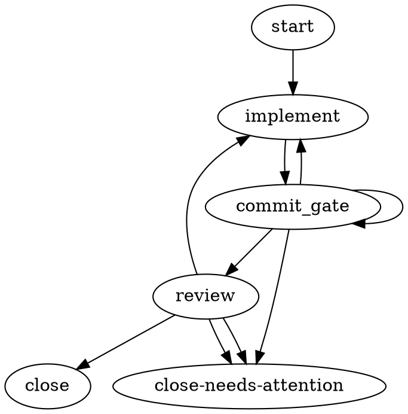

# A1 — The Maximal, First-Class Typed I/O Model for DOT

> **Angle.** This is the *most principled* version of a unified structured-I/O model for
> harmonik's DOT workflow mechanism, argued from first principles + FP discipline (strict,
> explicit types; no stringly-typed hacks), constraints OFF. It deliberately proposes the
> more-work, more-powerful design so the eventual decision has a real maximal pole to pull
> against. Costs & risks are honest at the end.
>
> Ground truth: the five research findings under `research/` and the frame `01-frame.md`.
> Everything below maps onto the *existing* primitives (WG-040 prompt, WG-044 goal, WG-045
> params, context bag / `context_keys`, `input_mapping`) rather than replacing them wholesale.

---

## 0. The one-sentence thesis

**Every node becomes a typed function**: it declares named, typed **input ports** and named,
typed **output ports**; edges are the *only* place data is bound (consumer names producer +
output, explicitly); small control values travel inline on edges, bulk payloads travel as
typed **references** to an artifact store; and a node's brief is assembled *only* from the
input ports it declares — so one role can never see another role's instructions, because it
was never wired to.

This single move — **ports + explicit edge binding** — solves P1 (leak), P4 (bead-specific
text), P5 (reviewer prompt not wired), and the DOT-mode feedback gap (§6 of the specs
finding) as *corollaries of one model*, not four separate patches.

---

## 1. Typed parameter & dataflow model

### 1.1 The type lattice (closed, JSON-Schema-shaped, checkable without execution)

A port's `type` is drawn from a **closed tag set**. Types are structural and declarative so the
whole contract validates at graph-load with zero token spend:

| tag | shape | example use | validated how |
|---|---|---|---|
| `string` | UTF-8 text | a task instruction, a summary | non-null, ≤ cap |
| `number` | JSON number | a score, a round counter | numeric |
| `bool` | true/false | `tests_passed` | boolean |
| `enum[A,B,C]` | one of a closed member set | verdict `APPROVE\|REQUEST_CHANGES\|BLOCK` | member ∈ set |
| `object(<json-schema>)` | small structured record | a `Feedback` struct | JSON-Schema validate |
| `ref<KIND>` | **opaque typed handle** into the artifact store; bytes do NOT travel | `ref<diff>`, `ref<transcript>`, `ref<rubric>` | handle resolves + KIND matches |

`ref<KIND>` KINDs are themselves a closed, extensible registry: `diff`, `transcript`,
`rubric`, `verdict-detail`, `file`, `blob`. This is the **params-vs-artifacts split** made
first-class and *typed* (Argo's single most transferable idea; Dagster's IO-manager
generalization): the *type* stays in the graph and is cheap to check; the *bytes* live in a
store and are passed by reference. A diff, a full transcript, a rubric, a review detail — all
travel as `ref<…>`, never inlined onto an edge.

**Why a closed tag set, not open JSON Schema everywhere:** the edge-condition dialect (WG-013)
branches on values. To statically check that `condition="verdict == 'APPROVE'"` is even
*possible*, the loader must know `verdict` is `enum[APPROVE,REQUEST_CHANGES,BLOCK]`. A closed
scalar+enum set makes edge-condition/producer-type compatibility a load-time check. `object(…)`
carries the escape hatch for genuinely structured records; `ref<KIND>` carries bulk.

### 1.2 Port modifiers

`required` (default) | `optional`; `default=<literal>` (implies optional); `enum` members for
`enum[…]`. `optional`+`default` is what makes a node **drop-in reusable** across graphs
(Dagster/Windmill/GitHub-Actions all lean on this). A `ref<KIND>` port cannot carry a `default`
literal (a handle has no literal form) — it may only be `optional`.

### 1.3 GLOBAL vs EDGE-SCOPED — recommend **edge-scoped default, tiny global set**

Every mature engine that has both keeps them **lexically distinguished** (Argo
`workflow.parameters.*` vs `tasks.X.outputs.*`; GitHub workflow `inputs` vs `needs.*.outputs`;
Windmill `flow_input` vs `results.id`). We adopt the same split, with a sharp rule:

> **If removing a producer node would make the value undefined, it belongs on an edge.
> If the value exists before any node runs, it is global.**

**GLOBAL (run-ambient) — a deliberately *tiny* sealed set**, read via an explicit `run.<name>`
namespace, existing before any node runs:

- `run.repo`, `run.branch`, `run.base_branch` — identity of the working tree.
- `run.goal` — the run-wide objective (this is **WG-044 `goal`**, now a typed global input).
- `run.policy.max_rounds`, `run.policy.model_budget` — run-wide policy ceilings.
- `run.params.<KEY>` — the **WG-045 template params**, now typed (see §1.7), still sealed into
  the Run record for replay determinism.

That is the whole global surface. **We resist a promiscuous global bus** (Airflow XCom /
n8n `$node[...]` read-anywhere) on purpose: every global a node reads is invisible in the graph
topology and defeats static dataflow analysis. Keeping global to *run identity + policy + goal
+ sealed params* keeps the `.dot` the **truth of dataflow**.

**EDGE-SCOPED (node→node) — the default for everything a node produces for a successor:** the
implement node's `diff`/`summary`/`status`; the review node's `verdict` flowing back. Read via
an **explicit mapping on the edge** — never an implicit "previous node" namespace.

### 1.4 Node output ports & explicit output→input mapping

A node declares a **named, typed output set** (Dagster's multi-`out`). The consumer names the
producer and the *specific* output on the edge. **No implicit binding** — the implicit-namespace
designs (n8n positional array, Airflow default `return_value`, Attractor's `last_response`
auto-inject) are exactly the ones that produce silent-wrong-data bugs.

Concrete `.dot` syntax — two attribute families:

**Node ports** (`inputs` / `outputs` attributes, JSON object values):

```dot
implement [
    type="agentic",
    agent_type="implementer",
    handler_ref="claude-implementer",
    idempotency_class="non-idempotent",
    inputs="{
      \"task\":     {\"type\": \"string\", \"required\": true},
      \"feedback\": {\"type\": \"object(feedback.v1)\", \"required\": false}
    }",
    outputs="{
      \"diff\":    {\"type\": \"ref<diff>\"},
      \"summary\": {\"type\": \"string\"},
      \"status\":  {\"type\": \"enum[done,partial]\"}
    }"
];
```

**Edge binding** (`map` attribute — the producer.output → consumer.input list):

```dot
implement -> review [
    map="implement.diff -> patch, implement.summary -> change_summary"
];
```

An edge with **no data to carry** (pure ordering / control flow) simply omits `map` — ordering
and dataflow stay separable (Argo's `dependencies` vs parameter refs). The `map` LHS must name a
declared output of the `from` node; the RHS must name a declared input of the `to` node.

**Ergonomic recovery (auto-bind, resolved at load):** requiring every edge to spell out a
`map` invites GitHub-`with:`-fatigue. So: **same-named output auto-binds to same-named input
unless the edge overrides it** — but the auto-bind is *resolved and recorded at graph-load*,
baked into the compiled graph, never a runtime lookup. Explicit `map` always wins. This gives
Windmill-strength wiring with far less ceremony while staying 100% statically checkable.

### 1.5 The params-vs-artifacts split, concretely

- **Params (inline, small):** `string`/`number`/`bool`/`enum`/small `object` values are
  materialized in the run's **typed value store**, keyed `(<producer-node-id>, <output-name>)`.
  The edge `map` binds one entry to a consumer input. These are cheap to log, diff, and validate.
- **Artifacts (by reference, bulk):** a `ref<KIND>` output writes bytes to
  `.harmonik/artifacts/<run_id>/<node_id>/<output_name>` (local) or the SSH-mirrored equivalent
  (remote), and the *handle* (`{kind, path, sha256, size}`) is what lands in the typed store and
  travels the edge. The consumer resolves the handle to read bytes only if/when its brief needs
  them. This is the Dagster IO-manager idea: **what the value is (typed) is decoupled from where
  the bytes live (store).**

This is the load-bearing decision. Every engine that skipped it (Airflow, n8n) had to bolt on a
"don't put big things on the bus" warning. We type the split instead.

### 1.6 Relationship to the existing `context` bag (`context_keys`, `context_updates`)

The context bag is *retained and subsumed*, not deleted. Today `context.<key>` is an untyped,
run-shared KV store written by `Outcome.context_updates`, and edge conditions read
`context.<key>` (WG-014 LHS whitelist). Under this model:

- The typed value store **is** the context bag, now **type-pinned**. `context_keys` graduates
  from a bare comma-list to a **typed declaration block** — closing OQ-WG-002 / D8 (the
  single most direct open door the prior-design finding named).
- Edge-condition `context.<key>` LHS refs are now validated against the declared types at load
  (today they are explicitly NOT validated). An edge that compares an `enum` key to a
  non-member literal is a **load error**, not a silent never-match.
- `Outcome.context_updates` remains the handler's write channel, but a write to an undeclared
  key or a type-mismatched value is now a load-checkable / dispatch-checkable error (upgrade the
  current HC-062 warn-and-drop to a typed contract).

So "typed params" is not a new parallel subsystem — it is the existing context bag with types
turned on, plus edge-scoped producer/output addressing layered over it.

### 1.7 Typed template params (WG-045)

Template params stay a launch-time, sealed-into-Run-record, replay-deterministic mechanism, but
gain a **typed declaration** at the graph level (the attractor-pi-dev `graph[vars]` idea, taken
one step further to real types):

```dot
graph [
    goal="Ship $FEATURE to $ENV",
    params="{
      \"FEATURE\": {\"type\": \"string\", \"required\": true},
      \"ENV\":     {\"type\": \"enum[staging,prod]\", \"default\": \"staging\"}
    }"
];
```

- Declared params validate the `--param KEY=VALUE` map at ingest against the declared type/enum
  (today it is untyped-string with only hygiene checks). A missing required param or an
  out-of-enum value is a **launch-time error before any agent runs**.
- The **security invariant is preserved unchanged**: substitution still happens AFTER parse,
  per-attribute, over the typed graph (WG-046); `tool_command` values still shell-quoted; every
  other attribute still verbatim. Typing the params does not move the substitution point.
- Params feed **global inputs** (`run.params.<KEY>`), never edges. They are ambient config, not
  dataflow.

---

## 2. Per-role structured input routing

### 2.1 The mechanism: a brief is assembled ONLY from declared input ports

Today the daemon renders the **whole bead body** into *both* `agent-task.md` (implementer) and
`review-target.md` (reviewer) — that is P1, and it is harness-agnostic (both the claude path and
the pi/codex path call the same `WriteAgentTaskVia` with the full body). The typed fix removes
the shared blob entirely:

> **A node's brief is assembled from exactly its declared input ports + its own node `prompt`
> + `role` + the global `run.goal`. Nothing else reaches it.**

There is no "bead body" that both roles render. The bead's payload is **decomposed into typed
global inputs** the graph binds to roles explicitly:

```dot
graph [
    // The bead contributes typed fields, not one blob.
    inputs="{
      \"task\":          {\"type\": \"string\", \"required\": true},
      \"review_rubric\": {\"type\": \"string\", \"required\": false}
    }"
];

implement [ type="agentic", agent_type="implementer", handler_ref="claude-implementer",
    inputs="{\"task\": {\"type\":\"string\",\"required\":true}, \"feedback\":{\"type\":\"object(feedback.v1)\",\"required\":false}}",
    outputs="{\"diff\":{\"type\":\"ref<diff>\"}, \"summary\":{\"type\":\"string\"}}" ];

review [ type="agentic", agent_type="reviewer", handler_ref="claude-reviewer",
    prompt="Verify BOTH LINE-A and LINE-B are present. REQUEST_CHANGES if either is missing.",
    inputs="{\"patch\":{\"type\":\"ref<diff>\",\"required\":true}, \"rubric\":{\"type\":\"string\",\"required\":false}}",
    outputs="{\"verdict\":{\"type\":\"object(feedback.v1)\"}}" ];

// The bead's `task` feeds ONLY the implementer; `review_rubric` feeds ONLY the reviewer.
start   -> implement [ map="run.inputs.task -> task" ];
implement -> review  [ map="implement.diff -> patch, run.inputs.review_rubric -> rubric" ];
```

**The reviewer's rubric is now structurally unreachable from the implementer's brief** — the
implementer node's `inputs` schema does not declare a `rubric` port, so the assembler has
nothing to render. This is *not* a string-split on a `## Review` marker (explicitly rejected in
the frame). It is the type system making the leak impossible to express. P1 solved.

### 2.2 P5 — the reviewer's own prompt/rubric reaches the reviewer, not the implementer

WG-040 makes reviewer-class `prompt` **inert at v1** — the reviewer brief comes only from the
(review-loop-mode-only) `review-target.md`. Under this model the reviewer node's `prompt` is
**activated**: it is one of the assembler inputs for the reviewer brief, alongside the reviewer's
declared `inputs` (`patch`, `rubric`). The implementer's assembler never sees the reviewer node's
`prompt` because it assembles from a *different node's* ports. This is the corollary that fixes
P5 for free.

### 2.3 The brief assembler (one function, all roles, all harnesses)

`buildAgentTaskContent` / `buildReviewTargetContent` (today two divergent builders in
`agenttask_chb028.go`) collapse into **one typed assembler**:

```
assembleBrief(node, boundInputs, run.goal, run.policy) -> BriefDoc
```

- It renders a deterministic section per declared input port (label = port name, body = the
  bound value, or "resolve this ref<…>" for artifacts).
- Role-specific framing (worktree discipline, "never run br close", reviewer read-only
  constraint, "produce verdict via `harmonik write-review-verdict`") is selected by
  `agent_type`, not by which builder was called.
- The output is written to the node's own worktree `.harmonik/` and delivered by the harness.
  The *content* is now identical in structure across implementer/reviewer/future node types —
  only the declared ports differ.

Future node types (planner, validator, debugger — cf. the amolstrongdm role split) drop in with
zero new builders: declare ports, declare a `role`, get an assembled brief.

---

## 3. Reviewer → implementer feedback as a typed channel

### 3.1 The problem being generalized

Today DOT mode has **no normative feedback-delivery mechanism** (the big gap, §6 of the specs
finding). The rich `reviewer-feedback.iter-N.md` machinery is `review-loop`-mode-only and *a
`dot` run MUST NOT produce it* (EM §7.5). A `review → implement` REQUEST_CHANGES loop in a DOT
graph re-dispatches the implementer with only its bead body / static prompt + goal — the
reviewer's verdict/flags/notes never thread forward. And where feedback *is* delivered
(review-loop mode), it is delivered by **two divergent harness paths** (claude paste-inject vs
pi/codex resume-seed) that must be hand-kept-aligned and already caused the no-commit-on-resume
loop (P3).

### 3.2 The design: feedback is just a typed output on a typed back-edge

The reviewer node emits a **typed `verdict` output** of `object(feedback.v1)`:

```
feedback.v1 = {
  verdict:       enum[APPROVE, REQUEST_CHANGES, BLOCK],   // required
  failure_class: enum[correctness, coverage, style, spec_drift, other] | null,
  flags:         string[],                                // machine-readable finding tags
  notes:         string,                                  // human-readable summary
  detail:        ref<verdict-detail> | null               // bulk: full findings, inline diff refs
}
```

The back-edge carries it explicitly:

```dot
review -> implement [
    condition="verdict.verdict == 'REQUEST_CHANGES'",
    traversal_cap="3",
    map="review.verdict -> feedback"
];
```

The implementer node declares `feedback: object(feedback.v1) (optional)`. On iteration 1 it is
unbound → the assembler omits the feedback section. On iteration ≥2 it is bound → the assembler
renders it **identically across every harness**, because it is just a typed input rendered into
the same brief doc. The bulk detail rides `ref<verdict-detail>` (never inlined). Routing still
happens on the enum via the existing cascade — but now the *content* travels the same edge as a
first-class typed payload, not as a mode-private side file.

### 3.3 Why this kills the harness divergence (P3)

The paste-inject-vs-resume-seed fork existed because feedback delivery was *out-of-band* (a
well-known file the harness had to be told to read, differently per harness). Once feedback is a
**declared input port**, the daemon writes it to the typed store once, and the single brief
assembler renders it into whatever delivery form each harness already uses (tmux brief file,
pi/codex seed argv). There is exactly one feedback representation and one assembler; the harness
adapter only chooses the *delivery envelope*, never re-derives *what* to say. The
`agentseedprompt.go` / `pasteinject.go` split stops being a semantic fork and becomes a thin
transport detail.

This also generalizes **beyond review-loop**: *any* node that emits `object(feedback.v1)` (a
validator, a build-gate, a supervisor `manager_loop`-style steer node) can feed *any* downstream
node's `feedback` port. The channel is the type, not the mode.

### 3.4 Optional: durable per-attempt learnings (Arc-style), typed

For loops that degrade over iterations, an *optional* `ref<transcript>`-typed accumulator output
(`learnings`) can self-loop on the implementer node, so each fresh attempt reads accumulated
prior-attempt insight without cross-iteration context pollution (Arc's `progress/` store, but
typed and edge-bound). Offered as a composable extra, not required for v1.

---

## 4. Validation at graph-load (fail before spending tokens)

A run costs model tokens and wall-clock, so a mistyped edge must **never launch an agent**
(GitHub Actions / Prefect posture: "Pending → Failed without Running"). At `.dot` load — after
parse, after param substitution, before dispatch — the loader statically checks, each emitting a
distinct diagnostic that becomes `*ErrWorkflowLoad` (→ `failure_class=workflow_load`, reopen
bead, zero agent spend):

1. **Unbound-input error** — every `required` consumer input is bound by an edge `map` (or
   auto-bind) OR has a `default` OR is `optional`. Else fail.
2. **Dangling-ref error** — every `map` LHS names a real output of the `from` node; every RHS
   names a real input of the `to` node; every `ref<KIND>` consumer's bound producer output is a
   `ref<same-KIND>`.
3. **Type/enum-mismatch error** — producer output type is assignable to consumer input type,
   *including enum-value compatibility for conditional edges* (a `condition` that compares a key
   to a literal outside the key's declared enum is a load error).
4. **Global-ref error** — every `run.*` / `graph.inputs.*` reference resolves to a declared
   global input or param.
5. **Loop-bound error** — the graph is a DAG *except* explicitly-marked feedback (back-)edges;
   every back-edge MUST carry a `traversal_cap` (the loop bound). An unbounded cycle is a load
   error. (Generalizes WG-028 / EM-043 from a convention to an invariant.)
6. **Port-schema error** — `inputs`/`outputs` JSON parses, every `type` tag is in the closed
   set, every `object(<name>)` names a registered schema, every `enum[…]` is non-empty.

Runtime still needs a **second, structural check at each edge crossing** (Dagster's
`type_check_fn` / Temporal's data-converter decode): the agent's *actual* emitted value is
validated against the declared output type before it is stored and bound. You cannot statically
type an agent's free-text output — so the realistic contract is **strict static types on the
small control values (verdict/status/counters) that drive branching, artifact handles for the
free-form bulk**: validate the former hard at load *and* at crossing; pass the latter by
reference and validate only the handle. Two-tier: static contract at load, structural check at
each crossing.

---

## 5. Migration

### 5.1 Modes: `single` / `review-loop` / `dot` all become typed DOT

- **`dot` mode** is the target and gains the typed layer additively.
- **`review-loop` mode** — today a hardcoded two-node Go path (EM-015d) — **desugars into a
  typed DOT graph**: `implement(ports) → review(ports) → {close | close-needs-attention}` with
  the `feedback.v1` back-edge of §3. The EM-015d-RFD/RIA file machinery becomes the typed
  feedback channel; the hardcoded Go path can then be *deleted* (it was already the dogfood
  migration target per the review-loop.dot header). This is the clean way to close the "DOT mode
  has no feedback mechanism" gap: there stops being a separate review-loop machine.
- **`single` mode** desugars to a one-agentic-node typed graph.

### 5.2 Back-compat for existing `.dot` files (the load-bearing compatibility rule)

**A node with no `inputs`/`outputs` attribute gets an implicit default port schema by
`agent_type`**, and edges with no `map` fall back to today's behavior:

| role | implicit inputs | implicit outputs |
|---|---|---|
| `implementer` | `{task: string (=bead body), feedback: object(feedback.v1) optional}` | `{diff: ref<diff>, summary: string}` |
| `reviewer` | `{patch: ref<diff>, rubric: string optional (=bead body)}` | `{verdict: object(feedback.v1)}` |
| `shell`/`noop` non-agentic | `{}` | `{status: enum, failure_class: enum optional}` |

With these defaults, **every existing `.dot` file loads and runs byte-for-byte as today** — the
implicit implementer `task` binds to the bead body exactly as now, the implicit reviewer sees
the bead body as `rubric`, and the standard-bead review→implement edge auto-binds the implicit
`verdict → feedback`. Nothing breaks. Authors *opt in* to the leak-proof, per-role-routed
behavior by declaring explicit ports (as in §2.1) — at which point the shared-body default no
longer applies to that node and P1 is closed for that graph.

> The **only** behavior change for un-migrated graphs: DOT-mode runs now *do* thread reviewer
> feedback to the implementer on the back-edge (via the implicit `feedback` port), where today
> they silently do not. This is strictly an improvement and is what gap6 / the round-trip
> determinism proof needs — but it is a normative change to EM §7.5 (see §6) and should ship
> behind the same schema bump.

### 5.3 Schema version

The port/`map`/typed-context surface is a **minor, additive** schema change from the author's
view but changes reader semantics, so bump graph-level `schema_version` `1 → 2`. N-1 readability
(WG-034): a v2 loader reads v1 graphs via the implicit-default schemas above; a v1 loader
rejects v2 graphs that use `inputs`/`outputs`/`map` (unknown reserved attrs, strict per D9).

---

## 6. Mapping onto existing primitives & the spec rules that change

| existing primitive | becomes |
|---|---|
| **WG-040 `prompt`** | one input to the brief assembler; **reviewer-class `prompt` activated** (was inert) — fixes P5. Spec change: WG-040 reviewer-inert clause removed. |
| **WG-044 `goal`** | a typed **global input** `run.goal`. Unchanged surface; now formally the one ambient objective global. |
| **WG-045/046 template params** | **typed** `params` declaration → `run.params.<KEY>`; ingest validates against declared type/enum. Substitution point & security invariant **unchanged** (WG-046 preserved). |
| **context bag / `context_keys` / `context_updates`** | the **typed value store**; `context_keys` graduates to a typed declaration; edge-condition LHS now type-validated. **Closes OQ-WG-002 / D8.** HC-062 warn-and-drop upgraded to a typed contract. |
| **`input_mapping` (WG-006, sub-workflow)** | the **hollow attribute filled**: sub-workflow node boundary reuses the *same* edge `map` mechanism to project parent outputs → inner-graph inputs and inner terminal outputs → parent. WG-006's "typed key→key mapping" finally has semantics. |
| **per-node `model`/`effort` (WG-042 / EM-012b-NODE)** | **unchanged** — deliberately stays node *config*, not dataflow. Model choice never travels an edge (matches Argo `runs-on`/`resources`, Temporal task-queues). The typed-I/O layer does not touch model resolution. |
| **`traversal_cap` (WG-028/EM-043)** | promoted from convention to a **load invariant**: every feedback back-edge MUST carry it (§4 check 5). |

**New spec rules to add** (illustrative IDs): WG-055 typed input/output ports; WG-056 edge
`map` binding + auto-bind resolution; WG-057 the `ref<KIND>` artifact-reference type + store
layout; WG-058 typed `params`/`context_keys` declarations (supersedes the OQ-WG-002 deferral);
EM-069 the two-tier validation (static-at-load + structural-at-crossing); EM-070 `feedback.v1`
typed feedback channel replacing EM-015d-RFD's mode-private file; and the amendment to **EM §7.5**
— *a `dot` run MAY now produce typed feedback* (the current "MUST NOT produce review-loop
artifacts" clause is replaced by the typed channel).

**Rules explicitly *unchanged*:** WG-013 edge dialect stays equality-only (the type system makes
it *safer* by validating LHS types, but does not add `<`/`>` or `||` — that is a separate axis);
WG-011 unconditional-fallback invariant; WG-042 model-not-on-edges (still a strict error to put
`model`/`effort` on an edge — only `map` is new on edges); the five-step cascade (EM-041); the
closed 4-node type enum (WG-001).

---

## 7. Worked end-to-end example — implement → review → feedback, fully typed

The repro from the frame: task = "add LINE-A, then LINE-B on the *next* pass"; rubric = "require
BOTH". Today P1 lets a capable model do both up front and the back-edge never fires. With typed
ports the rubric is unreachable from the implementer, so a genuine round-trip is forced.



**Trace:**
1. **Load:** ports parse; `run.inputs.task` binds implementer `task`; `run.inputs.review_rubric`
   binds reviewer `rubric` (never the implementer); `review.verdict` (`feedback.v1`) is
   assignable to implementer `feedback`; both back-edges carry caps; graph is DAG-except-marked.
   All §4 checks pass → dispatch.
2. **implement (iter 1):** brief = `{task}` + role + goal. **The reviewer's rubric is not in the
   brief** — the implementer's `inputs` has no rubric port. It does LINE-A only (the task text
   said "next pass" for LINE-B, and it cannot see the "require both" rubric). Emits
   `diff=ref<diff>`, `summary`.
3. **commit_gate:** build/vet/tests pass → `status=SUCCESS` → review.
4. **review (iter 1):** brief = `{patch=ref<diff>, rubric="require BOTH"}` + reviewer prompt.
   Sees LINE-B missing → emits `verdict={verdict: REQUEST_CHANGES, flags:[missing:LINE-B],
   notes:"add LINE-B", detail: ref<verdict-detail>}`.
5. **cascade:** `verdict.verdict == 'REQUEST_CHANGES'` → back-edge to implement, cap 1/3, maps
   `review.verdict -> feedback`. Daemon writes the typed feedback to the store.
6. **implement (iter 2):** `feedback` port now bound → assembler renders the feedback section
   **identically whether the harness is claude, pi, or codex** (no paste-inject vs seed fork).
   Implementer adds LINE-B. Emits new `diff`.
7. commit_gate SUCCESS → review (iter 2): both lines present → `verdict=APPROVE` → **close**.

The round-trip is now *deterministic and forced by the type system*, proving ① end-to-end (P3)
and closing gap6 — without any test-fixture hack, and identically across all harnesses (P7).

---

## 8. Costs & risks (honest)

1. **This is the most-work option.** It touches the AST (`inputs`/`outputs`/`map` typed fields +
   a `ref<KIND>` type + a schema registry), the loader/validator (six new static checks + typed
   context), the value/artifact store (new subsystem: typed store + artifact-store layout, local
   + SSH-mirrored), the brief assembler (collapse two builders into one port-driven assembler),
   the cascade bridge (bind `map` at each crossing + structural type-check), and every harness
   adapter (feedback as a port, not a side file). It is a genuine subsystem, spec-first, and
   should be a kerf work of its own — not a patch.
2. **Verbosity / author friction.** Fully-explicit ports + maps are wordy (GitHub-`with:`
   fatigue). Mitigations: implicit default schemas by role (§5.2), same-name auto-bind resolved
   at load (§1.4), and canonical starter graphs. Risk: authors under-declare and lean on
   implicit defaults, partially re-exposing P1 for un-migrated graphs — accept this as the
   back-compat price and make the migrated standard-bead the default so the *typed* path is what
   everyone gets out of the box.
3. **Two-tier validation is real complexity.** Static-at-load can't type an agent's free-text
   output; the structural-at-crossing check can *reject a completed agent's output* (tokens
   already spent) if it doesn't match the declared type. Keep declared outputs *minimal* (the
   few control values that drive branching) so the crossing check rarely bites; everything
   free-form goes through `ref<KIND>` where only the handle is checked.
4. **`ref<KIND>` store is new surface area.** Artifact lifecycle (GC, remote mirroring, replay
   determinism of handles, `.gitignore` discipline) must be designed carefully — it is the part
   most likely to leak operational bugs. The existing `.harmonik/` per-worktree file writes are
   the precedent to extend, not a greenfield store.
5. **JSON-in-DOT-attribute is ugly.** Escaping JSON inside `.dot` string attributes (the
   `\"…\"` soup above) is genuinely unpleasant to hand-author. Alternatives to weigh in design:
   a compact non-JSON port mini-syntax (`inputs="task:string!, feedback:feedback.v1?"`) that the
   parser expands to the typed schema — probably worth it for ergonomics, at the cost of one more
   grammar. The *model* is unchanged either way; only the surface syntax differs.
6. **Schema bump + N-1 window.** v1↔v2 readability must be genuinely tested (the WG-034 contract)
   or old daemons silently misread new graphs. The implicit-default compatibility layer (§5.2) is
   load-bearing and needs its own golden tests.
7. **Scope discipline.** The maximal design is tempting to over-build (typed objects everywhere,
   a full expression language on edges). Hold the line: edge dialect stays equality-only
   (WG-013); model stays off edges (WG-042); global stays tiny. The power is in *ports + explicit
   binding + the artifact split*, not in a richer condition language.

---

## 9. The single biggest bet

**That making every node a typed function with declared ports — and forbidding any implicit
data path — is worth its cost, because it collapses four separate problems (leak, bead-specific
text, reviewer-prompt wiring, DOT-mode feedback) into corollaries of one model, and turns the
harness-divergent feedback fork into a thin transport detail over a single typed channel.** The
bet is that the up-front subsystem cost buys a mechanism that is both *more powerful* (composable,
statically checkable, reusable graphs) and *more controllable* (the `.dot` is the whole truth of
dataflow) than any patch-the-leak alternative — and that back-compat via implicit-default port
schemas keeps every existing graph running while authors opt into the typed, leak-proof path.
