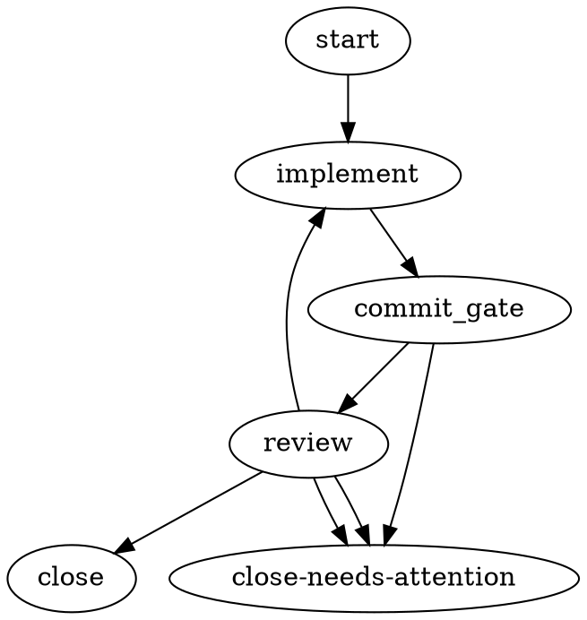

# A2 — Minimal / Pragmatic I/O design for the DOT mechanism

> **Angle:** the smallest, least-invasive set of changes that makes DOT genuinely
> controllable and robust. Convention over new machinery. Build on the primitives that
> already exist (`prompt`, `goal`, template params, `context` bag, the reviewer-feedback
> file). This is the counterweight to a maximalist typed-dataflow design.
>
> **North star:** harmonik runs ONE dominant workflow shape — `start → implement →
> commit_gate → review → {close | close-needs-attention}` with a single REQUEST_CHANGES
> back-edge. It is a *linear loop with exactly one producer→consumer pair* (implement→review)
> and one back-edge (review→implement). Almost every heavy feature the ecosystem offers
> (edge-scoped typed dataflow, CSS model stylesheets, artifact stores, fan-in, manager
> loops) is machinery for graph shapes harmonik does not run. The leanest design that fixes
> P1/P5 (leak + reviewer wiring) and P3/§6 (feedback in dot mode) is a **schema-version bump
> that un-defers two already-reserved behaviors and lifts one already-existing file out of
> review-loop-only scope.** No new first-class "typed node inputs" concept is needed.

---

## 0. The one-paragraph thesis

The frame (candidate ideas §"a dictionary") asks whether per-role input becomes a
first-class typed node-inputs concept or a convention over existing attributes. **It is
already a convention over existing attributes, and the convention is nearly free.** The
"dictionary" that routes distinct instructions to distinct roles is: **the per-node `prompt`
attribute (the routing key = which node references which token) + the template-param map
(the values, bead-specific, sealed for replay).** The implementer node's `prompt` is the
implementer's instructions; the reviewer node's `prompt` is the reviewer's instructions;
each is filled per-bead from `--param`. The only thing standing between that and a working
solution is that **reviewer-class `prompt` is inert at v1** (WG-040, deliberately reserved
for "a future schema version") and the **reviewer brief is sourced from the bead body, not
the node prompt** (P5). Un-defer those two and the leak is gone with zero new concepts.

---

## 1. Params / dataflow — the minimum that catches real errors

### 1.1 Keep template params as the ONLY value-injection mechanism
Template params (WG-045/046) already give everything the per-role split needs:
- **bead-specific** — filled per-launch from `queue submit --param KEY=VALUE` (P4 solved);
- **replay-deterministic** — the param map is snapshotted through the workloop and the
  substitution happens once, post-parse, per-attribute (WG-046 security ordering intact);
- **injectable into any attribute** — including two different nodes' `prompt=` attributes,
  which is exactly the per-role routing surface.

Nothing about the leak or the round-trip requires a new value channel. Do **not** add
edge-scoped params, object/JSON-schema values, or an artifact channel (see §5).

### 1.2 The ONE additive: a graph-level `params` declaration (required/default + optional enum)
Today an unfilled token fails *at launch* with a residual-`__TOKEN__` error (`params.go:38-46`)
and a typo'd token name fails the same way but blames the wrong thing. The cheapest upgrade
that catches real errors *before any agent is dispatched* is a lightweight declaration,
lifted verbatim from attractor-pi-dev's proven `vars="…"` (research 04 §4):

```dot
digraph bead_review {
  params="TASK, RUBRIC, MAX_ROUNDS=3, VERDICT_ENUM:enum(APPROVE,REQUEST_CHANGES,BLOCK)";
  ...
}
```

Grammar (one graph-level attribute, comma-separated entries):
- `NAME` — **required**; absent at launch → **load error** naming the param.
- `NAME=default` — **optional** with a default value.
- `NAME:enum(A,B,C)` — optional **enum annotation**; a supplied value outside the set is a
  load error. (This is the *entire* type surface. No `string`/`number`/`object`.)

This is the smallest type surface that still catches the two real error classes:
**(a) forgot a required param, (b) supplied a value the routing edges can never match.** Enum
is the only "type" worth having because it is the only one that lets graph-load verify the
value against the edge conditions that branch on it (a reviewer verdict is
`enum(APPROVE,REQUEST_CHANGES,BLOCK)`; an edge `condition="outcome.preferred_label == 'APPROVE'"`
is checkable against that enum). Numbers/booleans/objects buy nothing here — harmonik never
branches on them.

### 1.3 Where edge-scoping is actually needed → nowhere (yet)
Research 05 makes a strong general case for edge-scoped typed dataflow (Argo
`tasks.X.outputs.parameters.Y`, Dagster typed `ins/outs`, Windmill `results.id`). Its own
rule of thumb: *"if removing a producer node would make the value undefined, it belongs on an
edge; if the value exists before any node runs, it's global."* Apply that rule to harmonik's
actual graph:
- `TASK`, `RUBRIC`, `MAX_ROUNDS` — **exist before any node runs** → global params. ✔
- the reviewer's verdict — produced by the review node, consumed by the back-edge and the
  resumed implementer → *this is the one genuinely edge-scoped value.* But it already has two
  homes: `outcome.preferred_label` (routing) and the reviewer-feedback file (content). We do
  **not** need a typed-edge layer to carry one value that already flows through two working
  channels.

So: **global params + the existing `context` bag cover 100% of harmonik's dataflow.** Reserve
edge-scoped typed dataflow for the day a graph has multiple producer/consumer pairs feeding
distinct successors — a shape harmonik does not run. Building it now is pure speculative
generality.

### 1.4 Leave `context` type-pinning (OQ-WG-002) deferred
The `context` bag + `context_keys` already exists for the one real node-to-node value
(`context.last_verdict`, mirrored today in review-loop). Keep it string-keyed and unpinned.
Type-pinning is a solution waiting for a routing bug that has not occurred. If one occurs,
pin *that key*, not the whole system.

---

## 2. Per-role input routing — the cheapest correct fix for the P1 leak (+ P5)

### 2.1 The fix, in two spec deltas (no new concepts)
**Delta A — un-defer reviewer-class `prompt` (WG-040 v1 → v2).** Today a reviewer node's
`prompt=` is "accepted-but-inert." Make it **live**: on a reviewer-class node, `prompt`
becomes the review brief body written into `.harmonik/review-target.md`, replacing the
bead-body-derived brief — exactly symmetric to how implementer `prompt` already replaces the
bead body in `.harmonik/agent-task.md`. This is precisely the behavior WG-040 already reserved
"for a future schema version." We are just landing it.

**Delta B — wire the reviewer brief from the node prompt, not the bead body (fixes P5).**
`buildReviewTargetContent` (`agenttask_chb028.go:577`) renders `p.BeadBody`. When the reviewer
node carries a `prompt`, thread that prompt as the review-brief body instead. This is the
same one-field plumbing already done on the implementer side
(`claudelaunchspec.go:308-311` swaps body→prompt); do the mirror for the reviewer.

### 2.2 Why this closes the leak without string-splitting
P1's root cause: the bead **body** carries task + rubric, and the daemon renders the *whole
body* into *both* artifacts. Once each role's brief is sourced from its **own node's `prompt`**:
- implementer node `prompt="__TASK__"` → `agent-task.md` gets ONLY the task;
- reviewer node `prompt="__RUBRIC__"` → `review-target.md` gets ONLY the rubric.

The bead body is no longer rendered into either brief (it degrades to an optional fallback for
graphs that set no `prompt`). **The rubric never reaches the implementer.** No `## Review`
marker, no body splitting (the explicitly-rejected approach) — the split is *structural*: two
attributes on two nodes, filled from two params. This is the "dictionary" the frame wanted,
realized as convention over `prompt` + params rather than a new typed object.

### 2.3 Bead-specificity (P4) falls out for free
`prompt="__TASK__"` is a *static* attribute, but the token makes it bead-specific: the value
arrives per-launch via `--param TASK=…`. One `.dot` template serves every bead; the params
differ per submit. P4 ("a static prompt can't carry bead-specific text") is answered by the
param layer that already exists — not by inventing per-node dynamic inputs.

---

## 3. Feedback channel — least change that fixes harness-divergence + generalizes to dot mode

### 3.1 The situation
- The rich reviewer→implementer content delivery (`reviewer-feedback.iter-<N-1>.md`) exists
  and **both** harness families already read it: claude via paste-inject + the rewritten
  `agent-task.md` Prior-Iteration-Context section; pi/codex via `implementerResumeSeedPrompt`
  (the 8dbe5a17 fix). Findings 01 §4 confirms both paths reference the same file.
- BUT the spec (EM §7.5 ~L1610) says the feedback/target artifacts are **review-loop-mode
  ONLY** and "a `dot` run MUST NOT produce them." That prohibition is the single normative
  gap that makes the dot-mode back-edge deliver no content (research 02 §6).

### 3.2 The minimal fix (reuse, don't reinvent)
**Delta C — delete the "dot MUST NOT produce reviewer-feedback / review-target" prohibition
(EM §7.5), and make the daemon write `reviewer-feedback.iter-<N-1>.md` on any back-edge that
re-enters an implementer-class node in dot mode** — the same writer
(`WriteReviewerFeedback`, `agenttask_chb028.go:443`), the same well-known path, the same
already-structured content (verdict, flags, notes, diff summary). Both harness resume paths
already know how to read it, so **no per-harness work is needed** beyond letting the file be
written in dot mode. The harness-divergence risk collapses because there is now **one writer
and one file contract** feeding both resume paths, instead of the review-loop machinery being
a separate code island.

**Delta D — mirror the verdict into `context.last_verdict` in dot mode too** (already done in
review-loop). This is optional but cheap, and it lets a `.dot` author route on the *trailing*
verdict via `context.last_verdict` if they want — reusing the context bag, not a new channel.

### 3.3 Why NOT a new typed feedback channel
The rejected `kind=verdict` typed Outcome payload (research 03 §3) and research 04's
"structured feedback payload in a named context key" are real ideas, but the *content* the
implementer needs — the reviewer's prose findings ("LINE-B is missing") — is inherently
free-text. A typed envelope around free text buys nothing the markdown file does not already
give. The verdict *label* is already structured (`preferred_label`) and already drives
routing. The flags are already a list in the file. **Structured-enough already exists; make it
uniform, don't re-type it.**

---

## 4. Validation — the cheapest graph-load checks worth having

All are static, all fire before any agent is dispatched (the "validate before Running" posture
research 05 §D calls the strongest). Most already exist; the new ones are trivial:

| # | Check | Status | Error class |
|---|---|---|---|
| V1 | Every `params` entry that is required is supplied at launch | **NEW** (§1.2) | `param_required_missing` |
| V2 | Every supplied param with an `enum(...)` annotation is in-set | **NEW** (§1.2) | `param_enum_violation` |
| V3 | Every `__TOKEN__` referenced in the graph is declared in `params` | **NEW** (catches typos) | `param_undeclared` (warn→error) |
| V4 | No residual `__TOKEN__` after substitution | exists (`params.go:38`) | `param_unsubstituted` |
| V5 | Unconditional fallback edge present on every branching node | exists (WG-011) | `no_outgoing_edge_matches` |
| V6 | Terminal nodes reachable; `close` has exactly one inbound APPROVE edge | exists (WG-050 review-floor) | structural |
| V7 | Every back-edge (to an already-visited node) carries `traversal_cap` | partial (cap honored) → **make it required** | `unbounded_back_edge` |
| V8 | Graph is a DAG except for `traversal_cap`-bounded back-edges | exists (WG-029) | structural |

V3 and V7 are the two worth adding beyond the params decl: V3 catches the single most common
authoring mistake (`__TSAK__`), V7 guarantees no infinite implement↔review loop can even load.

**Deliberately NOT built:** type-assignability checking *across edges* (research 05 §D3). There
is no edge dataflow to check — the values on edges are `outcome.preferred_label` /
`context.<key>`, already covered by the LHS whitelist (WG-014) and the enum annotation (V2).

---

## 5. What we deliberately leave out — and why

| Maximalist feature | Source | Why it is overkill for harmonik |
|---|---|---|
| **Edge-scoped typed dataflow** (`node.X.outputs.Y → consumer.input`, explicit per-edge maps) | Argo, Dagster, Windmill (research 05) | harmonik's graph has **one** producer→consumer pair. A per-edge data-mapping layer is enormous machinery to carry one value (the verdict) that already flows via `preferred_label` + the feedback file. Speculative generality. |
| **CSS `model_stylesheet`** (`*`/shape/`.class`/`#id` specificity) | Attractor canonical, Fabro, F#kYeah (research 04 §1.4) | Stylesheet specificity pays off at dozens of node classes. harmonik has ~2 roles. `model=` per node (2 lines) + the `model:<alias>` bead label already give per-node + per-bead control. Already deferred (WG-043, hk-1xzg3); keep it deferred. |
| **params-vs-artifacts split** (typed small values on edges; bulk in an object store) | Argo, Dagster IO-managers (research 05 §A/B) | The "bulk" (the diff, the transcript) is *already* delivered out-of-band: the diff via `review_base_sha`/`review_head_sha` + the git worktree; the transcript via the harness. There is no bulk value being wrongly shoved through a param today. Nothing to split. |
| **Full type system** (`string`/`number`/`bool`/`object`/JSON-Schema/`type_check_fn`) | GitHub Actions, Dagster, Windmill (research 05) | harmonik branches only on enums (verdict) and equality. Required/default + `enum(...)` catches every load-time error that matters. Scalars/objects add validation code for values nothing routes on. |
| **New `kind=verdict` typed Outcome payload** | rejected in phase-3-dot; research 03 §3 | The verdict label is already structured (`preferred_label`); the findings are inherently free text. A typed wrapper around prose is ceremony. §3.3. |
| **Fleshing out `input_mapping`** (sub-workflow context projection) | WG-006, hollow today (research 02 G2b) | Sub-workflows are thinly exercised (findings 01 §8.10). Leave `input_mapping` reserved-and-hollow until a real sub-workflow use appears. Don't spec a mechanism nothing calls. |
| **`context_keys` type-pinning** (OQ-WG-002) | research 03 §5 "most direct open door" | A solution waiting for a routing bug that hasn't happened. Pin a key when a key misbehaves. §1.4. |
| **manager_loop / parallel fan-in / holdout scenarios / Arc durable-learnings store** | Attractor ecosystem (research 04 §1.8/1.9, §5) | Whole subsystems for supervisor/parallel/anti-overfit patterns harmonik does not run. Out of scale by an order of magnitude. |
| **per-run `--force-model` override** | Kilroy (research 04 §3) | Nice-to-have, but the node attr + bead label + env var (Tier-2.5, hot-reload) already give three override channels. Add only if A/B testing demand appears. |

**The through-line:** every "leave out" item solves a problem that arises from *graph
diversity* (many node classes, many producer/consumer pairs, bulk payloads on edges). harmonik
runs one graph shape. The maximal version pays a large, permanent complexity tax — a type
system, a stylesheet resolver, an edge-dataflow binder, an artifact store abstraction — to buy
generality that the actual workload never exercises. The minimal version ships the *same
observable capability* (no leak, per-role briefs, cross-harness feedback, load-time validation)
with a schema-version bump and ~4 spec deltas.

---

## 6. Worked example — implement → review → feedback, end to end, on existing primitives

### 6.1 The `.dot` template (one file, serves every bead)



### 6.2 The submit (per-bead values)

```bash
harmonik queue submit \
  --workflow bead_review.dot \
  --param TASK="Add line LINE-A to notes.txt." \
  --param RUBRIC="APPROVE only if BOTH LINE-A and LINE-B are present in notes.txt; \
                  otherwise REQUEST_CHANGES and say which line is missing."
```

Note the *deliberate asymmetry* that makes a round-trip deterministic: the implementer is told
only about LINE-A; the reviewer requires LINE-A **and** LINE-B. Because the rubric no longer
leaks into the implementer brief (§2.2), the implementer *cannot* know about LINE-B on pass 1 —
so a round-trip is forced by construction, and P2 is solved without any test-only hack.

### 6.3 The run, step by step

1. **Load** — `dot.Parse` (tokens intact) → V1/V2/V3 pass (TASK, RUBRIC supplied; no enum
   annotations; both tokens declared) → `substituteGraphParams` fills `prompt` on `implement`
   and `review` → V4–V8 pass. If TASK were omitted: **load error before any agent runs.**
2. **implement (iter 1)** — `agent-task.md` body = "Add line LINE-A to notes.txt." (TASK only;
   no rubric). Agent commits LINE-A.
3. **commit_gate** — `git rev-parse HEAD` succeeds → `outcome.status == SUCCESS` → edge to
   `review`.
4. **review (iter 1)** — `review-target.md` brief = the RUBRIC (Delta A/B). Reviewer sees only
   LINE-A present, LINE-B missing → `write-review-verdict --verdict=REQUEST_CHANGES
   --flags=missing-line --notes="LINE-B is not present in notes.txt"` → `review.json`.
5. **cascade** — `outcome.preferred_label == 'REQUEST_CHANGES'` → back-edge to `implement`
   (traversal 1 of cap 3).
6. **feedback (Delta C)** — daemon writes `.harmonik/reviewer-feedback.iter-1.md`
   (verdict + `missing-line` flag + "LINE-B is not present…" notes + diff summary). *This now
   happens in dot mode*, where before EM §7.5 forbade it.
7. **implement (iter 2, resume)** — both harness paths deliver the same instruction: "you are
   resuming after review; FIRST read `.harmonik/reviewer-feedback.iter-1.md` and address every
   point." (claude: paste-inject + rewritten Prior-Iteration-Context; pi/codex:
   `implementerResumeSeedPrompt`.) Implementer reads "LINE-B missing", commits LINE-B.
8. **commit_gate → review (iter 2)** — both lines present → `APPROVE`.
9. **cascade** — `outcome.preferred_label == 'APPROVE'` → `close`. Terminal. Done.

Every mechanism used already exists in the codebase; the only *new* behaviors are: reviewer
`prompt` is live (Delta A/B), the feedback file is allowed in dot mode (Delta C), and the
`params` declaration + V1/V2/V3/V7 checks (§1.2, §4).

---

## 7. Mapping onto existing primitives (nothing new invented)

| Need | Minimal answer | Existing primitive reused |
|---|---|---|
| Per-role instructions, no leak | implementer `prompt` vs reviewer `prompt` | WG-040 `prompt` (un-defer reviewer side) |
| Bead-specific values | `--param` fills each node's `prompt` token | WG-045/046 template params (unchanged) |
| Load-time param safety | `params="…"` decl (required/default/enum) | attractor-pi-dev `vars` pattern; new graph attr |
| Reviewer brief wiring (P5) | thread reviewer node `prompt` → `review-target.md` | `buildReviewTargetContent` one-field swap |
| Feedback content on back-edge | write `reviewer-feedback.iter-N.md` in dot mode | `WriteReviewerFeedback` (lift review-loop scope) |
| Cross-harness uniformity | one writer, one file, both resume paths read it | `pasteInjectImplementerResume` + `implementerResumeSeedPrompt` (both already read it) |
| Trailing-verdict routing (optional) | `context.last_verdict` mirror in dot mode | context bag + `context_keys` (unchanged) |
| Per-node model | `model=` attr + `model:<alias>` bead label | EM-012b (unchanged) |
| Loop bounding | `traversal_cap` on the back-edge (make required) | EM-043 / WG-028 (tighten V7) |

---

## 8. Spec deltas (the complete list)

- **WG-040 (v1→v2):** reviewer-class `prompt` becomes **live** — it is the review-brief body,
  replacing the bead-body-derived brief (symmetric to implementer). Remove the
  "accepted-but-inert / reserved for a future schema version" language.
- **WG-045-decl (NEW):** graph-level `params="NAME, NAME=default, NAME:enum(A,B,C)"`. Required
  entries missing at launch, or supplied values outside an enum, are **load errors** (V1/V2).
  A referenced `__TOKEN__` not declared in `params` is a load error (V3).
- **EM-015d-RFD / EM §7.5:** delete "reviewer-feedback / review-target are review-loop-mode
  ONLY; a dot run MUST NOT produce them." **Replace with:** in dot mode, when a back-edge
  re-enters an implementer-class node (iteration N≥2), the daemon writes
  `.harmonik/reviewer-feedback.iter-<N-1>.md` via the same writer, and both harness resume
  paths read it. (Optional: mirror the verdict into `context.last_verdict`.)
- **WG-028 / EM-043 (tighten):** a back-edge (to an already-reachable node) **MUST** carry
  `traversal_cap` — unbounded back-edge is a load error (V7).
- **No change** to: template-param substitution ordering (WG-046), the edge cascade (WG-010),
  the failure-class enum (WG-018), model resolution (EM-012b), node-type enum (WG-001),
  `input_mapping` (stays reserved-and-hollow), `context_keys` type-pinning (stays deferred).

---

## 9. The strongest argument for restraint

The maximal design imports a **type system, a CSS stylesheet resolver, an edge-dataflow binder,
and an artifact-store abstraction** to serve a workflow that is *one linear loop with one
producer→consumer edge and one bounded back-edge*. Every one of those subsystems is generality
priced for graph *diversity* — many node classes, many data edges, bulk payloads on
connections — that harmonik's single dominant graph shape never exercises. The leak (P1), the
reviewer-wiring gap (P5), the missing dot-mode feedback (§6/P3), and the absence of load-time
validation are **all fixable by un-deferring two behaviors WG-040 already reserved, lifting one
file out of review-loop-only scope, and adding a five-word `params` declaration.** That is a
schema-version bump, not a new engine. Ship the smallest thing that makes the graph
un-leaky, per-role, self-documenting at load, and uniform across harnesses — and let the typed
edge-dataflow layer earn its way in the day a second producer/consumer pair actually appears.
