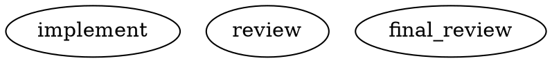

# Brainstorm B — Powerful, Controllable Model + Effort Selection

> Work: `2026-07-17-dot-mechanism`. Design axis: MODEL/EFFORT selection.
> Operator concern (verbatim intent): *"if a task is especially difficult, I can't easily
> configure the bead to run with Opus as the implementor when the .dot says Sonnet."*
> Constraints OFF. Respect the standing rule: **no external-version binding** — model choices
> are advisory aliases with graceful degradation; harmonik never hard-fails a run because a
> version string is unknown.

---

## 0. TL;DR

The mechanism is mostly built (EM-012b 6-tier walk + per-node `model=`/`effort=`). Three real
defects block "powerful + controllable":

1. **The ladder is upside-down for the operator's case.** A `.dot` node `model=sonnet` (tier 0)
   **beats** a per-bead `model:opus` label (tier 1) — see `dot_cascade.go:1351` layering
   `node.Model` on top of `resolvedModel`. So the operator literally cannot escalate a hard bead
   past the graph's node default. **Fix: split the ladder into an OVERRIDE band (per-run force,
   per-bead escalation) that sits ABOVE the DEFAULTS band (node attr, stylesheet, config, env,
   compiled).** Task-specificity must beat stage-typicality.
2. **Per-node `model=` is silently ignored for pi/codex** (`nodeModelForHarness`,
   `dot_cascade.go:1182`). **Fix: harness-portable *aliases* + a per-harness alias catalog, plumbed
   to `rc.model` for ALL harnesses; loud structural fail only on an explicit cross-harness concrete
   mismatch.**
3. **No per-run override and no cheap per-role knob.** **Fix: `--force-model`/`--force-effort` on
   `queue submit` (sealed into the Run for replay) + a restricted `model_stylesheet` keyed on the
   `agent_type`/`class`/`#id` harmonik already has.**

---

## 1. The revised precedence ladder

### 1.1 The ladder (highest wins)

| # | Tier | Channel | Scope | Who sets it | Sealed for replay? |
|---|------|---------|-------|-------------|--------------------|
| **OVERRIDE band — "this specific unit of work is unusual"** ||||||
| 0 | **Per-run force** | `queue submit --force-model=<alias> --force-effort=<lvl>` (new `Item.ForceModel/ForceEffort`) | one run | operator / orchestrator | YES — into `ModelPreference` seal |
| 1 | **Per-bead escalation label** (role-scoped) | `model:<alias>[@role]`, `effort:<lvl>[@role]` | all runs of the bead | operator / agent | YES — resolved value sealed at claim |
| **DEFAULTS band — "the graph's normal choice for this stage"** ||||||
| 2 | **Per-node attr** | `model="…"`, `effort="…"` on the `agentic` node | one node | graph author | value is static graph data; resolved value sealed per-node |
| 3 | **`model_stylesheet` rule** | graph-level rule matched by `#id` > `.class` > `agent_type` > `*` | node-set | graph author | resolved value sealed per-node |
| 4 | **Project config** | `.harmonik/config.yaml` `agents.<type>.{model,effort}` | project | operator | value sealed at claim |
| 5 | **Env var** | `HARMONIK_CLAUDE_MODEL` / `_EFFORT` (hot-reload) | box | operator | value sealed at claim |
| 6 | **Compiled default** | `defaultModelEntries` (`sonnet`/`medium`) | binary | dev | — |
| 7 | **Empty → harness tool default** | — | — | harness | — |

`model` and `effort` resolve **independently** through this ladder (unchanged from today).

### 1.2 What changed vs today, and why

- **Node attr (was tier 0) moves BELOW the two OVERRIDE tiers.** Today `dispatchDotAgenticNode`
  computes `resolvedModel` (which already folds in the bead label at tier 1) and then *overwrites*
  it with `node.Model` if the node has one. That inversion is the operator's exact pain. The node
  attribute is the *typical* model for that stage; a per-bead label / per-run force is *this task
  is special*. Specificity of intent, not position in the file, should win.
- **The node attr is a SOFT default.** An author who genuinely needs a node pinned regardless of
  escalation (e.g. a trivial formatting node that must stay cheap even on a "hard" bead) writes
  `model_locked="true"` on that node — then escalation skips it. Default is soft (overridable),
  because the common case is "let me escalate."
- **Escalation is ROLE-SCOPED so a bare label does the right thing.** `model:opus` with no
  qualifier applies to the **implementer class only** — the overwhelmingly common "the *coding* is
  hard" case — so a single label, no `.dot` edit, upgrades the implementer and leaves cheap
  reviewer/gate nodes alone. `model:opus@reviewer` targets reviewer nodes; `model:opus@*` targets
  every agentic node. This is the ergonomic answer to "better than a raw `model:alias` label": the
  label stays a label, but (a) it beats the node default and (b) it knows which role it means.

### 1.3 The ergonomic "this is hard, use Opus" path — three ways, in order of friction

1. **Semantic alias label (lowest friction, no CLI, no .dot edit):**
   `br update <bead> --label model:strong` — `strong` is an *alias* (see §6 catalog), role-scoped
   to implementer, resolved per-harness, overrides the node default. Nothing version-specific is
   typed; `strong` maps to whatever the strong model is for the harness that runs.
2. **Per-run force (no persistent label, one-shot):**
   `harmonik queue submit --bead <id> --force-model strong` — for an operator escalating a single
   dispatch without mutating the bead.
3. **Graph author default (the stable case):** `model=` / stylesheet in the `.dot`.

---

## 2. The cross-harness fix (the real bug)

### 2.1 Root cause

`nodeModelForHarness` (`dot_cascade.go:1182`) returns `node.Model` **only** when the effective
harness is `claude-code`; for pi/codex it discards the pin and returns the run-level model. The
justification is sound (a literal `claude-sonnet-4-6` is meaningless to the pi/DGX provider) but the
*remedy is too blunt* — it drops per-node control for two whole harness families. Yet the plumbing
already exists: **pi** passes `--model rc.model` (`pilaunchspec.go:284`) and **codex** passes
`--model rc.model` when non-empty (`codexlaunchspec.go:207`). The only missing piece is a value that
*means something* to a non-claude harness.

### 2.2 Fix: harness-portable aliases + explicit-namespace concretes

A node `model=` value is one of two shapes:

- **Alias** (bare token, e.g. `strong`, `fast`, `opus`, `sonnet`): resolved **per-harness** through
  the alias catalog (§6). `model=strong` on a claude node → the catalog's `strong.claude`
  (`claude-opus-…`); on a pi node → `strong.pi` (`ornith/<strong-id>`); on a codex node →
  `strong.codex`. **Harness-portable by construction.** A missing catalog entry for that harness →
  **degrade** to the run-level model + emit `model_alias_undefined` (never hard-fail).
- **Namespaced concrete** (`claude/claude-opus-4-6`, `pi/ornith/foo`, `codex/gpt-5.2`): applied
  **only** to a node whose effective harness matches the namespace. A namespace/harness **mismatch**
  (`pi/…` on a claude node) is an author graph error → **loud structural fail at load** with a
  precise diagnostic (`node "review": model="pi/…" but effective harness is claude-code`). This is
  a mistake in the file, not version drift, so it fails loud — the opposite of §6's version-drift
  degradation.
- **Un-namespaced concrete** (today's `claude-sonnet-4-6`, back-compat): treated as
  harness-agnostic-literal — passed to whatever harness runs; if the harness rejects it, that is the
  authoritative compatibility check (§6, degrade-or-fail per policy).

### 2.3 Code shape

Replace the boolean `nodeModelForHarness` with a resolver that returns a value + a typed diagnostic,
and plumb its output into `rc.model` for **all** harness paths (not just the claude branch). Both
pi and codex already consume `rc.model`, so no launch-spec change is needed beyond deleting the
claude-only guard:

```go
// resolveNodeModel maps a node model= attr onto a concrete model for effHarness.
//   ok=pass  → use `model`
//   ok=degrade → alias undefined for this harness; caller keeps run-level model + emits event
//   err      → explicit cross-harness concrete mismatch → structural fail at load
func resolveNodeModel(nodeAttr string, effHarness core.AgentType, cat AliasCatalog,
) (model string, action nodeModelAction, err error) {
    if nodeAttr == "" { return "", actionInherit, nil }
    if ns, rest, isNS := splitNamespace(nodeAttr); isNS {         // "claude/…", "pi/…"
        if !ns.matches(effHarness) {
            return "", actionFail, fmt.Errorf("model=%q namespaced to %s but node harness is %s",
                nodeAttr, ns, effHarness)
        }
        return rest, actionPass, nil                              // concrete for THIS harness
    }
    if concrete, found := cat.Resolve(nodeAttr, effHarness); found {
        return concrete, actionPass, nil                          // alias → per-harness concrete
    }
    if looksLikeAlias(nodeAttr) {                                 // bare token, not in catalog
        return "", actionDegrade, nil                             // graceful: keep run-level + event
    }
    return nodeAttr, actionPass, nil                              // bare literal concrete (back-compat)
}
```

Then `nodeModel := applyAction(resolveNodeModel(node.Model, nodeModelHarness, cat))` — and this is
what flows into `rc.model` regardless of harness family. `effort=` stays exactly as it is today
(unconditional, harness-agnostic; §5 adds per-harness clamping for degradation).

**Net:** per-node model now works across ALL harnesses via aliases; it fails **loudly** only when an
author explicitly names the wrong harness's concrete model; and a claude literal on a pi node
degrades gracefully instead of silently.

---

## 3. Per-run / per-dispatch override (Kilroy `--force-model`)

### 3.1 Surface

```bash
# Escalate one dispatch to a stronger model without touching the .dot or the bead labels:
harmonik queue submit --bead hk-abcde --force-model strong
harmonik queue submit --bead hk-abcde --force-model strong --force-effort max
harmonik queue submit --bead hk-abcde --force-model claude/claude-opus-4-6   # explicit concrete
```

- New optional fields on `queue.Item`: `ForceModel string`, `ForceEffort string`, validated at RPC
  ingest with the same shape rules as the node attr (`^[A-Za-z0-9._:/-]+$`, ≤128; effort ∈ closed
  enum). They travel exactly like `TemplateParams` do today (snapshotted through the workloop into
  `beadRunOne`).
- **Role scoping:** `--force-model strong` defaults to implementer (matches the label default);
  `--force-model strong@*` forces every agentic node; `@reviewer` etc. as with labels.
- **Agent escalation path:** an orchestrator/crew that decides mid-backlog "this one is hard" uses
  the identical flag on submit, or writes the `model:strong` label — no new agent API.

### 3.2 Flow + sealing for replay-determinism (critical)

Today `ResolveModelPreference` runs **once at claim** (`workloop.go:3274`) and the result is sealed
as `ModelPreference{model, effort}` into the Run record; per-node `model=`/`effort=` is then
described as "static graph data layered at dispatch, not a second walk." That was replay-safe when
the only inputs were the sealed run pref + immutable graph text. **Aliases + a catalog + labels +
force break that assumption** — the catalog can change, labels can change, the force value lives on
a transient queue item. So:

- **Seal the OVERRIDE inputs at claim.** Fold `ForceModel/ForceEffort` and the resolved
  escalation-label values into the sealed `ModelPreference` (extend it to carry the role-scoped map,
  not just one pair).
- **Seal the fully-resolved per-node plan.** At each agentic-node dispatch, after running the ladder
  + alias catalog, record the **concrete** chosen `(model, effort)` for that node into the Run
  record / `model_selected` event (already emitted at `harnessregistry.go:151`, extend its payload
  with `node_id` + `resolution_tier`). On replay, the sealed concrete value is authoritative — the
  ladder and catalog are **not** re-walked. This makes a replay byte-identical even if the alias
  catalog, bead labels, or project config changed afterward. This is the single most important
  correctness addition of this proposal.

Result: `--force-model` is powerful (beats everything) AND deterministic (its effect is frozen into
the run the moment the run is claimed).

### 3.3 Optional: the escalation *ladder* (retry-triggered bump)

A natural extension the operator will likely want: on each REQUEST_CHANGES back-edge re-entry, step
the implementer up a rung (`medium → high → max`, or `sonnet → opus`). Express it as a graph-level
`escalation_ladder="effort: medium,high,max"` consumed **deterministically** by iteration index
(`ladder[min(iter-1, len-1)]`), sealed like everything else. Keep it OPTIONAL and off by default —
it is pure sugar over "effort as a function of iteration," and its determinism hinges on the
iteration counter, which is already part of the sealed run state. Mentioned for completeness; not
required for the core fix.

---

## 4. `model_stylesheet` / `class` — adopt, in restricted form

### 4.1 Verdict: ADOPT (restricted), but rank it below §1–§3

The pain it removes is real and present: `sonnet-triple-review/workflow.dot` pins
`claude-sonnet-4-6` on **every** node — exactly the repetition a stylesheet collapses. And "all
reviewers high-effort, all implementers medium" is precisely the per-role knob asked for in §5.
harmonik already has natural selectors (`agent_type`, `role`), so a stylesheet is cheap. But a full
CSS engine is gold-plating — restrict hard.

### 4.2 Concrete syntax

Graph-level attribute; two declarations only (`model:`, `effort:`); four selector kinds with fixed
specificity `#id > .class > agent_type > *`:



- New optional node attr `class="a,b"` (comma-list), retained in the AST, matched by `.a`/`.b`.
- Selector matches an `agent_type` bare word, a `.class`, a `#node_id`, or `*`. Highest-specificity
  matching rule per field wins (model and effort resolved independently, as everywhere).
- **Values are aliases/concretes** — same opacity + per-harness resolution as node attrs (§2/§6).
- Sits at **tier 3** — below explicit node `model=` (an author who writes `model=` on the node means
  it), above project config.
- **Validation:** shape-only for values; selectors validated against the graph's actual
  ids/classes/agent_types → an unmatched selector is a **warning** (retained, non-fatal), never a
  load failure. No cascade beyond "pick the highest-specificity rule per field." No arbitrary CSS
  properties.

### 4.3 Why not just repeat `model=`?

For a 6-node graph, repetition is tolerable; for the multi-reviewer / fan-out graphs this project is
heading toward, it is not, and it scatters the model policy across the file where it can drift. The
stylesheet gives one auditable block: "here is this workflow's model policy." That is the
"powerful + easily controllable" lever the operator asked for at graph scope — complementary to the
per-bead escalation at run scope.

---

## 5. `effort` as a first-class per-role knob

Effort is *already* per-node and harness-agnostic (`dot_cascade.go:1352-1355`, applied
unconditionally). The gap is purely ergonomic — setting it per-role required writing `effort=` on
every node. The stylesheet closes that:

```dot
model_stylesheet=" implementer { effort: high }  reviewer { effort: max } "
```

Plus effort is exposed at every ladder tier that model is: `effort:max@reviewer` label,
`--force-effort`, node `effort=`, stylesheet, config, env. Keep the closed enum
`{low, medium, high, xhigh, max}` (out-of-enum on a static attr = ingest strict error, as today).

**Degradation (new):** effort is harness-agnostic in name but not every harness has 5 rungs. Add a
per-harness effort map (in the same catalog, §6) that clamps: a harness lacking `xhigh` maps it to
its nearest available rung and emits `effort_clamped` — **never** hard-fails. Claude passes through
raw as today; pi/codex map to their reasoning knob.

---

## 6. Validation & graceful degradation

### 6.1 Keep shape-only validation; add an OPTIONAL alias catalog

- **Parse-time:** model stays **shape-validated only** (`^[A-Za-z0-9._:/-]+$`, ≤128, non-empty) —
  harmonik never verifies a model exists. This is the "no external-version binding" rule, preserved.
- **The alias catalog is the ONE place concretes live**, and it is operator-owned + hot-reloadable
  (mtime-invalidated, unlike the restart-required config today), so **no version is compiled into
  the binary**. `.harmonik/config.yaml`:

```yaml
models:
  aliases:
    strong: { claude: claude-opus-4-6,   pi: "ornith/qwen3-235b", codex: gpt-5.2 }
    fast:   { claude: claude-haiku-4,     pi: "ornith/qwen3-30b" }
    sonnet: { claude: claude-sonnet-4-6 }
  effort_map:                    # per-harness clamping for §5 degradation
    pi:    { xhigh: high, max: high }
```

### 6.2 Degradation matrix — version/alias drift degrades; author mistakes fail loud

| Situation | Behavior | Event / diagnostic |
|---|---|---|
| Bare alias, **no catalog entry for this harness** | **Degrade** to next-lower ladder tier (run-level → … → harness default) | `model_alias_undefined` |
| Bare **literal concrete**, harness launch rejects it | Authoritative compat check → `structural` FAIL routed through existing failure-class edges; OPTIONAL one-shot auto-degrade-to-run-default-then-retry (config-gated) | `model_rejected` |
| **Namespaced concrete on the wrong harness** (`pi/…` on claude node) | **Loud structural FAIL at load** — author graph error, not drift | `node_model_harness_mismatch` |
| Unknown/out-of-enum **effort** on a static node attr | Ingest **strict error** (unchanged — it is a closed enum) | load diagnostic |
| Effort rung the harness lacks | **Clamp** via `effort_map` to nearest rung | `effort_clamped` |
| Alias catalog absent entirely | Everything falls back to bare-literal + today's behavior | — (back-compat) |

Principle: **version/alias drift never hard-fails a run** (degrade + event); **a graph the author
wrote wrong** (explicit cross-harness concrete) fails loud so the mistake surfaces immediately. That
split is the whole safety story.

---

## 7. Costs / risks

- **Behavioral change: node attr now loses to a bead label.** A workflow that deliberately relied on
  a node `model=` overriding a `model:` label changes. Mitigation: `model_locked="true"` restores
  the old "node wins" for that node; the reordering only bites the rare label+node collision, and it
  bites in the direction the operator wants. Grep existing `.dot` files for `model=` + any
  `model:`-labelled beads before landing.
- **Alias catalog + per-node seal is new persisted/plumbed state.** `ModelPreference` grows a
  role-scoped map; `model_selected` grows `node_id`/`tier`; a new `resolved_model_plan` is sealed
  per run. Migration + replay-golden updates required. This is the bulk of the implementation cost
  and the part most worth a careful review.
- **Stylesheet mini-parser** is new surface. Risk = scope creep toward real CSS. Mitigation: hard
  restriction to 2 properties + 4 selector kinds + specificity-pick (no cascade/inheritance),
  validator warns on unmatched selectors.
- **Role-scoping syntax (`@role`) on labels/flags** is new grammar to teach. Mitigation: the bare
  (unqualified) form defaults to implementer — the 90% case needs no qualifier at all.
- **Hot-reloading the catalog** introduces mid-daemon-life value changes; the per-node seal (§3.2)
  is what keeps that from breaking replay — so the seal is not optional, it is load-bearing.
- **Effort clamping** could surprise an operator who set `max` and silently got `high`; the
  `effort_clamped` event is the audit trail, and clamping only happens for harnesses that genuinely
  lack the rung.

---

## 8. Recommended landing order

1. **Cross-harness fix + reordered ladder (§1–§2)** — smallest change, directly answers the
   operator; per-node model works on pi/codex; role-scoped escalation label beats node default.
2. **Per-run `--force-model`/`--force-effort` + per-node resolution seal (§3)** — the escalation
   surface + the replay-determinism guarantee that everything else leans on.
3. **Alias catalog + degradation contract (§6)** — makes aliases harness-portable and drift-safe.
4. **`model_stylesheet` + `class` + per-role effort (§4–§5)** — the graph-scope ergonomic; highest
   value on multi-node graphs, lowest urgency for the operator's stated pain.
