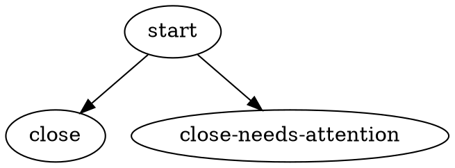

# Workflow Graph

```yaml
---
title: Workflow Graph
spec-id: workflow-graph
requirement-prefix: WG
status: draft
spec-category: foundation-cross-cutting
spec-shape: requirements-first
version: 0.1.0
spec-template-version: 1.1
owner: phase-3-dot
last-updated: 2026-05-23
depends-on:
  - architecture
  - execution-model
  - handler-contract
  - control-points
---
```

## 1. Purpose

This spec is the canonical vocabulary surface for `workflow_mode=dot` workflows: the static artifact a workflow author writes (DOT document on disk), the closed set of node types it admits, the on-disk attribute shapes those node types carry, the edge-condition mini-language used to route between them, the failure-class taxonomy on which routing branches, the on-disk schema-versioning contract, the repo convention for canonical example workflows, and the validation obligations a loader MUST discharge before the engine accepts a graph for execution.

It consolidates four audit-identified gaps (G1 node-type catalog, G2 edge-condition syntax, G5 failure-class taxonomy and routing surface, G6 schema versioning and repo convention) into a single normative surface. It does NOT redefine items that are already locked elsewhere: where another spec owns the underlying mechanism, this spec cites the requirement ID and constrains how the mechanism is exposed at the workflow-graph layer.

The substrate is [execution-model.md §4.1 EM-001] (workflow is a named, versioned directed graph). The runtime mechanics that consume the artifact specified here are owned by [execution-model.md §7.5] (the `dot` workflow-mode dispatcher).

## 2. Scope

### 2.1 In scope

- The static `.dot` artifact: node types, node attributes, edge fields, edge conditions.
- The closed enum of four node types (`agentic`, `non-agentic`, `gate`, `sub-workflow`) and the attribute set each carries.
- The edge-condition mini-language (restricted equality dialect; LHS whitelist; RHS literal types).
- The failure-class taxonomy citation and the routing surface that consumes it.
- Verdict surfacing (via `outcome.preferred_label`) and terminal-node differentiation (via distinct terminal node IDs).
- The graph-level `schema_version` attribute, the N-1 readability contract, and the workflow `version` field's relationship to it.
- The unknown-attribute policy a loader MUST apply at parse time (mixed strict/permissive per §10).
- The repo convention for canonical example workflows (`specs/examples/`) and the per-example documentation sidecar.
- Validation obligations the loader MUST discharge before a `.dot` graph is accepted for execution.

### 2.2 Out of scope

- Runtime dispatch mechanics (handler launch, queue interaction, claim flow, restart behavior) — owned by [execution-model.md §7.5] (`workflow_mode=dot` dispatcher).
- The handler-Outcome wire protocol and per-phase Outcome field semantics — owned by [handler-contract.md §4.5] (Outcome shape) and [handler-contract.md §4.4] (typed error taxonomy that produces `failure_class`).
- The ControlPoint Kind contracts (Gate, Hook, Guard, Budget) and the policy-expression language used in CP guard predicates — owned by [control-points.md §4.5–4.7].
- Generation of `.dot` from natural-language goals — no spec; reserved for future tooling.
- Dynamic mid-run graph mutation — locked-deferred per [architecture.md §4.10].
- Parallel fan-out (`parallel` / `parallel.fan_in` node primitives) — deferred per [architecture.md §4.6] and per the closed-set enum of §3.
- Per-handler agent-type catalogs (Claude Code, Pi, twins) — open-set posture per §3 WG-003; the known-handler list is maintained non-normatively by [handler-contract.md] and per-handler specs.

## 3. Glossary

- **workflow graph** — the named, versioned directed graph defined by [execution-model.md §4.1 EM-001], when represented on disk as a DOT document. The workflow graph is the canonical noun for the artifact this spec governs; the term 'DOT' is used only as a qualifier for the on-disk artifact format (e.g., "DOT attribute", "DOT document"). Synonyms such as "DAG" or bare "graph" are non-preferred; use 'workflow graph' consistently.
- **node** — a graph vertex; one of the four declared types of §3 WG-001. Carries a `type` attribute (mandatory) and zero or more type-specific attributes (§4).
- **edge** — a directed transition between two nodes, with the field set locked by [execution-model.md §4.1 EM-002].
- **node type** — one of the four members of the closed enum `{agentic, non-agentic, gate, sub-workflow}`. See §4.
- **agent type** — a sub-classifier on `agentic` nodes (e.g., `implementer`, `reviewer`). Open set per §4 WG-003.
- **edge condition** — an expression in the restricted dialect of §5 that determines, at routing time, whether an edge is eligible to be selected.
- **failure class** — one of the six members of the closed enum locked by [execution-model.md §8]. Consumed as a routing input per §6, §7.
- **terminal node** — a node declared in the workflow's `terminal_node_ids` list per [execution-model.md §6.1]. See §8.
- **schema version** — the graph-level integer recorded in the DOT artifact per §2 WG-002. Distinct from the workflow's own `version` field (which tracks author intent).
- **schema_version** (DOT attribute) — the graph-level DOT attribute that carries the schema version value. See §2 WG-002.
- **start_node** (DOT attribute) — the graph-level DOT attribute that names the entry-point node for a workflow graph. The corresponding parsed record field is `start_node_id`. See §9 WG-027.

## 4. Node type catalog

### WG-001 — Node types are a closed enum of four

The set of legal `type` values on a workflow node MUST be exactly `{agentic, non-agentic, gate, sub-workflow}`. A loader MUST reject a graph that declares a node with any `type` value outside this set; the rejection is an ingest-time error and the run MUST NOT start. Additions to this set MUST be accompanied by a graph-level `schema_version` bump per §2 WG-002.

The `control-point` value, present in earlier drafts of [execution-model.md §4.2 EM-006], is NOT a node type in `workflow_mode=dot` graphs. Control points bind to node attributes (`gate_ref`, `hook_ref`, `guard_ref`, `budget_ref`) per [control-points.md §4.13 CP-036]; the `gate` node type is the only node-shaped CP Kind. The collapse from five to four is recorded as the v1.0 baseline of this spec (no v0 corpus exists in production).

Tags: mechanism, normative

### WG-002 — Node type catalog table

The following table is normative for the v1.0 schema. Each row declares one node type, the category that drives dispatch shape, the required attributes a loader MUST find on every instance, the optional attributes a loader MUST accept without warning, the legal `outcome.status` values the node MAY return at run time, the `Outcome.kind` discriminator values (per [execution-model.md §4.1 EM-005a]) the node MAY emit, and the handler-contract anchor that governs the dispatch surface.

| `type` (ID) | category | required attrs | optional attrs | legal outcome statuses | Outcome `kind` surface | handler-contract anchor |
|---|---|---|---|---|---|---|
| `agentic` | LLM-driven | `agent_type`, `handler_ref` | `prompt`, `non_committing`, `model`, `effort`, `idempotency_class`, `axis_tags`, `skills_ref`, `freedom_profile_ref`, `budget_ref`, `hook_ref`, `guard_ref` | SUCCESS, FAIL, RETRY, PARTIAL_SUCCESS | `handler_outcome` | [handler-contract.md §4.5] |
| `non-agentic` | deterministic | `handler_ref` | `tool_command`, `timeout`, `idempotency_class`, `axis_tags`, `budget_ref`, `hook_ref`, `guard_ref` | SUCCESS, FAIL, RETRY, PARTIAL_SUCCESS | `handler_outcome` | [handler-contract.md §4.5] |
| `gate` | policy-decision | `gate_ref` | `axis_tags`, `hook_ref` | SUCCESS, FAIL | `gate_decision` | [control-points.md §4.5] |
| `sub-workflow` | composition | `sub_workflow_ref`, `workflow_version` | `input_mapping`, `axis_tags`, `hook_ref`, `guard_ref` | SUCCESS, FAIL, RETRY, PARTIAL_SUCCESS | (inherited from inner run's terminal node) | [execution-model.md §4.10 EM-034] |

Notes:
- `policy_ref` has been removed from all optional-attribute lists. The name is reserved-and-rejected; see [control-points.md §4.12 CP-056]. A loader MUST NOT accept `policy_ref` as a node attribute; doing so is an ingest error (see §10 WG-031).
- `skills_ref` and `freedom_profile_ref` are the typed `*_ref` family per [control-points.md §4.13 CP-055].
- The `*_ref` family is by-name binding per [control-points.md §4.13 CP-036]: the loader resolves each `*_ref` against the policy YAML the workflow loads alongside its DOT artifact; an unresolved reference is an ingest error (§10 WG-026).
- `prompt` (§4 WG-040), `non_committing` (§4 WG-041), `model`, and `effort` (§4 WG-042) are valid ONLY on `agentic` nodes. `model`/`effort` are the highest-precedence (tier-0) input to the model/effort resolution chain of [execution-model.md §4.3 EM-012b]; when present they override the run-level default for the node that carries them. `class` and `model_stylesheet` are INFORMATIVE-only at v1.0 (see §4 WG-043); a loader MUST accept them permissively per §10 WG-031/WG-032 and MUST NOT dispatch on them.
- `tool_command` and `timeout` (§4 WG-039) are valid ONLY on `non-agentic` nodes; a `non-agentic` node carrying `tool_command` is a **tool node** dispatched by the built-in `shell` handler ([handler-contract.md §4.1 HC-063]).

Tags: mechanism, normative

### WG-003 — `agent_type` is an open set

The `agent_type` attribute on `agentic` nodes is an open-set string. A loader MUST NOT reject a graph because an `agent_type` value is unrecognized at parse time; the field is consumed by the handler-resolution step at dispatch time per [handler-contract.md §4.3], where unresolved agent types surface as a `structural` failure on the affected run. The set of known agent types at v1.0 is documented non-normatively by [handler-contract.md] and per-handler specs; that list is not closed by this spec.

The validation weight that a closed `agent_type` enum would carry is supplied by the four-axis tags discipline of [execution-model.md §4.2 EM-011]: a workflow author who introduces a new `agent_type` MUST also declare consistent `axis_tags`, and the engine's pre-run validation checks consistency (§10 WG-029).

Note: pass-6 integration will reconcile this open-set posture against the `agent_type` catalog maintained in per-handler specs; the catalog there is informative and tracks deployed handlers, while WG-003 holds the normative posture for the workflow-graph layer.[^agent-type-tbd]

[^agent-type-tbd]: The cross-reference target for the catalog is TBD at pass-5; pass-6 integration is expected to land an anchor in [handler-contract.md] or in a future `agent-catalog` appendix. The normative posture (open set) does not depend on the catalog's location.

Tags: mechanism, normative

### WG-004 — Non-agentic subtype is an open set

The non-agentic node category carries no `agent_type` field. Subtypes (lint, test, typecheck, build, merge, format, etc.) are distinguished by `handler_ref` plus the four-axis tags of [execution-model.md §4.2 EM-011]. A loader MUST NOT reject a non-agentic node because the bound handler is unrecognized at parse time; unresolved handlers surface as a `structural` failure at dispatch time per [handler-contract.md §4.3].

Tags: mechanism, normative

### WG-005 — `gate` node attribute set

A node with `type=gate` MUST carry **both** (a) a `gate_ref` attribute whose value resolves to a Gate-kind ControlPoint declared in the run's policy YAML per [control-points.md §4.5] and bound by name per [control-points.md §4.13 CP-036], AND (b) a `handler_ref` attribute that names the Gate-evaluator handler responsible for dispatching the evaluator and returning the §4.13 GateDecisionPayload per [control-points.md CP-054 + CP-058]. A `gate` node MAY carry `hook_ref` (binding to a Hook ControlPoint), `skills_ref`, and `axis_tags`; it MUST NOT carry `agent_type`, `idempotency_class`, or `policy_ref`.

The dispatch path for `gate` nodes routes through the handler registry per [execution-model.md §7.5 EM-007 amendment]: the named handler launches the Gate-evaluator surface owned by [control-points.md §4.5 + §4.13]. The pre-Phase-3 EM-007 prose that listed `handler_ref` as `agentic`-only is superseded by the amendment landed in C2; under the amendment, `gate` joins `agentic` and `non-agentic` as node-types that REQUIRE `handler_ref`. See §13 OQ-WG-001 (RESOLVED).

Tags: mechanism, normative

### WG-006 — `sub-workflow` node attribute set

A node with `type=sub-workflow` MUST carry `sub_workflow_ref` (a target workflow's `name` per [execution-model.md §4.1 EM-001]) and `workflow_version` (a target workflow version per [execution-model.md §4.1 EM-001]). It MAY carry `input_mapping` (a typed key→key mapping that projects parent-run context into the inner run's context per [execution-model.md §4.8 EM-034a]) and `axis_tags`.

Expansion semantics are owned by [execution-model.md §4.8 EM-034]: a `sub-workflow` node MUST be expanded in the parent run's checkpoint trail (single-run expansion); node-ID namespacing on expansion is per [execution-model.md §4.8 EM-034a]; expansion-graph acyclicity is per [execution-model.md §4.8 EM-034b].

Tags: mechanism, normative

### WG-007 — Legal outcome statuses per node type

Each node type's row in the §4 WG-002 table is the closed set of `outcome.status` values that the node MAY return at run time, drawn from [execution-model.md §4.1 EM-005]'s status enum `{SUCCESS, FAIL, RETRY, PARTIAL_SUCCESS}`. Nodes of type `gate` MUST NOT return `PARTIAL_SUCCESS` or `RETRY`: a gate either permits (SUCCESS) or denies (FAIL); intermediate or retry semantics on a gate are not coherent. A run that observes an out-of-set status from a node MUST be classified as a `structural` failure per [execution-model.md §8] and the run terminated at a `close-needs-attention` terminal node (§8 WG-016).

Tags: mechanism, normative

### WG-008 — Idempotency-class attribute

A node's `idempotency_class` attribute, when present, MUST be one of `{idempotent, non-idempotent, recoverable-non-idempotent}` per [execution-model.md §4.2 EM-009]. The attribute is required on `agentic` and `non-agentic` nodes per [execution-model.md §4.2 EM-010]; it is forbidden on `gate` and `sub-workflow` nodes. Reconciliation behavior driven by this tag is owned by [execution-model.md §4.2 EM-009] and [reconciliation/spec.md §8].

Tags: mechanism, normative

### WG-039 — Tool-command attributes on `non-agentic` nodes

A `non-agentic` node MAY carry a `tool_command` (string) optional attribute. When `tool_command` is present, the node is a **tool node**: at dispatch time the run executes `tool_command` as a shell command in the run's worktree per the built-in `shell` handler of [handler-contract.md §4.1 HC-063], and the command's exit state is mapped to an Outcome per [handler-contract.md §4.1 HC-063] / §7 WG-017.

A `non-agentic` node MAY carry a `timeout` (integer, seconds) optional attribute. `timeout` is the wall-clock kill bound for the command; when absent, the loader applies a default of `300` seconds. `timeout` is only meaningful on a node that also carries `tool_command`; a `timeout` attribute on a `non-agentic` node without `tool_command` is retained in the AST and ignored.

A `non-agentic` node WITHOUT `tool_command` is unchanged from prior behavior: it carries no tool semantics and its handler dispatch is governed by the §4 WG-002 `non-agentic` row and [handler-contract.md §4.1].

A tool node MUST carry `handler_ref="shell"` (the built-in shell handler of [handler-contract.md §4.1 HC-063]). The `handler_ref="shell"` requirement satisfies the §4 WG-002 `non-agentic` row's required-`handler_ref` obligation and [execution-model.md §7.5.3 EM-057] item 7. A `tool_command` present on a node whose `handler_ref` is not `shell` is a validation warning at v1 (the loader emits the §10 WG-031 warning event and retains the node); it is reserved to become a strict error at the next schema major bump.

**Trust boundary (normative).** `tool_command` is a literal shell string supplied by the `.dot` author. The `.dot` author is a trusted operator. At v1 the value is passed verbatim to `/bin/sh -c`; there is NO sandboxing, NO argument escaping, and NO allow-list of permitted commands. A workflow that admits an untrusted `.dot` author admits arbitrary command execution in the run's worktree under the daemon's privileges. Operators MUST treat `.dot` artifacts as trusted code, equivalent to a checked-in shell script.

**`transient_exit_codes` is reserved.** A tool node controls exactly which exit codes are classified `deterministic` at v1: every non-zero exit is `deterministic` per [handler-contract.md §4.1 HC-063]. The attribute name `transient_exit_codes` (example: `transient_exit_codes="75,111"`) is NOT accepted as a node attribute at v1; it is reserved for a future schema version that may let a tool-node author declare specific exit codes as `transient` so the cascade routes them as retryable infra failures rather than deterministic ones. A tool node carrying `transient_exit_codes` at v1 is a validation warning per §10 WG-031 (the value is retained in the AST and ignored). The constraint is reserved to become strict at the next schema major bump. Deferred until operator demand surfaces. Refs: hk-9j49t.

Tags: mechanism, normative

### WG-040 — Inline prompt attribute on `agentic` nodes

An `agentic` node MAY carry a `prompt` (string) optional attribute. `prompt` is the node's brief: the natural-language instruction the agent receives for this node's dispatch.

When `prompt` is present on an **implementer-class** `agentic` node, it REPLACES the bead-derived task body for that node's dispatch: the agent's task brief is `prompt` verbatim, not the bead's body. The bead `Title` and bead ID remain in the per-dispatch task artifact's header for traceability (per [handler-contract.md §4.2 HC-006a, the `agent-task.md` content row]); only the body is overridden.

When `prompt` is absent, the node's brief is the bead-derived body, exactly as prior behavior.

`prompt` is **input-only**: it affects the task brief delivered to the agent and does NOT alter the Outcome contract ([execution-model.md §4.1 EM-005]), the routing cascade ([execution-model.md §4.10 EM-041]), or any handler-emitted field.

`prompt` composes with a graph-level `goal` (§4 WG-044): `goal` is the run-level objective threaded via the run-level ExtraContext channel, while `prompt` is the node-level task body; they occupy distinct channels and do NOT double-inject (see [execution-model.md §7.5] launch-surface and the B↔E composition note).

**Reviewer-class scope (v1).** A `prompt` on a **reviewer-class** `agentic` node (resolved by the node's reviewer-class binding, e.g. `agent_type="reviewer"` / `handler_ref="claude-reviewer"`) is accepted-but-inert at v1: the reviewer's brief is sourced from the review-target artifact per [execution-model.md §4.3 EM-015d (sub-clause EM-015d-RIA)] and is NOT overridden by `prompt`. The loader retains the `prompt` attribute in the AST and emits no error; the value is ignored for reviewer-class dispatch. Reviewer-class `prompt` override is reserved for a future schema version.

A `prompt` on a `non-agentic` or `gate` node is a validation warning at v1 per §10 WG-031 (those node types dispatch no agent that reads a brief); the value is retained in the AST and ignored.

Tags: mechanism, normative

### WG-041 — Non-committing attribute on `agentic` nodes

An `agentic` node MAY carry a `non_committing` (boolean) optional attribute. When `non_committing="true"` on an **implementer-class** `agentic` node, the node returns `SUCCESS` on a clean agent exit WITHOUT requiring the worktree HEAD to advance past its pre-launch value; the engine does NOT treat a no-commit clean exit as a failure for that node. When `non_committing` is absent or `"false"` (the default), an implementer-class node that exits cleanly without advancing HEAD is a node failure, as in prior behavior.

A `non_committing` clean exit yields `Outcome{status = SUCCESS}` at v1; the engine does NOT inspect a work product, an embedded `{"status":...}` marker, or any other artifact to derive a non-`SUCCESS` outcome from a `non_committing` node. SUCCESS-without-commit is already a legal Outcome per [execution-model.md §4.1 EM-005]; `non_committing` relaxes an engine-side HEAD-advance check, it does not introduce a new Outcome shape.

**Authoring rule (normative).** A `non_committing` node produces no committed work product the engine validates; the engine cannot distinguish a good no-commit exit from a bad one. A workflow author MUST pair every `non_committing` node with a downstream validating `non-agentic` tool node (per §4 WG-039) that inspects the node's work product and exit-codes the routing decision. The engine does not enforce the pairing; it is an authoring obligation documented in the canonical example sidecar.

**`auto_status` is reserved.** A `non_committing` node controls exactly one axis: commit-or-not. It does NOT derive status from a work product or an embedded marker. The attribute name `auto_status` is NOT accepted as a node attribute at v1 (it would mislead authors into expecting status-derivation that does not exist); `auto_status` is reserved for a future status-derivation feature. Pipelines ported from external `auto_status=true` semantics MUST use `non_committing="true"`.

A `non_committing` attribute on a **reviewer-class** `agentic` node, a `non-agentic` node, or a `gate` node is a validation warning at v1 per §10 WG-031 (those dispatch paths do not reach the implementer HEAD-advance check); the value is retained in the AST and ignored.

Tags: mechanism, normative

### WG-042 — Per-node `model` / `effort` attributes on `agentic` nodes

An `agentic` node MAY carry an optional `model` attribute and/or an optional `effort` attribute. When present, the attribute overrides the run-level `(model, effort)` pair sealed at claim time (per [execution-model.md §4.3 EM-012b]) **for that node's dispatch only** (the override mechanism is normative in [execution-model.md §4.3 EM-012b], sub-clause EM-012b-NODE).

- **`model`** (string, optional). An opaque model alias. A loader MUST validate it for **shape only** — non-empty when present, matching `^[A-Za-z0-9._:/-]+$`, at most 128 characters — per the value-opacity invariant of [execution-model.md §4.3 EM-012b] and [execution-model.md §6.1] `ModelPreference`. harmonik MUST NOT verify that the value names a real model; handler-side launch failure is the authoritative compatibility check.
- **`effort`** (string, optional). A loader MUST require the value to be a member of the closed enum `{low, medium, high, xhigh, max}` per [execution-model.md §6.1] `EffortLevel`. An out-of-enum `effort` value on a node attribute is an **ingest-time strict error**: the graph is static, so the loader MUST reject it at load and the run MUST NOT start. (This is stricter than tier-1's runtime bead-label path in [execution-model.md §4.3 EM-012b], which treats an unrecognised label as absent and emits `bead_label_conflict`; that runtime relaxation applies only to bead labels, not to static node attributes.)
- `model` and `effort` are independent: a node MAY carry one without the other. A node carrying only `model` inherits the run-level `effort`, and vice versa.
- Both attributes are valid ONLY on `agentic` nodes. A `model` or `effort` attribute on a `non-agentic`, `gate`, or `sub-workflow` node, on an edge, or at the graph level, is a reserved-attribute-out-of-position strict error per §10 WG-031.

Tags: mechanism, normative

### WG-043 — `class` / `model_stylesheet` (informative)

Some upstream pipelines select per-node models via a graph-level CSS `model_stylesheet` (a `*`-default selector plus a `.hard`-class override) together with a per-node `class` attribute. harmonik does NOT interpret `class` or `model_stylesheet` at v1.0: a loader accepts them permissively per §10 WG-031/WG-032 (warned, retained in `UnknownAttrs`) and the dispatcher MUST NOT route on them. Neither name is added to the §10 WG-031 reserved set.

To port such a pipeline to harmonik, translate each `.hard { llm_model: <model> }` rule plus `class="hard"` into a direct `model="<alias>"` attribute on each classed node (per §4 WG-042 and [execution-model.md §4.3 EM-012b] tier 0), and drop `llm_provider` (handler binding is fixed per [handler-contract.md §4.1 HC-003]). Promoting `model_stylesheet` to a normative selector mechanism (e.g. for more than two model tiers, or selector indirection) is a clean future amendment; the direct `model`/`effort` attributes remain the floor. Deferred to hk-1xzg3.

Tags: informative

### WG-044 — Graph-level `goal` attribute

A `workflow_mode = dot` graph MAY carry a graph-level `goal` DOT attribute: a free-form string stating the run's objective. A loader MUST parse `goal` into the typed `Graph.Goal` field ([execution-model.md §6.1] Workflow RECORD); it is a reserved graph-level attribute name per §10 WG-031 (a `goal` attribute on a node or edge is a reserved-attribute-out-of-position strict error). When `goal` is present, the daemon MUST surface it to `agentic`-node briefs (per [claude-hook-bridge.md §4 CHB-028]) as the run-level objective, threaded through the run-level ExtraContext channel ([execution-model.md §7.5]); it composes with — and does NOT replace — any per-node `prompt` attribute (§4 WG-040) and the bead-derived body. `goal` MAY contain template-param placeholders (§4 WG-045), which are substituted at launch before parse (§4 WG-045). A graph with no `goal` leaves the brief bead/prompt-driven, unchanged from prior behavior.

`goal` joins `workflow_class` and `context_keys` as a typed, dispatcher-surfaced graph-level attribute.

Tags: mechanism, normative

### WG-045 — Template-param substitution over `.dot` source text

A `.dot` source MAY contain template-param placeholders matching the grammar `__[A-Z][A-Z0-9_]*__` (double-underscore-delimited, an uppercase leading letter, then uppercase letters, digits, and underscores). At run launch, the daemon MUST apply a **single substitution pass over the raw `.dot` source text — before parsing the graph (before the §9 / [execution-model.md §7.5] parse step)** — replacing each placeholder with the corresponding value from the run's launch-time **param map**. The param-map key for a placeholder is the placeholder name with the delimiting double-underscores removed (the map key `ISSUE_NUMBER` substitutes the token `__ISSUE_NUMBER__`).

Substitution scope is the **entire source text**, not the parsed AST: placeholders MAY appear inside any attribute value — `goal` (§4 WG-044), node `tool_command` (§4 WG-039), node `prompt` (§4 WG-040), or any other attribute — and a single source-text pass substitutes all of them uniformly. A loader MUST NOT substitute by walking the parsed AST (an AST walk would miss tokens in attributes the parser retains in `UnknownAttrs`).

Substitution MUST occur exactly once, at launch, before parse and validation, and MUST NOT be re-applied during the run (parallels the resolve-once discipline of [execution-model.md §4.3 EM-012b]). The param map is sealed into the Run record ([execution-model.md §6.1]) so a replay re-substitutes identically.

After the substitution pass, **any residual token matching the grammar `__[A-Z][A-Z0-9_]*__` is a launch-time error**: the daemon MUST refuse to start the run, MUST NOT dispatch a literal `__TOKEN__` into any node attribute or shell command, and MUST report the offending token(s). A `.dot` source containing no placeholders is unaffected (the pass is a no-op).

**Trust boundary (normative).** Param values are operator-supplied and TRUSTED. Substitution occurs over raw source text before parse, so a param value MAY contain DOT syntax, shell metacharacters, or further `__…__` tokens; the daemon does NOT sanitize, escape, or quote param values, and a param value that injects malformed DOT surfaces as a normal parse/validation error against the substituted text. Operators MUST treat `--param` values with the same trust they treat the `.dot` artifact itself. (A param value that itself contains a `__UPPER_SNAKE__` token is substituted only by the single pass — the pass is not recursive — so such a token survives into the substituted text and trips the residual-token launch error of the preceding paragraph.)

Tags: mechanism, normative

### WG-046 — Substitution ordering invariant

The load-to-dispatch ordering for a `workflow_mode = dot` run is: **read source → substitute params (§4 WG-045) → parse → validate (§9) → dispatch.** Because substitution precedes parse, every downstream consumer — node `tool_command` (§4 WG-039), node `prompt` (§4 WG-040), `goal` (§4 WG-044), and any validation rule of §9 — operates on the concrete (substituted) graph. A loader MUST NOT reorder these steps; in particular it MUST NOT validate or dispatch a graph carrying unsubstituted placeholders, and MUST NOT substitute after parse.

Tags: mechanism, normative

## 5. Edge semantics

### WG-009 — Edge fields are EM-002's locked set

An edge in a `workflow_mode=dot` graph MUST carry exactly the field set locked by [execution-model.md §4.1 EM-002]: `from_node`, `to_node`, an optional `condition` (in the dialect of §5), an optional `preferred_label`, a `weight`, and an `ordering_key`. No additional edge fields are introduced by this spec. A loader MUST reject a graph that declares an edge attribute outside this set, subject to the unknown-attribute policy of §10 (a non-reserved attribute is retained in the AST with a warning; a reserved attribute used outside its declared position is a strict error).

Tags: mechanism, normative

### WG-010 — Edge-selection cascade

Edge selection at run time MUST follow the five-step cascade locked by [execution-model.md §4.10 EM-041]. This spec cites the cascade verbatim and does not redefine it. The five steps are:

1. **Conditional match.** Evaluate `condition` on every outgoing edge against the just-completed node's Outcome and the run's context. Edges whose condition evaluates true form the conditional-match set.
2. **`preferred_label` match.** If the Outcome carries a non-empty `preferred_label`, restrict the conditional-match set to edges whose `preferred_label` matches.
3. **Highest `weight`.** Restrict the surviving set to edges of the highest `weight` value present in the set.
4. **`ordering_key` tiebreak.** If more than one edge survives, select the edge with the lexicographically smallest `ordering_key`.
5. **Unconditional fallback.** If the conditional-match set is empty AND an outgoing edge with no `condition` exists, select that edge (subject to §5 WG-011's invariant).

Tags: mechanism, normative

### WG-011 — Unconditional-edge fallback invariant

If steps 1–4 of §5 WG-010 yield no surviving edge AND at least one outgoing edge has no `condition` (an unconditional edge), the engine MUST take an unconditional edge before declaring `no_outgoing_edge_matches`. The unconditional-fallback step is non-negotiable: it is the structural guarantee that a workflow author who declares a default route from a node has expressed an intent the engine MUST honor.

This invariant is per `D-edge-cascade-invariant` (pass-3 design); it promotes a behavior that previously appeared only in the audit-V3.2 fix to a day-one invariant of the cascade.

Tags: mechanism, normative

### WG-012 — No-match-set fallback

If §5 WG-010's full cascade (including the unconditional-fallback of §5 WG-011) yields no edge, the engine MUST classify the transition as a `structural` failure with reason `no_outgoing_edge_matches` per [execution-model.md §8] and [execution-model.md §4.10 EM-046a]. The reason field is the discriminator that distinguishes a missing-edge failure from other structural failures.

Tags: mechanism, normative

## 6. Edge-condition language

### WG-013 — Dialect is a restricted equality mini-language

The `condition` field on an edge MUST be expressed in the restricted equality dialect specified by this section. The dialect is intentionally narrower than [control-points.md §4.7]'s guard-predicate language: edge conditions are written by workflow authors (high-frequency, must be readable at a glance); guard predicates are written by policy authors (lower-frequency, may tolerate more expressivity). The two dialects are NOT interchangeable.

The grammar (informative EBNF):

    condition       ::= conjunction
    conjunction     ::= equality ( "&&" equality )*
    equality        ::= lhs op literal
    op              ::= "==" | "!="
    lhs             ::= "outcome." outcome-field | "context." context-key
    outcome-field   ::= "status" | "preferred_label" | "failure_class" | "kind"
    context-key     ::= IDENT  // see §6 WG-015
    literal         ::= string-literal | integer-literal | enum-literal
    string-literal  ::= "'" CHAR* "'"
    integer-literal ::= DIGIT+
    enum-literal    ::= IDENT  // restricted to the closed enums of §7, EM-005, EM-005a

The dialect admits ONLY:

- Equality (`==`) and inequality (`!=`) comparisons.
- Logical AND (`&&`) between equality expressions.
- A single-quoted string, a non-negative integer, or a member of one of the closed enums declared in §7 (failure class), [execution-model.md §4.1 EM-005] (status), or [execution-model.md §4.1 EM-005a] (kind) as the RHS.

The dialect does NOT admit: parentheses, logical OR (`||`), logical NOT (`!`), comparison operators other than `==` / `!=` (no `<`, `>`, `<=`, `>=`), function calls, arithmetic, or compound RHS expressions. A workflow author who needs disjunction MUST declare multiple edges; the cascade of §5 WG-010 selects among them deterministically.

Tags: mechanism, normative

### WG-014 — LHS whitelist

The LHS of an equality in an edge condition MUST be one of the following:

- `outcome.status` — values drawn from [execution-model.md §4.1 EM-005]'s status enum.
- `outcome.preferred_label` — an arbitrary string declared by the just-completed node's Outcome per [handler-contract.md §4.5].
- `outcome.failure_class` — values drawn from §7's six-class enum. Legality of this LHS is per `D1` (pass-3 design); it is the routing input that distinguishes transient retries from structural escalation.
- `outcome.kind` — values drawn from [execution-model.md §4.1 EM-005a]'s `Outcome.kind` discriminator (`handler_outcome`, `gate_decision`, etc.).
- `context.<key>` — references to context keys declared in the workflow's `context_keys` graph-level attribute (§10 WG-031a). At v1.0, type-pinning of declared context keys is still open (see §13 OQ-WG-002).

A loader MUST reject a graph that declares an edge condition with an LHS outside this whitelist (strict policy per §10 WG-024); the rejection is an ingest-time error.

Tags: mechanism, normative

### WG-015 — RHS literal types

The RHS of an equality MUST be one of:

- A single-quoted string literal (e.g., `'APPROVE'`).
- A non-negative integer literal (e.g., `3`).
- An identifier that names a closed-enum member from §7 (failure class), [execution-model.md §4.1 EM-005] (status), or [execution-model.md §4.1 EM-005a] (kind) (e.g., `transient`, `SUCCESS`, `handler_outcome`).

A loader MUST reject an edge whose RHS literal references an unknown enum member (strict policy per §10 WG-025); status and failure-class enum membership is checked at parse time.

Tags: mechanism, normative

### WG-016 — Edge conditions and guard predicates are distinct dialects

This spec's edge-condition dialect (§6 WG-013) is NOT the policy-expression language of [control-points.md §4.7]. A guard predicate on a ControlPoint MAY use the richer surface of [control-points.md §4.7]; an edge condition in a `.dot` graph MUST NOT. A loader MUST reject an edge condition that uses any construct outside the §6 grammar, even if the same construct is legal in a guard predicate.

Tags: mechanism, normative

## 7. Failure-class taxonomy and routing inputs

### WG-017 — Failure-class taxonomy is EM §8's locked six-class set

The failure-class taxonomy at the workflow-graph layer is the closed six-class enum locked by [execution-model.md §8]:

- `transient` — a failure expected to recover on retry (network glitch, rate limit, etc.).
- `structural` — a failure rooted in graph or environment shape (missing handler, no-edge-matches, missing reference, schema violation).
- `deterministic` — a failure that will repeat under identical inputs (logic bug, test failure on stable test data).
- `canceled` — operator-initiated cancellation or context-deadline expiry.
- `budget_exhausted` — a Budget-kind ControlPoint denied continuation per [control-points.md §4.6].
- `compilation_loop` — a repeated-rollback termination per [execution-model.md §4.9 EM-040].

This spec cites the enum and does not redefine the membership. Detection rules, default responses, escalation paths, and emitted events for each class are owned by [execution-model.md §8].

Tags: mechanism, normative

### WG-018 — `failure_class` is a top-level field on FAIL outcomes; two-sided contract

`failure_class` is a top-level field on the Outcome record, placed alongside `status` and `preferred_label` rather than nested under a sub-object.

**Handler-side (emission):** A handler MAY omit `failure_class` on a FAIL outcome; it MUST be absent when `outcome.status` is `SUCCESS`, `PARTIAL_SUCCESS`, or `RETRY`. Per [handler-contract.md §4.2a HC-058], the field is OPTIONAL on FAIL outcomes — the daemon-side post-classifier back-fills it when the handler omits it. When `outcome.status == RETRY`, the field MUST be absent (it is not advisory on RETRY at the handler layer).

**Daemon-side (enforcement):** After the daemon's post-classifier runs, the Outcome record MUST carry `failure_class` whenever `outcome.status == FAIL`. The cascade of §5 WG-010 reads `outcome.failure_class` (via the LHS whitelist of §6 WG-014) and requires a populated value for failure-class-conditional routing to be deterministic.

The wire-protocol detail for the field's on-the-wire representation is owned by [handler-contract.md §4.5].

Placement per `D2` (pass-3 design): top-level placement makes the field directly addressable by the §6 LHS whitelist (WG-014's `outcome.failure_class`); a nested placement would require the dialect to admit dotted paths beyond `outcome.<field>`.

Classification authority (the mapping from a handler's typed error to a `failure_class` value) is per [handler-contract.md §4.4]'s mechanism-tagged `ErrX` sentinels: `ErrTransient` → `transient`, `ErrStructural` → `structural`, `ErrDeterministic` → `deterministic`, `ErrCanceled` → `canceled`, `ErrBudget` → `budget_exhausted`. The `compilation_loop` class is detected by the engine per [execution-model.md §4.9 EM-040], not produced by a handler.

Tags: mechanism, normative

### WG-019 — Verdict surfacing is via `outcome.preferred_label`

In review-loop-style sub-graphs (and any workflow whose dispatcher needs to route on a verdict), the verdict MUST be surfaced via `outcome.preferred_label` per `D-verdict-surfacing` (pass-3 design). Workflow authors route on `outcome.preferred_label == 'APPROVE'`, `outcome.preferred_label == 'REQUEST_CHANGES'`, `outcome.preferred_label == 'BLOCK'`, etc. No first-class `verdict` field is introduced; the same `preferred_label` channel that drives the cascade's step-2 match (§5 WG-010) carries the verdict.

Tags: mechanism, normative

### WG-020 — No `retry_target` attribute at v1.0

This spec does NOT introduce `retry_target`, `fallback_retry_target`, or any other side-channel attribute that competes with the edge cascade for routing authority. Retry behavior MUST be expressed via the edge cascade:

- Same-node retry on `outcome.status == 'RETRY'` is owned by [execution-model.md §4.10 EM-046b]'s RETRY protocol; no graph-level attribute is required.
- Cross-node retry on a transient failure is expressed by declaring an edge with `condition="outcome.status == 'FAIL' && outcome.failure_class == 'transient'"` whose `to_node` is the retry target.
- Cross-node fallback on a non-transient failure is expressed by declaring an edge with `condition="outcome.status == 'FAIL'"` (matched at lower priority by the cascade) whose `to_node` is the fallback target.

Decision per `D-attractor-adoption` (pass-3 design): harmonik's `failure_class`-as-LHS (§7 WG-018, §6 WG-014) gives equivalent expressivity to an Attractor-style `retry_target` primitive through a single routing channel (the cascade). Introducing a second channel would create a "where does retry routing live?" ambiguity. The position remains future-tractable: a later spec amendment MAY introduce `retry_target` if the single-channel expressivity proves inadequate.

Tags: mechanism, normative

## 8. Terminal nodes

### WG-021 — Distinct terminal node IDs

Terminal-state semantics in a `workflow_mode=dot` graph MUST be communicated by **distinct terminal node IDs**: a workflow that has multiple terminal outcomes (normal close, needs-attention close, paused close, etc.) MUST declare a distinct terminal node for each outcome, and the run's terminal node ID MUST be the surface the orchestrator and downstream consumers read. This spec does NOT introduce a `terminal_kind` attribute and does NOT direct consumers to inspect the last edge's `preferred_label` to determine outcome.

Per `D12` (pass-3 design): node identity equals node semantics; the `.dot` artifact makes the alternative outcomes visually distinct at the graph layer; the mechanism matches the existing review-loop reservation in [execution-model.md §4.3 EM-015d].

Tags: mechanism, normative

### WG-022 — Reserved terminal node IDs

At v1.0, two terminal node IDs are reserved across all `workflow_mode=dot` graphs:

- `close` — normal completion. The default close path; signals the orchestrator (and Beads, per [beads-integration.md §4.4]) to apply a successful close.
- `close-needs-attention` — operator-attention close. Signals the orchestrator to apply the `needs-attention` close path of [execution-model.md §3] (and the corresponding Beads label per [beads-integration.md §4.4] and [operator-nfr.md §4.3]).

Workflow authors MAY declare additional terminal node IDs (e.g., `close-paused`, `close-budget-exhausted`) consistent with the open-set posture of §4 WG-003 and §4 WG-004. Additional terminal IDs are NOT reserved by this spec; consumers MUST treat unknown terminal IDs per the policy of §10 WG-027 (permissive at the graph layer; consumer-specific routing is downstream).

The reservation is general across `workflow_mode=dot`; [execution-model.md §4.3 EM-015d]'s review-loop-specific reservation is a special case of this general rule.

Tags: mechanism, normative

### WG-023 — Terminal-node detection

The engine MUST detect terminal state per [execution-model.md §4.9]'s terminal-state-detection rule: a run enters terminal state when its current node is declared in the workflow's `terminal_node_ids` list per [execution-model.md §6.1]. No outgoing edges are followed from a terminal node; if a workflow declares outgoing edges from a node in `terminal_node_ids`, a loader MUST reject the graph (strict policy per §10 WG-028).

Tags: mechanism, normative

## 9. Validation rules

### WG-024 — Reserved-attribute strictness

A loader MUST check the following at parse time and reject the graph on any violation (the run MUST NOT start):

- The `type` attribute on every node is present and is one of the four members of §4 WG-001.
- The required attribute set per §4 WG-002 is present on each node (e.g., `gate_ref` on `gate` nodes, `sub_workflow_ref` and `workflow_version` on `sub-workflow` nodes).
- Forbidden attributes are absent (e.g., `agent_type` on a `non-agentic` node, `idempotency_class` on a `gate` node, `policy_ref` on any node). NOTE: `handler_ref` is REQUIRED on `gate` and `non-agentic` nodes per the EM-007 amendment (see §4 WG-005, [execution-model.md §7.5]).
- Each `*_ref` attribute resolves to a declaration in the run's policy YAML per [control-points.md §4.13 CP-036]; an unresolved reference is a strict error.
- `idempotency_class`, where required, is a member of [execution-model.md §4.2 EM-009]'s closed enum.
- On a `non-agentic` node carrying `tool_command`, `handler_ref` MUST equal `shell`. A `tool_command` on a node whose `handler_ref` resolves to any other handler is a warning at v1 per §10 WG-031 (not a strict error); the constraint is reserved to become strict at the next schema major bump. `timeout`, when present, MUST be a non-negative integer; a non-integer or negative `timeout` is a strict error.

Tags: mechanism, normative

### WG-025 — Edge-condition strictness

A loader MUST parse each edge `condition` against the grammar of §6 WG-013 and reject the graph if any condition violates the dialect, the LHS whitelist (§6 WG-014), or the RHS literal types (§6 WG-015). Membership in a closed enum (status, kind, failure class) is checked at parse time; an unknown enum-member identifier on the RHS is a strict error.

Tags: mechanism, normative

### WG-026 — Reference resolution

A loader MUST resolve every reference (`handler_ref`, `gate_ref`, `hook_ref`, `guard_ref`, `budget_ref`, `skills_ref`, `freedom_profile_ref`, `sub_workflow_ref`) at parse time against the run's policy YAML and (for `sub_workflow_ref`) the workflow registry. An unresolved reference is a strict error. Note: `policy_ref` is a reserved-and-rejected name and MUST NOT appear in any valid workflow graph; see [control-points.md §4.12 CP-056] and §10 WG-031.

Tags: mechanism, normative

### WG-027 — Well-formedness checks

A loader MUST verify the following structural properties at parse time and reject the graph on any violation:

- Exactly one node is declared as the `start_node` (DOT graph-level attribute per §3 Glossary) per [execution-model.md §6.1]; the corresponding parsed record field is `start_node_id`.
- The `terminal_node_ids` list per [execution-model.md §6.1] is non-empty.
- Every node declared in `terminal_node_ids` exists in the node set.
- Every node ID referenced by an edge's `from_node` or `to_node` exists in the node set.
- Every node reachable from the `start_node` either has at least one outgoing edge OR is a member of `terminal_node_ids`.
- Every node in `terminal_node_ids` is reachable from the `start_node`.
- No node in `terminal_node_ids` has outgoing edges (§8 WG-023).

Reachability checking and cycle-bound checks are obligations of the pre-run validation step of [execution-model.md §6.4].

Tags: mechanism, normative

### WG-028 — Cycle bounding

A loader MUST verify that every edge in the graph carries a per-edge traversal cap per [execution-model.md §4.9 EM-043] (or inherits a workflow-level default), and MUST reject the graph if any cycle in the graph contains an edge without an effective cap. The traversal-counter storage locus is per [execution-model.md §4.9 EM-043].

Tags: mechanism, normative

### WG-029 — Sub-workflow acyclicity

A loader MUST verify, by transitive expansion of every `sub-workflow` node, that the expansion graph is acyclic per [execution-model.md §4.10 EM-034b]. A direct or indirect sub-workflow self-reference is a strict error.

Tags: mechanism, normative

### WG-030 — Axis-tag consistency

When `axis_tags` are present on a node, a loader SHOULD verify the tag values are drawn from the four-axis catalog of [execution-model.md §4.2 EM-011]; an unrecognized axis-tag value is a warning, not an error, per the permissive policy of §10 WG-031 (the catalog is open at the workflow-graph layer; per-handler specs may pin tighter constraints).

Tags: mechanism, normative

## 10. Unknown-attribute policy

### WG-031 — Mixed strict/permissive policy

A loader MUST apply a **mixed** policy to attributes encountered during DOT parsing, per `D9` (pass-3 design):

**Strict positions** — an unknown value at one of the following positions is an ingest error; the run MUST NOT start:

- The `type` attribute value on a node (closed enum per §4 WG-001).
- A reserved attribute name used outside its declared position. The reserved set at v1.0 is: `type`, `agent_type`, `handler_ref`, `gate_ref`, `sub_workflow_ref`, `workflow_version`, `input_mapping`, `idempotency_class`, `axis_tags`, `tool_command`, `timeout`, `transient_exit_codes` (node-level, `non-agentic` tool nodes only; reserved-and-warning at v1 per §4 WG-039; see [handler-contract.md §4.1 HC-063]), `prompt`, `non_committing`, `model`, `effort`, `policy_ref` (reserved-and-rejected name; see [control-points.md §4.12 CP-056]), `hook_ref`, `guard_ref`, `budget_ref`, `skills_ref`, `freedom_profile_ref`, `schema_version`, `version`, `condition`, `preferred_label`, `weight`, `ordering_key`, `start_node`, `terminal_node_ids`, `context_keys` (graph-level per [handler-contract.md §5.6 HC-062]; see WG-031a), `goal` (graph-level per §4 WG-044).

  Position rules: `tool_command` / `timeout` / `transient_exit_codes` are node-level (`non-agentic` only); `prompt` / `non_committing` / `model` / `effort` are node-level (`agentic` only); `goal` is graph-level. A name used outside its declared position is the WG-031 strict error and the run MUST NOT start. `class` and `model_stylesheet` are NOT in the reserved set (permissive/informative per WG-043). The WG-045 template-param surface is a load-time text transform, not an attribute, and adds no reserved name.
- The RHS of an equality in an edge condition, when the RHS names a closed-enum member (per §7, [execution-model.md §4.1 EM-005], or [execution-model.md §4.1 EM-005a]).
- The LHS of an edge condition (whitelist per §6 WG-014).

**Permissive positions** — an unknown name at one of the following positions is a warning, retained in the parsed AST (NOT silently dropped), and ignored by the dispatcher:

- A non-reserved node attribute name (e.g., a workflow author tags a node with `priority="P1"` for their own tooling).
- A non-reserved edge attribute name.
- An `agent_type` string on an `agentic` node (open set per §4 WG-003).
- An `axis_tags` value unrecognized by the four-axis catalog of [execution-model.md §4.2 EM-011] (warning per §9 WG-030).
- A terminal node ID outside the reserved pair of §8 WG-022.

The warning event MUST be emitted at the same lifecycle moment as other pre-run validation warnings; the specific event type and emission moment is owned by [execution-model.md §7.5] (pass-6 integration is expected to bind the warning to an existing pre-run-validation event type).

Rationale: strict-on-enums protects the engine from a v2 graph running silently against a v1 engine with mis-routed nodes; permissive-on-attributes preserves [execution-model.md §6.4]'s additive-bump posture, where a new attribute introduced in a minor schema bump MUST NOT break a reader on the prior minor schema. The mixed policy threads both constraints.

Tags: mechanism, normative

### WG-031a — `context_keys` is a graph-level DOT attribute

A workflow graph MAY carry a graph-level `context_keys` DOT attribute whose value is a comma-separated list of identifier names (e.g., `context_keys="bead_id,pr_url,target_branch"`). This attribute declares the set of context keys the workflow expects to be present at runtime and that may appear as `context.<key>` on the LHS of edge conditions (§6 WG-014).

Per [handler-contract.md §5.6 HC-062], the attribute is a graph-level declaration site: a `context_keys` attribute appearing on a node or edge is a reserved-attribute-out-of-position strict error per §10 WG-031.

At v1.0, a loader MUST accept and parse `context_keys`; it MUST NOT validate individual `context.<key>` LHS references in edge conditions against the declared list (type-pinning of declared context keys is still open — see §13 OQ-WG-002). A loader MUST retain the parsed `context_keys` list in the AST for tooling and downstream consumers.

Tags: mechanism, normative

### WG-032 — AST retention of unknown permissive attributes

A loader MUST retain unknown permissive attributes in the parsed AST after warning emission; it MUST NOT silently drop them. The retained attributes are available to debugging tools, replay tooling, and policy-extension probes; the dispatcher consults the closed reserved set only. This is the structural guarantee that an unrecognized attribute introduced by a downstream tool can be inspected post-run without re-parsing the source `.dot` file.

Tags: mechanism, normative

## 11. Schema version

### WG-033 — Schema version is graph-level

Every `workflow_mode=dot` graph MUST carry a graph-level `schema_version` attribute. Per `D10` (pass-3 design), `schema_version` is graph-level ONLY: per-node `schema_version` attributes are NOT introduced by this spec, and a loader MUST treat a `schema_version` attribute appearing on a node or edge as a reserved-attribute-out-of-position strict error per §10 WG-031.

The current schema version is `1`. The attribute is encoded as a DOT graph attribute (e.g., `schema_version="1"`).

Tags: mechanism, normative

### WG-034 — N-1 readability

A `workflow_mode=dot` engine MUST be able to read a graph whose `schema_version` is one major version older than the engine's current schema version, per [execution-model.md §6.4]'s N-1 readability contract. A graph at schema version older than N-1 MAY be rejected with a structural failure.

Additive minor-version bumps (new permissive attribute introduced; existing attribute semantics unchanged) MUST NOT break readers at the prior minor version, by virtue of the permissive policy of §10 WG-031. A major-version bump signals a vocabulary change (e.g., a new node type added to §4 WG-001, an enum member added to §7 WG-017, a new edge field introduced) and is the case where the N-1 contract applies.

Tags: mechanism, normative

### WG-035 — Workflow `version` is distinct from `schema_version`

A `workflow_mode=dot` graph MUST also carry the workflow's own `version` field per [execution-model.md §4.1 EM-001]. The two fields are distinct:

- `version` tracks **author intent**: an increment signals a revision to a specific workflow's behavior (e.g., the workflow author added a new node, changed a routing condition, etc.).
- `schema_version` tracks **vocabulary format**: an increment signals a change to the on-disk DOT vocabulary that this spec governs (e.g., a new node type added to §4 WG-001).

Both fields are graph-level. Neither composes with the other (a workflow at `version="2.1"` can carry `schema_version="1"`; a workflow at `version="1.0"` can carry `schema_version="2"`). The DOT attribute spellings are `version="..."` and `schema_version="..."` to make the two visually distinct in the `.dot` source.

Tags: mechanism, normative

## 12. Repo convention

### WG-036 — Canonical example workflows live in `specs/examples/`

Canonical example `.dot` workflows that exercise this spec MUST live at the repo-relative path `specs/examples/`. The path is normative: the engine's example-loader looks there; the test harness round-trips files in this directory through the validator per [scenario-harness.md] (see C5 of `phase-3-dot`). Filenames are `<workflow-name>.dot`.

At v1.0, the minimum canonical example is `specs/examples/review-loop.dot`. Additional canonical examples MAY be added; each MUST satisfy WG-037.

Per `D11` (pass-3 design): declaring `specs/examples/` only (not also a project-local path such as `.harmonik/workflows/`) is the minimal commitment that closes G6. A future addendum MAY declare a project-local workflow path; that decision is deferred per §13 OQ-WG-004.

Tags: mechanism, normative

### WG-037 — Per-example documentation sidecar

Each `.dot` file under `specs/examples/` MUST have a sibling `<name>.md` documentation file that records:

- Which spec sections (WG-NNN, EM-NNN, etc.) the workflow exercises.
- The expected golden trace (per the two-layer testing plan of [scenario-harness.md], to be authored as C5 of `phase-3-dot`).
- Any reserved context-key dependencies the workflow assumes.

The sidecar is the mechanism by which a reviewer-agent verifies that a canonical example is a faithful test case for this spec's vocabulary.

Tags: mechanism, normative

### WG-038 — Project-local workflow paths are out of scope at v1.0

A v1.0 engine MUST accept a `.dot` path argument from any filesystem location (subject to operator policy); this spec does NOT declare a project-local path such as `.harmonik/workflows/` as normative. A future addendum may declare such a path with the loader-discovery and override semantics it requires; the current spec defers the decision per §13 OQ-WG-004.

Tags: mechanism, normative

## 13. Open questions and forward compatibility

The following items are explicitly NOT closed by this spec. Each is tracked for resolution in a later pass or follow-up bead.

**OQ-WG-001 — `gate` node dispatch path vs. EM-007.** RESOLVED at pass-5: option (a) adopted by C2's EM-007 amendment + C4's CP-054 — `gate` (and `non-agentic`) nodes REQUIRE `handler_ref`. See §4 WG-005. No pass-6 reconciliation needed; this OQ is retained as a history marker.

**OQ-WG-002 — `context_keys` type-pinning.** §10 WG-031a declares `context_keys` as the graph-level DOT attribute for context-key declaration, per HC-062. The type-pinning question (how types for declared keys are locked, how a loader validates an edge condition's `context.<key>` against the declared schema) remains open at v1.0. At v1.0, a loader MUST accept and parse `context_keys` but MUST NOT validate individual `context.<key>` LHS references against the declared list. A future spec amendment will pin the type-pinning mechanism. Tracked as `D8`.

**OQ-WG-003 — `gate` node Outcome payload `kind=gate_decision`.** §4 WG-002 declares `gate_decision` as the Outcome `kind` surface for `gate` nodes. The payload structure for `kind=gate_decision` is owned by [handler-contract.md §4.5]'s Outcome shape and is pending. Tracked as `D7`.

**OQ-WG-004 — Project-local workflow path.** Per §12 WG-038, the decision to declare `.harmonik/workflows/` or another project-local path as normative is deferred. The decision is coupled to the loader-discovery contract of [execution-model.md §7.5] and is expected to land in a post-Phase-3 follow-up bead.

**OQ-WG-005 — `policy_ref` overload vs. typed `skills_ref`.** Resolved by CI-2 (pass-6): `policy_ref` is deprecated and rejected per [control-points.md §4.12 CP-056]; `skills_ref` and `freedom_profile_ref` are the typed successors per [control-points.md §4.13 CP-055]. This OQ is retained as a history marker; the §4 WG-002 table already reflects the resolved state.

**OQ-WG-006 — Mechanism-tagged Gate schema-drift handling.** When a Gate's policy YAML drifts from the version a graph was authored against, the loader's behavior (strict reject, permissive warning, or per-tag policy) is pending. Tracked as `D15`.

**OQ-WG-007 — Tool-node handler contract.** If a `tool` node type is added in a future schema version (currently rejected by the closed-set enum of §4 WG-001), its handler contract is pending. Tracked as `D17`. Currently not material; flagged because a tool-node primitive has been raised in pass-1 research.

**OQ-WG-008 — Parallel fan-out primitives.** [architecture.md §4.6] defers `parallel` / `parallel.fan_in` node primitives. They are absent from the closed-set enum of §4 WG-001 (rejected, not stubbed). A future schema bump MAY introduce them.

**OQ-WG-009 — `agent_type` catalog anchor.** §4 WG-003's open-set posture defers the catalog of known agent types to per-handler specs. The cross-reference target is TBD; pass-6 integration will bind WG-003's catalog reference to a concrete anchor.

## 14. Cross-references

Specifications cited by this document:

- [execution-model.md §4.1 EM-001] — workflow as named, versioned directed graph (substrate).
- [execution-model.md §4.1 EM-002] — edge field set (locked).
- [execution-model.md §4.1 EM-005] — Outcome status enum (locked).
- [execution-model.md §4.1 EM-005a] — Outcome `kind` discriminator (locked).
- [execution-model.md §4.2 EM-006] — node type enum (collapsed to four per §4 WG-001).
- [execution-model.md §4.2 EM-007] — `handler_ref` exclusivity (cited; see OQ-WG-001).
- [execution-model.md §4.2 EM-008] — per-node refs (cited).
- [execution-model.md §4.2 EM-009] — idempotency-class enum (cited).
- [execution-model.md §4.2 EM-010] — idempotency-class requirement (cited).
- [execution-model.md §4.2 EM-011] — four-axis tags (cited).
- [execution-model.md §4.3 EM-012a] — workflow-mode resolution precedence; tier-4 built-in fallback maps `dot` mode to a canonical default `.dot` artifact (cited; see §17 WG-051).
- [execution-model.md §4.3 EM-015d] — review-loop terminal reservation (cited; generalized in §8 WG-022).
- [execution-model.md §4.9 EM-040] — compilation-loop detection.
- [execution-model.md §4.9 EM-043] — per-edge traversal caps and counter storage.
- [execution-model.md §4.10 EM-034] — sub-workflow expansion semantics.
- [execution-model.md §4.10 EM-034a] — input mapping.
- [execution-model.md §4.10 EM-034b] — sub-workflow acyclicity.
- [execution-model.md §4.10 EM-041] — five-step edge-selection cascade.
- [execution-model.md §4.10 EM-046a] — `no_outgoing_edge_matches` structural failure.
- [execution-model.md §4.10 EM-046b] — RETRY protocol.
- [execution-model.md §6.1] — `start_node` (DOT attribute) / `start_node_id` (parsed record field) and `terminal_node_ids` declaration.
- [execution-model.md §6.4] — schema-version N-1 readability contract.
- [execution-model.md §7.5] — `workflow_mode=dot` dispatcher (consumes this spec).
- [execution-model.md §7.5.1 EM-055] — `dot` input contract; canonical-default-artifact location for the tier-4 fallback (cited by §17 WG-051).
- [execution-model.md §8] — failure-class taxonomy (six-class enum).
- [handler-contract.md §4.1] — `Handler` interface.
- [handler-contract.md §4.2a HC-058] — `failure_class` OPTIONAL on FAIL (handler-side).
- [handler-contract.md §4.3] — handler resolution.
- [handler-contract.md §4.4] — typed error taxonomy → `failure_class` mapping.
- [handler-contract.md §4.5] — Outcome wire shape (top-level `failure_class` field).
- [handler-contract.md §5.6 HC-062] — `context_keys` graph-level DOT attribute declaration.
- [control-points.md §4.5] — Gate-kind ControlPoint.
- [control-points.md §4.6] — Budget-kind ControlPoint.
- [control-points.md §4.7] — policy-expression language (distinct from §6 dialect).
- [control-points.md §4.12 CP-056] — `policy_ref` reserved-and-rejected.
- [control-points.md §4.13 CP-036] — by-name binding of `*_ref` attributes.
- [control-points.md §4.13 CP-055] — `skills_ref` and `freedom_profile_ref` typed `*_ref` family.
- [architecture.md §4.6] — parallel fan-out deferral.
- [architecture.md §4.10] — three-artifact separation (workflow, spec, bead).
- [beads-integration.md §4.4] — terminal-transition Beads writes.
- [operator-nfr.md §4.3] — needs-attention close-path semantics.
- [scenario-harness.md] — two-layer testing of canonical examples (C5 of `phase-3-dot`).
- [reconciliation/spec.md §8] — reconciliation classification driven by idempotency class.
- [sub-workflow-dispatch.md] — planned companion spec for sub-workflow dispatch and the standard-bead default-binding surface (cited by §17 WG-051; spec not yet on disk — forward cross-ref, unverified).

## 15. Examples

Non-normative; for illustration only. The canonical worked example at v1.0 is `specs/examples/review-loop.dot` (authored as C5 of `phase-3-dot`); the sidecar `specs/examples/review-loop.md` documents which sections of this spec the example exercises.

### 15.1 Minimal three-node graph (illustrative)



This graph exercises: §4 WG-002 (catalog), §5 WG-009 (edge fields), §6 WG-013 (dialect), §6 WG-014 (LHS whitelist), §8 WG-021 (distinct terminal IDs), §8 WG-022 (reserved terminal IDs), §11 WG-033 (graph-level `schema_version`), §11 WG-035 (`version` distinct from `schema_version`).

### 15.2 Routing on `failure_class`

```dot
work -> work [condition="outcome.status == 'RETRY'", weight=10, ordering_key="a"];
work -> work [condition="outcome.status == 'FAIL' && outcome.failure_class == 'transient'",
              weight=5, ordering_key="b"];
work -> "close-needs-attention" [condition="outcome.status == 'FAIL' && outcome.failure_class == 'structural'",
              weight=5, ordering_key="c"];
work -> "close-needs-attention" [condition="outcome.status == 'FAIL'",
              weight=1, ordering_key="d"];
```

This fragment exercises: §6 WG-013 (`&&` conjunction), §6 WG-014 (`outcome.failure_class` LHS per `D1`), §7 WG-017 (failure-class enum on RHS), §7 WG-020 (status-primary routing without `retry_target`), §5 WG-010 (cascade `weight` ordering).

## 16. Non-normative material

### 16.1 Vocabulary diff against pre-existing specs

| Item introduced or pinned here | Source / status before this spec |
|---|---|
| Node-type closed enum (4 members) | [execution-model.md §4.2 EM-006] (5 members); collapsed per `D3`. |
| §4 WG-002 attribute table | Scattered across [execution-model.md §4.2 EM-008/009/010/011] and [control-points.md §4.13 CP-036]; consolidated here. |
| §5 edge cascade | [execution-model.md §4.10 EM-041]; cited verbatim. |
| §5 WG-011 unconditional-fallback invariant | Promoted from audit-V3.2 fix per `D-edge-cascade-invariant`. |
| §6 dialect | New normative content per `D5`. |
| §6 WG-014 LHS whitelist | New normative content per `D4`; `outcome.failure_class` LHS per `D1`. |
| §7 WG-018 top-level `failure_class` | New normative placement per `D2`; two-sided contract (handler-side OPTIONAL, daemon-side MUST). |
| §7 WG-019 verdict via `preferred_label` | New normative posture per `D-verdict-surfacing`. |
| §7 WG-020 no `retry_target` | New normative posture per `D-attractor-adoption`. |
| §8 WG-021 distinct terminal IDs | Generalization of [execution-model.md §4.3 EM-015d]'s review-loop reservation per `D12`. |
| §10 WG-031 mixed unknown-attribute policy | New normative posture per `D9`. |
| §10 WG-031a `context_keys` graph-level DOT attribute | Promoted from C3 HC-062; OQ-WG-002 narrowed to type-pinning only. |
| §11 WG-033 graph-level-only `schema_version` | New normative posture per `D10`. |
| §12 WG-036 `specs/examples/` path | New normative posture per `D11`. |
| §4 WG-039 tool-command attrs | New normative content per component A (attractor-parity); tool node = non-agentic + tool_command + handler_ref="shell"; built-in shell handler HC-063; trust-boundary normative. |
| §4 WG-040 inline prompt | New normative content per component B (attractor-parity); per-node prompt REPLACES bead body for implementer-class nodes; reviewer-class inert at v1; input-only. |
| §4 WG-041 non_committing | New normative content per component C (attractor-parity); implementer-class clean exit ⇒ SUCCESS without HEAD-advance; auto_status reserved/not-accepted; pair-with-validating-tool-node authoring rule. |
| §4 WG-042 per-node model/effort | New normative content per component D (attractor-parity); OQ-2 resolved (direct attrs normative, model_stylesheet/class informative per WG-043). |
| §4 WG-044 graph-level goal attr | New normative content per component E (attractor-parity); goal was previously an unknown permissive graph attr, now a typed reserved field threaded via ExtraContext. |
| §4 WG-045/WG-046 template-param substitution | New normative content per component E (attractor-parity); pre-parse source-text substitution + residual-token launch error + ordering invariant. OQ-1 resolved: substitution point is LAUNCH, over raw source, before parse. |
| §4 WG-039 `transient_exit_codes` reservation | attractor-parity v2 (hk-9j49t): `transient_exit_codes` reserved-and-warning at v1; added to §10 reserved attribute set (node-level, non-agentic only); see [handler-contract.md §4.1 HC-063] companion. |
| §17 WG-047..WG-052 standard-bead.dot exemplar | New normative content per kerf work `standard-bead-dot` (epic hk-o7j); pins `specs/examples/standard-bead.dot` as the canonical default DOT workflow that EM-012a tier-4 dispatches; SOLE-inbound-edge-to-`close` review-floor invariant promoted to a normative requirement (WG-050). |

### 16.2 Rationale for the control-point node-type removal

The pre-existing five-member enum in [execution-model.md §4.2 EM-006] listed `control-point` as a node type. Pass-3 design `D3` (`control-point-node-type-design.md`) determined that control points bind to node attributes (`gate_ref`, `hook_ref`, `guard_ref`, `budget_ref`) per [control-points.md §4.13 CP-036], not to a node-shaped catalog entry — except for the Gate Kind, which is node-shaped and retained as the `gate` node type. The other CP Kinds (Hook, Guard, Budget) attach to other node types as attributes, not as node types in their own right.

The collapse is a documentation change: no in-tree workflow references `control-point` as a node-type value, and the loader's strict policy of §4 WG-001 rejects it as ingest-time error.

### 16.3 Why two edge-condition dialects

The dialect of §6 (restricted equality) is intentionally narrower than the policy-expression language of [control-points.md §4.7]. The split is motivated by author frequency and cognitive load: workflow authors write edge conditions every time they declare a route (high frequency); policy authors write guard predicates when they define a ControlPoint (lower frequency, higher expressive needs). Forcing both onto the same dialect would either underserve guard predicates (if the edge dialect were chosen) or overserve edge conditions (if the guard dialect were chosen). Keeping them distinct preserves each surface's affordances. The trade-off is the cost of two grammars to learn; the affordance gain is that an edge condition is unambiguously a route directive (no side effects, no nested expressions) and a guard predicate is unambiguously a policy check.

## 17. Canonical exemplar: standard-bead.dot

This section is normative. It pins the canonical **standard-bead** workflow topology that `workflow_mode = dot` beads run by default. The graph lives at `specs/examples/standard-bead.dot` (per §12 WG-036) with its sidecar `specs/examples/standard-bead.md` (per §12 WG-037). standard-bead.dot is the artifact the tier-4 built-in fallback of [execution-model.md §4.3 EM-012a] resolves a `dot`-mode run to when no per-daemon `.dot` artifact is configured (see WG-051); every requirement of §4–§13 governs it. This section adds no new vocabulary — it constrains a specific graph to a fixed shape so that the default DOT lifecycle is itself a normative artifact, not merely an example.

The graph unions the implement-review-fix and green-build-merge-gate reference topologies ([docs/sdlc-workflow-corpus.md §1, §15]) into one complete bead lifecycle: `implement → commit_gate → review → close`, with review **APPROVE** as the SOLE inbound edge to `close`.

### WG-047 — standard-bead.dot node catalog

The standard-bead graph MUST declare exactly the following six nodes; a graph claiming to be standard-bead.dot (resolved as the tier-4 default per WG-051) that omits, renames, or adds a node MUST NOT be accepted as the canonical default.

| node ID | §4 `type` | category (WG-002) | agentic? | terminal? | required binding |
|---|---|---|---|---|---|
| `start` | `non-agentic` | deterministic | no | no | `handler_ref="noop"`, `idempotency_class="idempotent"` |
| `implement` | `agentic` | LLM-driven | yes (implementer-class) | no | `agent_type="implementer"`, `handler_ref="claude-implementer"`, `idempotency_class="non-idempotent"` |
| `commit_gate` | `non-agentic` | deterministic (**tool node**, §4 WG-039) | no | no | `handler_ref="shell"`, `tool_command` (build + vet + affected-package gate), `timeout`, `idempotency_class="idempotent"` |
| `review` | `agentic` | LLM-driven | yes (reviewer-class) | no | `agent_type="reviewer"`, `handler_ref="claude-reviewer"`, `idempotency_class="idempotent"` |
| `close` | `non-agentic` | deterministic | no | **yes** (reserved, §8 WG-022) | `handler_ref="noop"`, `idempotency_class="idempotent"` |
| `close-needs-attention` | `non-agentic` | deterministic | no | **yes** (reserved, §8 WG-022) | `handler_ref="noop"`, `idempotency_class="idempotent"` |

Bindings are constrained as follows:

- `start` and `commit_gate` are **non-agentic** (deterministic) nodes; `commit_gate` is specifically a **tool node** per §4 WG-039 (it carries `tool_command` and `handler_ref="shell"`). Neither dispatches an LLM.
- `implement` and `review` are **agentic** nodes (§4 WG-002 `agentic` row); `implement` is implementer-class and `review` is reviewer-class, distinguished by `agent_type` (§4 WG-003) and bound to the `claude-implementer` / `claude-reviewer` handler classes respectively ([handler-contract.md §4.3]).
- `close` and `close-needs-attention` are the two reserved **terminal** node IDs of §8 WG-022, both `non-agentic` with `handler_ref="noop"`.

The graph-level attributes MUST be: `schema_version="1"` (§11 WG-033), `version="1.0"` (§11 WG-035), `start_node="start"` (§9 WG-027), `terminal_node_ids="close,close-needs-attention"` (§8 WG-022 / §9 WG-027), and `context_keys="bead_id"` (§10 WG-031a).

Tags: mechanism, normative

### WG-048 — standard-bead.dot edge set and conditions

The standard-bead graph MUST declare exactly the following ten edges, with the conditions (§6 dialect) and traversal caps (§9 WG-028) shown. Edge ordering MUST place each node's unconditional fallback edge LAST among that node's outgoing edges (the §5 WG-011 fallback is selected only when no conditional edge matches; ordering is asserted by the golden test of WG-052).

| # | from → to | `condition` | traversal cap | basis |
|---|---|---|---|---|
| 1 | `start` → `implement` | (none — unconditional entry) | — | §5 WG-011 |
| 2 | `implement` → `commit_gate` | (none — unconditional) | — | §5 WG-011 |
| 3 | `commit_gate` → `review` | `outcome.status == 'SUCCESS'` | — | §6 WG-013 |
| 4 | `commit_gate` → `implement` | `outcome.status == 'FAIL' && outcome.failure_class == 'deterministic'` | `3` | §6 WG-013, §7 WG-018 |
| 5 | `commit_gate` → `commit_gate` (self-loop) | `outcome.status == 'FAIL' && outcome.failure_class == 'transient'` | `2` | §6 WG-013, §7 WG-018 |
| 6 | `commit_gate` → `close-needs-attention` | (none — unconditional fallback, declared LAST) | — | §5 WG-011 |
| 7 | `review` → `close` | `outcome.preferred_label == 'APPROVE'` | — | §6 WG-013, §7 WG-019 |
| 8 | `review` → `implement` | `outcome.preferred_label == 'REQUEST_CHANGES'` | `3` | §6 WG-013, §7 WG-019, [execution-model.md §4.3 EM-015e] |
| 9 | `review` → `close-needs-attention` | `outcome.preferred_label == 'BLOCK'` | — | §6 WG-013, §7 WG-019 |
| 10 | `review` → `close-needs-attention` | (none — unconditional fallback, declared LAST) | — | §5 WG-011 |

Traversal caps:

- The `commit_gate → implement` deterministic fix-loop (edge 4) is capped at **3**: at most three fix attempts before the cascade exhausts the capped edge and falls through to the unconditional fallback (edge 6 → `close-needs-attention`) per §9 WG-028 / [execution-model.md §4.9 EM-043].
- The `commit_gate → commit_gate` transient self-loop (edge 5) is capped at **2**: transient retries are bounded to avoid masking a real failure.
- The `review → implement` REQUEST_CHANGES fix-loop (edge 8) is capped at **3**, consistent with the review-loop iteration cap of [execution-model.md §4.3 EM-015e].
- Both unconditional fallback edges (6, 10) MUST carry no condition, MUST be declared last among their node's outgoing edges, and exist to satisfy the §5 WG-011 unconditional-edge-fallback invariant — guaranteeing a route exists for any outcome that matches no conditional edge (e.g. `canceled`, `structural`, or an unrecognized `preferred_label`).

Tags: mechanism, normative

### WG-049 — Verdict and failure-class routing inputs

The standard-bead graph routes exclusively on the §7 routing inputs already locked by this spec; it introduces no new routing surface:

- `commit_gate` routes on `outcome.status` (§6 WG-014) and `outcome.failure_class` (§7 WG-018) — `SUCCESS` advances to review; a `deterministic` FAIL loops back to `implement`; a `transient` FAIL self-loops. The gate is a tool node, so its Outcome status/failure-class are derived from the shell command's exit state per §4 WG-039 / [handler-contract.md §4.1 HC-063] (every non-zero exit is `deterministic` at v1 unless the gate's own classifier maps it to `transient`).
- `review` routes on `outcome.preferred_label` (§7 WG-019) — the reviewer surfaces its verdict (`APPROVE` / `REQUEST_CHANGES` / `BLOCK`) via `preferred_label`; no first-class `verdict` field is used. `gate`-node Outcome `kind=gate_decision` is NOT used here — `commit_gate` is a `non-agentic` tool node (Outcome `kind=handler_outcome`), not a `gate`-type node.

Tags: mechanism, normative

### WG-050 — SOLE-inbound-edge-to-`close` invariant (review-floor guarantee)

The `close` terminal node MUST be reachable by EXACTLY ONE inbound edge: `review → close` carrying `condition="outcome.preferred_label == 'APPROVE'"` (edge 7 of WG-048). No other node in the standard-bead graph MAY declare an edge whose `to_node` is `close`.

This is the **review-floor guarantee**: a standard-bead run can reach normal completion (`close`) ONLY after the reviewer emits an `APPROVE` verdict. Every other terminal path — a `commit_gate` fallback, a deterministic-fix cap exhaustion, a `BLOCK`, a REQUEST_CHANGES cap exhaustion, or any unrecognized outcome — routes to `close-needs-attention` (the operator-attention close path of §8 WG-022), never to `close`. There is no path from `start`, `implement`, or `commit_gate` directly to `close`.

A graph claiming to be the standard-bead default (resolved per WG-051) that declares a second inbound edge to `close`, or that reaches `close` from any node other than `review` on the APPROVE condition, MUST NOT be accepted as the canonical default; the invariant is a precondition of the default-binding of WG-051 and is asserted structurally and behaviorally by the golden test cited in WG-052.

Tags: mechanism, normative, invariant

### WG-051 — standard-bead.dot is the canonical default DOT workflow

`specs/examples/standard-bead.dot`, constrained by WG-047–WG-050, is the **canonical default** `workflow_mode = dot` workflow. When a `dot`-mode run's workflow-mode resolution reaches tier-4 (built-in fallback) of [execution-model.md §4.3 EM-012a] — i.e. no per-bead label, no project config, and no per-daemon `.dot` artifact selects a different graph — the daemon MUST resolve the run to the standard-bead topology (the canonical-default-artifact location of [execution-model.md §7.5.1 EM-055]). This is the graph that gives the dispatch-default flip (hk-30vlb) a complete, review-gated bead lifecycle: implement → build/vet/affected-package-test gate → independent review → close-on-APPROVE.

A daemon MAY override the default by per-daemon configuration (tier 3) or a future per-bead override (tier 1, deferred per [execution-model.md §7.5.1 EM-055]); when it does, the overriding graph is NOT subject to WG-047–WG-050 (those constrain the canonical default only). The constraints of §4–§13 apply to every `dot`-mode graph regardless.

Cross-references for the default-binding surface:

- [execution-model.md §4.3 EM-012a] (tier-4 mode-resolution fallback) and [execution-model.md §7.5.1 EM-055] (canonical-default-artifact location) — the resolution path that selects standard-bead.dot.
- [sub-workflow-dispatch.md] — the planned companion spec for sub-workflow dispatch and the standard-bead default-binding surface. **Forward cross-ref: this spec is not yet on disk at `specs/` (unverified); pass-6 integration is expected to land it or re-anchor this reference to [execution-model.md §7.5].**

Tags: mechanism, normative

### WG-052 — Golden-test obligation for the standard-bead invariants

The invariants of WG-047–WG-050 MUST be asserted by a golden/scenario test that drives `specs/examples/standard-bead.dot` through the real parser → validator → loader → cascade dispatcher pipeline. The asserting test at the time of this spec is `internal/workflow/scenario_standard_bead_hkp0kum_test.go` (bead ref hk-p0kum), which asserts:

- **Invariant A (WG-050) — single-inbound-edge-to-`close`:** the `close` node has exactly one inbound edge, originating from `review` with the raw condition `outcome.preferred_label == 'APPROVE'` (`TestSB_SingleInboundEdgeToClose`).
- **Invariant B — the seven cascade routes (WG-048):** happy-path (`TestSB_HappyPath`: start→implement→commit_gate[SUCCESS]→review[APPROVE]→close); gate deterministic fix-loop (`TestSB_GateDeterministicFixLoop`); gate transient self-loop (`TestSB_GateTransientSelfLoop`); gate fallback → `close-needs-attention` (`TestSB_GateFallback`); review REQUEST_CHANGES → `implement` (`TestSB_ReviewRequestChanges`); review BLOCK → `close-needs-attention` (`TestSB_ReviewBlock`); review unconditional fallback → `close-needs-attention` (`TestSB_ReviewFallback`).

A re-author or relocation of this test MUST preserve these assertions. If the test is removed or renamed without an equivalent replacement, the standard-bead invariants become a **test obligation** that the next implementer MUST re-satisfy before standard-bead.dot is accepted as the canonical default per WG-051.

Tags: mechanism, normative

## 18. Revision history

| date | version | author | change |
|---|---|---|---|
| 2026-06-11 | 0.2.0 | kerf work `standard-bead-dot` (epic hk-o7j) | **Canonical standard-bead exemplar.** New §17 (WG-047–WG-052) pins `specs/examples/standard-bead.dot` as the canonical default `workflow_mode = dot` workflow: WG-047 (six-node catalog with type/category/handler bindings), WG-048 (ten-edge set with conditions + traversal caps), WG-049 (verdict + failure-class routing inputs), WG-050 (SOLE-inbound-edge-to-`close` review-floor invariant), WG-051 (default-binding via [execution-model.md §4.3 EM-012a] tier-4 + [execution-model.md §7.5.1 EM-055]; forward cross-ref to the planned `sub-workflow-dispatch.md`), WG-052 (golden-test obligation, cited test `internal/workflow/scenario_standard_bead_hkp0kum_test.go`, bead hk-p0kum). §14 Cross-references gains EM-012a, EM-055, and the (unverified) `sub-workflow-dispatch.md` forward reference. §16.1 vocabulary-diff table gains the §17 row. No prior requirement IDs renumbered or retired; strictly additive over v0.1.0. Refs: kerf work `standard-bead-dot`, epic hk-o7j, hk-p0kum, hk-30vlb. |
