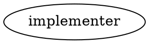

# Codex Harness — Operator Guide

> **C6/T17 (hk-u1id4).** Covers setup, credential posture, harness selection, and the
> **MUST-TEST pre-production checklist** (R3.5 + R6.5 empirical sign-off items).
> Read this before enabling codex on any bead in a production queue.

---

## 1. Overview

harmonik supports two implementer harnesses:

| Harness | Binary | Completion mode | Session ID |
|---|---|---|---|
| `claude` (default) | `claude` | EventStreamThenQuit — daemon pastes `/quit` | Caller-minted |
| `codex` | `codex` | ProcessExit — binary self-terminates on turn completion | Captured from `thread.started` JSONL |

Absent any harness selection, all beads run on `claude`. The codex harness is opt-in
and **disabled by default** (the global default is `claude`). This means the codex
change is N-1 safe: existing beads, queues, and DOT workflows require no changes.

The codex harness requires an active **ChatGPT subscription login** (`codex login`).
It will not run against an API-key login or an unauthenticated CODEX_HOME; it fails
closed. See §3 for why this is load-bearing.

---

## 2. Prerequisites

### 2.1 Install codex CLI

```bash
npm install -g @openai/codex        # or your package manager
codex --version
```

Pin the codex version in your project's tooling lock file. The billing guard
behavior and env-precedence rules are version-variable (see §3.3 and the MUST-TEST
checklist in §6).

### 2.2 Log in with a ChatGPT subscription

```bash
codex login
# follow the browser OAuth flow — select your ChatGPT Plus/Pro/Team plan
codex login status
# expected: "Logged in as <email> via chatgpt"
```

Do **not** use `codex login --with-api-key`. The daemon's billing guard fails closed
on an API-key login (see §3).

### 2.3 Verify CODEX_HOME is writable

By default harmonik sets `CODEX_HOME=$HOME/.codex`. Token refresh requires write
access; a sandboxed or read-only HOME causes codex to re-prompt for auth mid-run.

```bash
ls -la ~/.codex/auth.json           # must exist and be readable by the operator
```

To override the home path, set `CODEX_HOME` in the daemon's environment before
starting it. harmonik reads the value from its own env and passes it to the child.

---

## 3. Credential posture and billing guard

### 3.1 Why this matters

The 2026-05-30 API-key burn incident (see `project_flywheel_apikey_burn` memory) showed
that a stray `ANTHROPIC_API_KEY` in the daemon's env silently billed the API credit
pool. The codex harness has the same landmine: a stray `OPENAI_API_KEY` or
`CODEX_API_KEY` in the daemon process environment would bill the API credit pool
instead of the ChatGPT subscription.

### 3.2 Defense-in-depth layers

The codex harness applies three layers (implemented in `codexlaunchspec.go` and
`codexbillingguard.go`):

**Layer 1 — Negative guard (env strip).**
`OPENAI_API_KEY` and `CODEX_API_KEY` are stripped from the codex child environment
and re-emitted as empty overrides (`KEY=`). The tmux server's additive `-e` mechanism
means merely omitting a key leaves the server env value intact; only an explicit
`KEY=` zeros it. This mirrors the `ANTHROPIC_API_KEY` guard in the claude harness.

**Layer 2 — Config belt.**
Before launching codex, harmonik materializes `forced_login_method = "chatgpt"` in
`$CODEX_HOME/config.toml`. This makes codex itself refuse to fall back to an API-key
login, even if one is found. The materialization is idempotent and preserves other
config keys.

**Layer 3 — Positive pre-flight assert (fail closed).**
After materialize, harmonik asserts that `config.toml` declares the wanted
`forced_login_method` AND that `auth.json` does not carry a populated `OPENAI_API_KEY`
field (which would indicate an API-key login is in effect). If either check fails, the
run is refused with a `codex_billing_guard` event and a clear error. No codex subprocess
is spawned.

### 3.3 What the guard does NOT cover

- The `#2000` wart: a ChatGPT subscription login does not prevent a "Codex CLI
  (auto-generated)" **org-level API key** from existing in your OpenAI organization.
  If codex has a code path that prefers an org key over the subscription OAuth token,
  the env strip protects the daemon env but may not protect against an org key injected
  by the codex binary itself. **This must be audited manually** (see §6, MUST-TEST item 3).

- **Version-variable env precedence:** older codex versions (pre-#3286) silently
  preferred `OPENAI_API_KEY` over a ChatGPT login even when the env key was cleared;
  current interactive ignores a bare env key (#3286), but `codex exec` env precedence
  is undocumented and version-variable. The MUST-TEST checklist (§6) requires empirical
  verification on the pinned codex version before production use.

### 3.4 Observability

Every step of the billing guard emits a `codex_billing_guard` event to
`.harmonik/events/events.jsonl`:

```
{"type":"codex_billing_guard","payload":{"bead_id":"...","codex_home":"...","outcome":"materialized","reason":"forced_login_method = \"chatgpt\" ensured in config.toml"}}
{"type":"codex_billing_guard","payload":{"bead_id":"...","codex_home":"...","outcome":"allowed","reason":"ChatGPT plan confirmed; codex launch permitted"}}
```

A denied outcome with `"outcome":"denied"` means the run was refused; see the
`reason` field for the specific check that failed.

---

## 4. Harness selection

The harness is resolved per-run at claim time, in precedence order (highest wins):

| Tier | How to set | Example |
|---|---|---|
| Per-bead | `harness:codex` bead label | `br label hk-abc add harness:codex` |
| Per-queue | `default_harness` field in `queue/types.go` Group | `"default_harness": "codex"` in JSON |
| Per-node (DOT) | `harness` attribute on an `implementer` node | `harness=codex` in the DOT workflow |
| Global daemon default | `Config.DefaultHarness` / `--default-harness` flag | `--default-harness codex` |
| Built-in fallback | — | `claude` (always) |

**The built-in fallback is always `claude`.** An absent or empty selection at every
tier resolves to claude — this is the N-1 safety anchor.

**Do not** set `--default-harness codex` until the MUST-TEST checklist in §6 is
complete and signed off. Per-bead selection is the recommended path for the first
production runs.

### 4.1 Per-bead selection (recommended for initial rollout)

```bash
br label hk-abc add harness:codex
# Verify:
br show hk-abc | grep harness
```

### 4.2 Per-node selection (DOT workflows)

In your `.dot` workflow file, add the `harness` attribute to any implementer node:



### 4.3 Global default

```bash
harmonik --project /path/to/repo --default-harness codex --max-concurrent 3
```

**Warning:** the global default applies to ALL beads that lack an explicit selection.
Do not flip the global default in a shared project queue without completing the
MUST-TEST checklist.

### 4.4 Reviewer harness

By default the reviewer harness matches the implementer harness. An optional
`reviewer_harness` override lets you pin an always-claude reviewer for a codex
implementer run:

```dot
implementer [harness=codex, reviewer_harness=claude-code]
```

The `reviewer_harness` attribute is read **exclusively off the implementer node**
(`internal/daemon/dot_cascade.go:421`); setting it on the `reviewer` node has no
effect. The value must be a valid harness identifier — use `claude-code` (the
reserved `AgentType` string, `internal/core/agenttype.go:18`), not `claude`.

There is **no** `--reviewer-harness` daemon CLI flag. The only per-run reviewer-harness
mechanism is the DOT `reviewer_harness=` attribute on the implementer node shown above.

Pinning the reviewer to claude is **recommended** while the codex structured-verdict
reliability is unproven (MUST-TEST §6, item 4 / R6.5). Once R6.5 is signed off, the
default (reviewer = implementer harness) is safe to use.

---

## 5. Monitoring a codex run

Codex runs appear in the standard event stream alongside claude runs. Key differences:

- **No `/quit` machinery.** Codex self-terminates; the daemon does not paste `/quit`
  or fire the heartbeat-staleness kill. Only the absolute `commitHardCeiling` (90 min)
  governs run length.
- **`thread_id` captured from JSONL.** The codex `thread_id` (from the first
  `thread.started` event) is recorded in the run's context as the `session_id`; it is
  used for `codex exec resume <thread_id>` on review-loop iteration 2+.
- **`Refs:<bead>` trailer is guaranteed.** If codex edited the worktree but did not
  include the trailer in its commit, the daemon performs a deterministic
  commit-after-exit (stage + commit with the trailer). If codex made no edits, the
  standard `noChange` path fires.

Monitor a running codex bead the same way as any bead:

```bash
harmonik subscribe --types run_started,run_completed,run_failed,reviewer_verdict --json
```

Look for `codex_billing_guard` events at run start to confirm the billing guard fired
correctly.

---

## 6. MUST-TEST pre-production checklist

**These checks are empirical — they must be run against the pinned codex version before
enabling codex in any production queue.** Unit tests cover the harness structure; they
do not cover the runtime behavior of the `codex exec` binary itself.

Each item must be manually verified and signed off (operator initial + date) before the
corresponding feature is enabled in production.

---

### Item 1 — `codex exec` does NOT use stripped API keys  *(R3.5, empirical)*

**Risk:** Older codex versions silently preferred `OPENAI_API_KEY` over a ChatGPT login
even when stripped. If the pinned version has this bug, the env strip is insufficient.

**Test procedure:**

```bash
# 1. Set a dummy API key in your shell.
export OPENAI_API_KEY=sk-test-dummy-key-$(date +%s)
export CODEX_API_KEY=sk-test-dummy-key-$(date +%s)

# 2. Run a trivial bead labeled harness:codex against a test repo.
#    Use a queue with --dry-run=false and --max-concurrent 1.
#    Observe the codex_billing_guard events:
tail -f .harmonik/events/events.jsonl | grep codex_billing_guard

# 3. After the run, check the OpenAI usage dashboard:
#    https://platform.openai.com/usage
#    Confirm no API credit was billed for the run timeframe.

# 4. Also confirm the bead run succeeded (not a billing-guard denial).
```

**Expected outcome:** `codex_billing_guard` shows `"outcome":"allowed"` and the OpenAI
usage dashboard shows **no API credit** consumed. Any API credit usage during this test
indicates a codex version bug; upgrade codex or open an issue before proceeding.

**Sign-off:** `[ ] PASS — verified by _______ on _______ with codex version _______`

---

### Item 2 — `forced_login_method=chatgpt` is honored by `codex exec`  *(R3.5, empirical)*

**Risk:** `forced_login_method` is a config key the daemon materializes, but codex's
runtime behavior is undocumented. If `codex exec` ignores it, the config belt provides
no protection.

**Test procedure:**

```bash
# 1. Inspect the materialized config:
cat ~/.codex/config.toml
# Expected: contains 'forced_login_method = "chatgpt"'

# 2. Temporarily rename auth.json to simulate an unauthenticated CODEX_HOME:
mv ~/.codex/auth.json ~/.codex/auth.json.bak

# 3. Run 'codex exec --json --sandbox workspace-write -a never -C /tmp/test-repo "echo hello"'
#    If forced_login_method is honored, codex SHOULD prompt for ChatGPT login rather
#    than silently falling back to an API key.
codex exec --json --sandbox workspace-write -a never -C /tmp echo "hello"

# 4. Restore auth.json:
mv ~/.codex/auth.json.bak ~/.codex/auth.json
```

**Expected outcome:** With `auth.json` absent and `forced_login_method=chatgpt` in
`config.toml`, codex either prompts for ChatGPT login or exits with an auth error — it
MUST NOT silently proceed with API-key billing.

**Sign-off:** `[ ] PASS — verified by _______ on _______ with codex version _______`

---

### Item 3 — Audit OpenAI org for auto-generated "Codex CLI" key  *(R3.5, empirical — the #2000 wart)*

**Risk:** When codex is installed and used with a ChatGPT org account, it may
auto-generate an API key named "Codex CLI (auto-generated)" in the OpenAI organization.
This key exists at the **org level**, not in the daemon env. The env strip and
`forced_login_method` do not defend against a codex code path that prefers this org
key. If such a key exists and codex prefers it, runs will bill the API credit pool
despite passing all automated guards.

**Test procedure:**

```bash
# 1. Log in to the OpenAI platform as an org admin:
#    https://platform.openai.com/api-keys

# 2. Search for keys named "Codex CLI (auto-generated)" or matching the pattern
#    from GitHub issue #2000 in the openai/codex repository.

# 3. If such a key exists:
#    a. Note the key ID and creation date.
#    b. Revoke it immediately.
#    c. Confirm revocation.
#    d. Run a test bead (item 1 above) to confirm API credit is not billed.

# 4. Document whether the key was present (YES/NO) and what action was taken.
```

**Expected outcome:** No "Codex CLI (auto-generated)" key exists in the org, OR the
key has been revoked and subsequent test runs show no API credit usage.

**Sign-off:** `[ ] PASS — audited by _______ on _______. Auto-generated key present: YES/NO. Action taken: _______`

---

### Item 4 — Codex reviewer reliably writes the structured verdict  *(R6.5, empirical)*

**Risk:** The review-loop depends on the reviewer writing a structured verdict to
`.harmonik/review.json`. The claude harness has been tested extensively for this; the
codex harness has not. If a codex reviewer does not reliably emit the structured verdict,
the review loop stalls or falls through to the `verdict absent` salvage path.

**Test procedure:**

```bash
# 1. Configure a test bead with harness:codex on both implementer and reviewer:
br label hk-test add harness:codex
# or use a DOT workflow with both nodes set to harness=codex

# 2. Submit the bead to a test queue with workflow_mode=review-loop:
#    The run should traverse: run_started → implementer → reviewer_launched →
#    reviewer_verdict → run_completed (or iteration 2 if REQUEST_CHANGES).

# 3. After the run, check:
cat .harmonik/worktrees/<run-id>/.harmonik/review.json
# Expected: a valid JSON object with schema_version and verdict fields

# 4. Also check the events:
grep reviewer_verdict .harmonik/events/events.jsonl
# Expected: a reviewer_verdict event with verdict APPROVE or REQUEST_CHANGES or BLOCK

# 5. Run at least 5 independent test beads to establish reliability. A single pass
#    is insufficient — structured-verdict output is a model decision.
```

**Expected outcomes:**
- If the codex reviewer reliably writes the structured verdict (≥4/5 runs): the default
  `reviewer_harness = implementer` is safe to use. Mark PASS.
- If the codex reviewer frequently fails to write the structured verdict (<4/5 runs):
  pin `reviewer_harness=claude-code` on the implementer node in your DOT workflow
  (§4.4). Mark FAIL with the observed rate, and file a bead to investigate.

**Sign-off:** `[ ] PASS — verified by _______ on _______ with codex version _______. Observed success rate: __/5 runs.`

**OR**

`[ ] FAIL — reviewer_harness pinned to claude-code. Observed rate: __/5. Bead filed: hk-_____`

---

## 7. Summary: gates before enabling codex in production

```
MUST-TEST SIGN-OFF STATUS
──────────────────────────────────────────────────────────────────────────────
Item 1  API key env strip — codex version X.Y.Z    [ ] PASS  [ ] FAIL
Item 2  forced_login_method honored by codex exec  [ ] PASS  [ ] FAIL
Item 3  #2000 org-key audit                        [ ] PASS  [ ] FAIL/MITIGATED
Item 4  Reviewer structured-verdict reliability    [ ] PASS  [ ] FAIL+FALLBACK
──────────────────────────────────────────────────────────────────────────────
Production gate: ALL four items PASS (or FAIL+FALLBACK for item 4)
```

Do not add `harness:codex` to any bead in a shared production queue, and do not set
`--default-harness codex`, until all four items are signed off.

---

## 8. Troubleshooting

| Symptom | Likely cause | Remediation |
|---|---|---|
| Run fails immediately with `codex billing guard: assertChatGPTPlan: ... does not declare forced_login_method` | billing guard materialization failed or race | Check `~/.codex/config.toml` exists and is writable; re-run |
| Run fails with `carries a populated OPENAI_API_KEY (API-pool billing); refusing to launch` | `~/.codex/auth.json` has an API-key login active | Run `codex logout` then `codex login` with ChatGPT |
| `codex_billing_guard` event absent from events.jsonl | codex not selected for this run | Confirm bead has `harness:codex` label or global default is set |
| `reviewer_verdict` absent, run loops to `iteration_cap_hit` | codex reviewer not writing structured verdict | Pin `reviewer_harness=claude-code` (on implementer node); check item 4 of MUST-TEST |
| Run hangs past 90 min with no `run_completed` | `commitHardCeiling` hit | Investigate worktree state; codex may have stalled mid-task |
| `auth.json` keeps disappearing between runs | `CODEX_HOME` mismatch | Verify daemon and `codex login` both use the same `CODEX_HOME` path |
