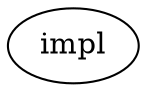

# Codex Implementer Harness — Live Soak Test Plan

> Status: ACTIVE soak plan (codexcrew, 2026-06-16). Live-tests the OpenAI **codex**
> implementer harness merged under the `codex-harness` kerf work. The harness is built
> and unit-tested; this plan exercises it end-to-end against a real `harmonik` daemon and
> verifies the ChatGPT-subscription billing posture on every run.
>
> Authoritative source files (read these, not memory):
> - `specs/harness-contract.md` — normative cross-harness contract (HN-001..HN-024).
> - `internal/daemon/codexharness.go` — `CodexHarness` adapter (Captured / ProcessExit).
> - `internal/daemon/codexlaunchspec.go` — `buildCodexLaunchSpec` (argv/env/seed/guard call).
> - `internal/daemon/codexbillingguard.go` — `runCodexBillingGuard` (materialize + fail-closed assert).
> - `internal/daemon/codexcommit.go` — `ensureCodexRefsTrailer` (Refs: fallback).
> - `internal/daemon/codexjsonlparser.go` — thread_id / turn capture.
> - `internal/daemon/harnessresolve.go` — four-tier `resolveHarness`.
> - `internal/daemon/harnessregistry.go` — `routedLaunchSpecBuilder` (the dispatch seam).

---

## 0. Known wiring gaps (read before you start)

A read of the merged code shows three pieces are **built but NOT invoked in the live run
path**, plus one missing completion-gate. These shape what is testable today and what will
fail. Verify each against the current `main` before soaking — they may have landed since.

| Gap | Evidence | Effect on soak |
|---|---|---|
| **G1 — `ensureCodexRefsTrailer` not wired** | `codexcommit.go:180` has ZERO non-test callers (only `export_test.go:2285`). | If codex commits without the exact `Refs: <bead>` trailer, nothing repairs it → run hits `no_commit`. The ONLY trailer guarantee is the seed prompt (`codexlaunchspec.go:67`), which is probabilistic. **Expect a non-trivial no_commit rate.** |
| **G2 — thread_id capture not fed live** | `parseCodexJSONLEvent` / `captureCodexThreadID` / `codexRunArtifacts` (`codexjsonlparser.go:146,228,196`) have ZERO non-test callers; codex stdout is `io.Copy`'d generically (`internal/handler/session.go:211,258`), never routed to the codex parser. `RunCtx.PriorSessionID` is never set for codex. | **Iteration ≥ 2 (review-loop retask / `codex exec resume`) cannot work** — no thread_id is ever captured. Soak with **single-iteration / no-review** workflows, or expect retask to launch a *fresh* (non-resumed) turn. |
| **G3 — non-DOT path does not gate the /quit watchdog on `ProcessExit`** | Only `dot_cascade.go:1165` gates `pasteInjectQuitOnCommit` on `Completion() != CompletionProcessExit`. The single-mode workloop (`workloop.go:~3190`) and builtin review-loop (`reviewloop.go:~654`) launch it unconditionally. | A codex run in **non-DOT mode** gets the `/quit` + force-kill watchdog applied even though codex self-terminates. **Run codex soak in DOT mode** (`--workflow-mode dot`) to get the correct completion gate. |
| **G4 — billing-guard events not emitted on the routed path** | `CodexHarness.LaunchSpec` (`codexharness.go:89-96`) builds `codexRunCtx` WITHOUT `billingEmitter`/`runID`, so `emitCodexBillingGuard` is a no-op (`codexlaunchspec.go:96-99`). `skipBillingGuard` defaults false, so the guard's **enforcement (materialize + fail-closed assert) DOES run**; only the *event* is silent. | **`codex_billing_guard` events will NOT appear in events.jsonl** on a real routed run today. Billing-correctness must be verified out-of-band (see §6). |

> Net: soak codex **in DOT mode, single-iteration / no-review, single-turn beads** to stay
> inside the wired path. File a bead for each gap you want closed before production enable.

---

## 1. Selection paths — exactly how to route a bead to codex

`resolveHarness` (`harnessresolve.go:46`) walks four tiers, highest first:
`per-bead label > per-queue default > DOT node attr > global default`, falling back to
`claude-code` when all absent. An unknown/conflicting selector at tier 1 is treated as
absent (emits `bead_label_conflict`) and the walk continues. The value after the prefix
MUST satisfy `^[a-z][a-z0-9-]{1,62}$` (`agenttype.go:31`); the codex value is the literal
string **`codex`** (`core.AgentTypeCodex`, `agenttype.go:24`).

### Tier 1 — per-bead label (RECOMMENDED for soak; works in any mode)

Exact label string: **`harness:codex`** (prefix `harness:` from `harnessresolve.go:34` +
agent-type `codex`).

```bash
br create --title="codex soak run N" --type=chore --priority=3 --label "harness:codex"
# or on an existing bead:
br update <id> --label "harness:codex"
```

- Exactly ONE `harness:` label must be present; two `harness:*` labels → conflict → treated
  as absent (`harnessresolve.go:74-78`).
- Tier 1 is read from the dispatch-time `BeadRecord.Labels` and threaded into
  `routedLaunchSpecBuilder` at `workloop.go:2478` and `dot_cascade.go:933`. **This is the
  only tier that works in plain (non-DOT) workloop mode** — but combine with `--workflow-mode dot`
  to also get the correct completion gate (G3).

### Tier 2 — per-queue `default_harness` (CURRENTLY A NO-OP AT DISPATCH)

The field exists end-to-end in the queue layer: `QueueSubmitRequest.DefaultHarness` /
`Queue.DefaultHarness`, JSON key **`default_harness`** (`internal/queue/types.go:332,417`),
normalized by `NormaliseDefaultHarness` (`internal/queue/rpc.go:257,789`). **But it is NOT
consumed at dispatch** — `workloop.go:2479` passes `core.AgentType("")` as `queueDefault`
(comment: "per-queue harness field not yet landed (hk-4x3rg)"). There is **no CLI flag** for
it on `queue submit`. To set it you must hand-author the submit JSON:

```json
{ "schema_version": 1, "default_harness": "codex",
  "groups": [ { "group_index": 0, "kind": "stream", "status": "pending",
    "created_at": "2026-06-16T00:00:00Z",
    "items": [ { "bead_id": "hk-xxx", "status": "pending" } ] } ] }
```

> DO NOT rely on tier 2 for soak — it stores but does not route until hk-4x3rg lands.
> Confirm with a dry run before trusting it.

### Tier 3 — DOT node `harness` attribute (works only in DOT mode)

DOT node attribute. Exact attr: **`harness=codex`** (or alias **`agent_runtime=codex`**,
`ast.go:223`; both resolve to the node-tier default — `harness` + `agent_runtime` with
different values on one node is a strict parse error). Parsed into `dot.Node.Harness`
(`parser.go`), consumed at `dot_cascade.go:928,930-938`.



Requires `--workflow-mode dot` with a custom graph that carries the attr on the implementer node.

### Reviewer-harness override — DOT node `reviewer_harness` attribute

Exact attr on the IMPLEMENTER node: **`reviewer_harness=codex`** (or `reviewer_harness=claude-code`
to pin an always-claude reviewer while codex's verdict reliability is unproven). Parsed into
`dot.Node.ReviewerHarness` (`ast.go:237`, `parser.go:785`), applied at `dot_cascade.go:533,923-929`
with precedence: implementer's `reviewer_harness` > reviewer node's own `harness` > (default)
implementer's resolved harness (`reviewloop.go:1079-1084`). Reviewer harness defaults to the
implementer harness (HN-014).

---

## 2. Bead types to exercise

Run each type at least 3× (more for code edits). Keep every soak bead trivial and SAFE
(see §7). The goal is harness mechanics, not task difficulty.

| # | Type | Bead shape | What it probes |
|---|---|---|---|
| T1 | trivial no-op append | append one ISO-ts line to `docs/codex-soak-log.md` | happy path; commit + Refs trailer; billing |
| T2 | single-file code edit | rename a local var / add a comment in one `.go` file | edit→commit; build gate |
| T3 | multi-file | touch 2 files (e.g. a const + its one caller) | multi-file staging in the fallback / agent commit |
| T4 | doc / markdown | edit one `docs/*.md` paragraph | no-build-gate path |
| T5 | with-tests | add a tiny `_test.go` case next to existing code | test-compile gate behavior |
| T6 | without-tests | code change with no test | reviewer / no-test handling |
| T7 | genuine no-op | bead whose work is already on main | `codexRefsNoChange` → `no_commit` route (G1: verify no fabricated commit) |

For each: confirm the merged commit body carries `Refs: <bead>` (so completion detection
fired) and that the diff is what you asked for.

---

## 3. Lifecycle expectations (codex)

Per `specs/harness-contract.md` §6.3 and `codexharness.go`:

- **Launch / seed:** `codex exec --json --sandbox workspace-write -C <worktree> "<seed>"`
  (`codexlaunchspec.go:156-164`). The task is delivered via the **seed-prompt argv** + a
  pre-written `.harmonik/agent-task.md` (`harnessregistry.go:119-150`). `Seed`/`Retask` are
  no-ops (`codexharness.go:116,127`) — there is no TUI to paste into.
- **Completion detection:** `Completion() == ProcessExit` (`codexharness.go:170`). The shared
  loop relies on `sess.Wait` + the 90-min commit hard ceiling, NOT the `/quit`+grace+kill
  watchdog (DOT path only — see G3). "Done" is decided by git: HEAD ≠ parent AND a
  `Refs:<bead>` trailer (HN-009 / HN-INV-001).
- **Does codex make its OWN git commits?** YES — by instruction. The seed prompt
  (`codexlaunchspec.go:67`) tells codex to `git commit` all changes with the
  `Refs: <bead>` trailer. There is NO daemon-side fallback wired today (G1): if codex skips
  the commit or the trailer, the run fails `no_commit`. (`ensureCodexRefsTrailer` would
  amend/create the commit deterministically, but it is not yet called — see §0.)
- **Worktree isolation:** identical to claude — each run gets an isolated worktree under
  `.harmonik/worktrees/<run_id>`; merge-one-at-a-time; conflicting merges auto-skipped. The
  harness only sees opaque argv/env/cwd (HN-010).
- **Session / resume + re-task:** `SessionIDPolicy() == Captured` (`codexharness.go:162`):
  the thread_id should be captured from the first `thread.started` JSONL line and reused via
  `codex exec resume <thread_id>` (`codexlaunchspec.go:148-155`). **Today capture is not
  fed live (G2)** → resume/retask launches a fresh turn, not a resumed one. Soak
  single-turn / no-review to avoid this.
- **Teardown:** no-op for codex (process self-terminates); `Teardown` best-effort `Kill`s a
  stray handle (`codexharness.go:138-143`).

---

## 4. Failure modes to exercise + expected recovery

| Failure | How to induce / observe | Expected daemon behavior |
|---|---|---|
| codex not installed | run with `codex` absent from PATH | billing guard / launch fails closed; run fails, bead reopened (NOT silently claude) |
| billing guard denies | `$CODEX_HOME/config.toml` missing `forced_login_method="chatgpt"`, or `auth.json` has a populated `OPENAI_API_KEY` | `buildCodexLaunchSpec` returns error → no launch → run fails closed (`codexbillingguard.go:212-238`) |
| codex error / turn.failed | a bead with a contradictory task | run fails; check the failure class in events.jsonl; bead should reopen, eligible for one re-dispatch |
| rate-limit | run a wider batch than the plan allows | back off — see §7 pacing; daemon should fail the run, not wedge |
| timeout | a task codex can't finish in 90 min | commit hard ceiling fires; `run_stale`/`run_failed`; bead reopens |
| no-commit | codex edits nothing OR commits without the trailer (G1) | `no_commit` failure; bead reopens. **This is the #1 expected codex failure today.** |

Recovery rule (AGENTS.md "On batch failure"): failed once → eligible for one re-dispatch;
failed twice in a session → STOP and dispatch an investigator. Never re-dispatch a bead more
than twice without investigation.

---

## 5. Preconditions / environment

Before the first codex run the daemon's environment must satisfy the billing guard
(`codexbillingguard.go`). The guard's *enforcement* runs even though its events are silent (G4).

1. **`codex` binary** on PATH (or pass `--codex-binary /abs/path/to/codex`,
   `main.go:700`). `codex --version` should succeed.
2. **`CODEX_HOME`** — defaults to `$HOME/.codex` (`codexlaunchspec.go:200-209`). The guard
   will `mkdir -p` it (0700) and materialize `config.toml`. Must be **writable** (a
   non-writable home fails the launch closed).
3. **ChatGPT-subscription login** — `codex login` (NOT `--with-api-key`). After login,
   `$CODEX_HOME/auth.json` must NOT carry a populated `OPENAI_API_KEY`
   (`codexbillingguard.go:184-198`). Verify: `codex login status` reports a ChatGPT plan.
4. **No leaked API keys** — `OPENAI_API_KEY` / `CODEX_API_KEY` are stripped from the child env
   and re-emitted empty (`codexlaunchspec.go:46-49, 241-247`). They may exist in your shell;
   the guard zeroes them for the child. Still, do NOT export them into the daemon's env.
5. **Daemon flags** — start the daemon with `--workflow-mode dot` (G3) and optionally
   `--default-harness codex` (`main.go:694`) to make codex the tier-4 global default, or omit
   it and route per-bead via `harness:codex`. Rebuild + restart the daemon after any binary
   change (`go install ./cmd/harmonik`; `pkill -f "harmonik --project"`; relaunch).

Gotchas found in code that would make a live run fail:
- **G1:** any codex run that commits without the exact `Refs: <bead>` line fails `no_commit`
  with no repair. Watch the seed-prompt compliance rate closely.
- **G3:** running codex in non-DOT mode applies the wrong (claude `/quit`+kill) watchdog.
- The codex seed prompt is the SOLE trailer guarantee — keep beads simple so codex reliably
  produces a single trailer-bearing commit.

---

## 6. BILLING verification (CRITICAL — do this after EVERY run)

The guard (`runCodexBillingGuard`, `codexbillingguard.go:283`) does two enforced things before
each launch: (B2) materialize `forced_login_method = "chatgpt"` into `$CODEX_HOME/config.toml`,
and (B3) a fail-closed assert that config declares chatgpt AND `auth.json` has no API key.
**Because the routed path passes a nil emitter (G4), `codex_billing_guard` events do NOT land
in events.jsonl today** — so you cannot prove the guard fired from the event log alone. Verify
out-of-band:

1. **Config materialized:** `grep forced_login_method $CODEX_HOME/config.toml` →
   `forced_login_method = "chatgpt"`. The guard rewrites/appends this every launch.
2. **No API-key login:** `auth.json` must have empty/absent `OPENAI_API_KEY`
   (`codexbillingguard.go:175-198`). `python3 -c 'import json;print(json.load(open("'$CODEX_HOME'/auth.json")).get("OPENAI_API_KEY",""))'`
   should print empty.
3. **Plan check:** `codex login status` reports the ChatGPT plan.
4. **Spend ledger:** check the OpenAI **API usage** dashboard shows NO new spend for the soak
   window (subscription usage is fine, API credit-pool spend is the failure). This is the
   ground-truth billing check.
5. **What a billing FAILURE looks like:** the run **fails to launch at all** — the guard
   returns an error from `buildCodexLaunchSpec` and the run hits a deterministic failure
   (not a successful codex turn). Plus any new API-pool spend in the OpenAI dashboard. A
   *successful* codex run that produced API-pool spend would be the worst case — guard it by
   checking #4 after the very first run before scaling up.

> If/when G4 is fixed, the events to look for are `codex_billing_guard` with outcome
> `materialized` then `allowed` (success) or `denied` (fail-closed) — `core.CodexBillingGuardOutcome`,
> `codexbillingguard.go:294-305`. Search: `jq 'select(.type=="codex_billing_guard")' .harmonik/events/events.jsonl`.

---

## 7. Soak procedure (runnable)

Throwaway, SAFE work only: each soak bead appends one timestamped line to
`docs/codex-soak-log.md` and commits it. No other files touched.

```bash
# 0. Preconditions (§5): codex on PATH, ChatGPT login, CODEX_HOME writable.
codex --version && codex login status

# 1. Rebuild + restart the daemon in DOT mode (G3).
go install ./cmd/harmonik
pkill -f "harmonik --project /Users/gb/github/harmonik" || true
tmux new-session -d -s harmonik-daemon \
  'harmonik --project /Users/gb/github/harmonik --no-auto-pull --max-concurrent 4 --workflow-mode dot'
harmonik queue status   # confirm up (exit 17 = not running)

# 2. Create a small paced batch of codex soak beads (tier-1 label).
for n in 1 2 3 4; do
  br create --title="codex soak run $n" --type=chore --priority=3 \
    --label "harness:codex" \
    --description "Append the single line '$(date -u +%FT%TZ) codex soak run $n' to docs/codex-soak-log.md (create the file if absent). Commit ONLY that change in a single commit whose body contains the line 'Refs: <this-bead-id>'. Do nothing else."
done

# 3. Submit (tier-1 routes via the label; dry-run first).
harmonik queue dry-run --beads hk-a,hk-b,hk-c,hk-d
harmonik queue submit  --beads hk-a,hk-b,hk-c,hk-d

# 4. Monitor.
harmonik subscribe --types run_completed,run_failed,run_stale,reviewer_verdict,heartbeat --heartbeat 60s --json

# 5. After EACH run: §6 billing checks + confirm the merged commit carries 'Refs: <bead>'.
git -C /Users/gb/github/harmonik log --oneline -8
```

Pacing: **≤4–5 concurrent** on this 10-core box (the disk/CPU knee — wide waves exhaust disk
and oversubscribe cores). On any rate-limit, drop to `--max-concurrent 2` and pause new
submits until the limit clears. Run beads in small batches (4–5), wait for the group to drain,
inspect, then submit the next batch.

---

## 8. Metrics to capture

Track per batch and cumulatively in `docs/codex-soak-log.md` (or a sibling table):

| Metric | How |
|---|---|
| N runs | count of codex `run_completed` + `run_failed` |
| success rate | `run_completed` / N |
| commit rate | runs whose merged HEAD carries `Refs: <bead>` / N |
| billing-correct rate | runs with §6 #1–#4 all green / N (target 100%) |
| latency / run | `run_started`→`run_completed` from events.jsonl per run_id |
| failure-mode breakdown | count by class (`no_commit`, `context_cancelled`, `turn.failed`, timeout, billing-deny) |
| no_commit rate | the key codex-specific signal given G1 |

Gate to production-enable: billing-correct rate = 100% across ≥ ~20 runs, AND a no_commit
rate low enough to be operationally acceptable (or G1 fixed first). File a bead per gap
(§0) you want closed before flipping `--default-harness codex` on the real fleet.

---

## 9. Operator soak methodology (batch-and-investigate) — REQUIRED

> Per operator directive (2026-06-16, via captain). Applies once the daemon path is
> unblocked (§10) and the captain GREENs the resume.

Run codex through **30+ small beads total** to flush ALL issues — but **NEVER fire them all
at once**. Use small batches with investigation between each:

1. **Batch of 2–3** beads (one `harmonik queue submit --queue codexcrew` of 2–3 `harness:codex` beads).
2. **Investigate EACH run** before the next batch — five dimensions per run:
   - **spawn:** did codex actually launch? (`session_log_location agent_type=codex`, NOT claude — guards hk-lr5t)
   - **complete:** reached completion without `agent_ready_timeout`? (guards hk-f6g7)
   - **commit:** merged HEAD carries the `Refs:<bead>` trailer? (guards hk-gd9r — daemon fallback vs codex self-commit)
   - **billing:** ChatGPT-billed, no API-key leak (§6 checks, every run)
   - **output quality:** is the diff what the bead asked for?
3. **Adjust if needed** — any daemon bug found routes to thufir; any harness/bead-shape issue → refine + re-run.
4. **Next batch of 2–3 → investigate → repeat**, ramping batch size up only as runs prove clean, to **30+ total**.

Each batch's findings feed the next. Pacing still ≤4–5 concurrent (§7); back off on rate-limit.

### Bead sourcing (staged risk)
- **Early batches (first ~2): throwaway / low-stakes ONLY** — `docs/codex-soak-log.md` appends. codex
  self-commit is freshly fixed (hk-gd9r); do **NOT** risk real work until **2 batches prove clean**
  (spawn + complete + commit + billing all green).
- **Later batches: small REAL beads** from the backlog (`br ready --limit 0`, pick trivial/safe) —
  but **review codex's output before it merges** (codex is unproven; verify each diff).

---

## 10. Preconditions to resume the real harness soak (post-fix)

BLOCKED until thufir lands these (filed 2026-06-16, `codename:codex-harness`) + captain redeploys + GREENs:
- **hk-lr5t** (P1) — `harness:codex` routes to claude → codex must actually spawn.
- **hk-f6g7** (P1) — HC-056 `agent_ready` gate (all modes incl DOT) → codex must reach completion.
- **hk-gd9r** (P1) — `--sandbox workspace-write` blocks `.git` self-commit → daemon-side commit fallback (or loosened sandbox).
- **hk-mzgh** (P2) — thread_id→resume wiring + drop `-C` on the resume subcommand (only for codex WITH review-loop/iter≥2; single-turn soak unaffected).

LIVE-TEST PROVEN (2026-06-16, standalone): codex CLI works; ChatGPT-subscription billing correct every
run (no API-key leak); `codex exec resume <thread_id>` carries context + re-tasks (commits with `Refs:`);
latency ~33s median single-turn (8–70s), resume 4–9s. So once the four beads land, codex is expected to
soak cleanly. On GREEN: re-arm `harmonik subscribe`, then run §9 batch-and-investigate; verify each run's
`agent_type=codex` + a `Refs:` commit before scaling.

---

## 11. Live-test matrix + bead-class pre-screen (interim prep, 2026-06-16)

> Prepared read-only while blocked on thufir's redeploy. Operationalizes §9's
> 2–3→investigate→30+ cadence with a concrete matrix and a vetted bead-class order.

### 11.1 Live-test matrix (bead-type × what to verify)

Every cell ALSO runs the per-run billing checklist (11.2). Run each row ≥3× across batches.

| Bead type | Example (safe) | Probes | Pass criteria (beyond billing) |
|---|---|---|---|
| trivial no-op append | append ISO-ts line to `docs/codex-soak-log.md` | spawn, complete, commit, Refs | merged HEAD has `Refs:<bead>`; diff = 1 line |
| single-file code edit | add a comment / rename a local var in one `.go` | edit→commit, build gate | builds; diff scoped to 1 file |
| multi-file | a const + its single caller | multi-file staging in one commit | both files in one `Refs` commit |
| doc / markdown | fix a `docs/*.md` typo | no-build-gate path | diff = the wording change only |
| with-tests | add one `_test.go` case | test-compile gate | test compiles + passes |
| without-tests | code change, no test | reviewer / no-test handling | merges or REQUEST_CHANGES, not a crash |
| genuine no-op | bead whose work already on main | `no_commit` route (no fabricated commit) | clean `no_commit`; bead reopens |

### 11.2 Per-run billing checklist (apply to EVERY run — see §6)
1. `config.toml` has `forced_login_method = "chatgpt"` (rewritten each launch — also proves the guard fired).
2. `auth.json` has empty/absent `OPENAI_API_KEY`.
3. `codex login status` = ChatGPT plan.
4. No new OpenAI **API-pool** spend for the soak window (ground truth).
5. (after G4/hk-? fix) `codex_billing_guard` event `materialized`→`allowed` in events.jsonl.

### 11.3 Bead-class soak order (pre-screened backlog 2026-06-16: 53 ready)
- **Batches 1–2 (THROWAWAY, required first):** self-created `harness:codex` + `codex-soak` beads that append a timestamped line to `docs/codex-soak-log.md`. Zero risk; prove spawn+complete+commit+billing on the fresh hk-gd9r fix BEFORE any real work.
- **Batches 3–4 (SMALL-REAL, self-authored):** I create tiny genuinely-real beads in the soak area (e.g., a docs typo fix, a comment clarification) — real but low-stakes; review each diff.
- **Later batches (BACKLOG docs/spec-drift ONLY):** the ready backlog is mostly **lane-owned** (flywheel / remote-substrate / daemon-reliability / keeper) or touches live subsystems — NOT safe codex fodder. The only genuinely-isolated class is docs/spec-drift wording, e.g. **hk-p0bj** (spec-drift WG-031 reserved-graph-attr, docs P3). **Do NOT poach another crew's active-lane or any `internal/daemon` bead for soak.**
- **Pacing:** ≤4–5 concurrent; back off on rate-limit; investigate EVERY run before the next batch (§9).
