# Harmonik SDLC Workflow Corpus — FINAL

> **Status: FINAL.** Supersedes `_consolidated.md`. Two reviews complete; the three review
> fixes are applied (see "Changes from `_consolidated.md`" below). This is the corpus that the
> kerf `sdlc-workflows` plan lands as `specs/examples/<name>.dot` fixtures + scenario tests.

Curated from 7 slice files (~44 candidates) + the Attractor/kilroy parity research, deduped
into one coherent corpus of **21 workflows**: **14 NOW** (was 13; `security-review-loop` added),
**5 SOON**, **2 DEMO**. (One additional pattern — parallel multi-reviewer — is recorded as
**DEFERRED**, per the parity ruling, not as a needed capability.)

Every DOT below is in the proven harmonik v1 dialect, verified against the source-of-truth read in
the slices (`internal/workflow/dot/{parser,edges,validator}.go`, `internal/daemon/dot_cascade.go`,
`internal/workspace/reviewverdict.go`, `specs/workflow-graph.md`, `specs/examples/review-loop.dot`,
`specs/examples/review-loop-finalize.dot`).

## Changes from `_consolidated.md` (review fixes applied)

1. **ADDED NOW `security-review-loop` (#14).** A re-role of the canonical `implement-review-fix`
   with a security-axis reviewer brief. Fills the explicit security-review demo gap that was only
   implicitly covered by the "subsumed role-variants" note on #1. Complete drop-in DOT included.
   (Subsequent SOON / DEMO numbers shift by +1 from the consolidated draft; the master table is
   renumbered.)
2. **FIXED demo arc D1 (`plan-to-shipped-now`):** its `consolidate` and `docs_review` node briefs
   now include "run `go build ./... && go test ./...` in-session and BLOCK on red," so the all-NOW
   arc still demonstrates a green-build gate even though the deterministic tool node is SOON
   (`hk-l8rpd`). Noted in D1's header. (D2 keeps the real `green_build` tool node.)
3. **RECORDED the marquee brief discipline** (see the next section) — verified runnable today:
   the consolidate family (`triple-review-consolidate`, `dual-review-consolidate`,
   `two-reviewer-consensus`) RUNS TODAY. Reviewer-class nodes do NOT require a commit; the
   reviewer brief writes+commits `reviews/reviewer-X.md` FIRST, then writes `.harmonik/review.json`.
   `hk-69asi` is NOT needed for the marquee — only for the SOON zero-commit nodes (sentry-triage).
   The earlier "NOW-pending-verification" flag on #2/#3/#4 is **resolved to NOW** with the brief
   discipline below; smoke `dual-review-consolidate` first (cap=2).

---

## Marquee brief discipline (verified runnable today)

The consolidation family is **runnable on today's engine** — no pending bead — provided every
reviewer-class node's brief follows this two-step ordering. This is the load-bearing detail that
turns the formerly "NOW-pending-verification" workflows into plain NOW.

**Why it works.** `.harmonik/review.json` is **single-slot** (`reviewverdict.go:528`) — overwritten
on every reviewer launch. In a sequential reviewer chain only the LAST verdict survives in
`outcome.preferred_label`. The consolidate node, being the last reviewer in the chain, owns that
slot. The findings of the earlier reviewers must therefore travel through a durable channel —
committed files — not through `review.json`.

**Mechanism facts (verified against the engine):**

- A reviewer-class node (`agent_type="reviewer"`, `idempotency_class="idempotent"`) does **NOT**
  require HEAD to advance to SUCCEED. The HEAD-advance gate (`dot_cascade.go` "implementer didn't
  advance HEAD") applies to implementer-class nodes only. So a reviewer **MAY** commit a findings
  file, and that commit is preserved through the worktree/merge flow — but the commit is NOT an
  engine requirement, it is the durable-channel choice.
- The reviewer-class node SUCCEEDS by writing `.harmonik/review.json`. Its appearance triggers
  `/quit`. **A reviewer that writes NO `review.json` errors.** So every reviewer node — including
  the per-axis reviewers, not just the consolidate node — MUST write a `review.json` before the
  session ends, even though only the consolidate node's verdict is the one the branch edge reads.

**The reviewer brief MUST, in order:**

1. **Write + `git commit`** its findings to a durable worktree file (`reviews/reviewer-<axis>.md`)
   FIRST. (This is the cross-reviewer channel the consolidate node reads.)
2. **THEN write `.harmonik/review.json`** with its own verdict. (Its appearance triggers `/quit`;
   omitting it errors the node.)

**The consolidate node's brief** is: read every `reviews/reviewer-*.md`, severity-join the verdicts
(`BLOCK > REQUEST_CHANGES > APPROVE`; or the AND-rule for `two-reviewer-consensus`), write ONE
merged verdict to `.harmonik/review.json`. Because it is the last reviewer launched, its verdict is
the one in `outcome.preferred_label` that the consolidate→implement / consolidate→close branch edges
read.

**Smoke order:** smoke `dual-review-consolidate` FIRST (cap=2 → cap-hit path reachable fast),
confirming reviewer-committed findings are readable by the consolidate node, before landing the
3-reviewer `triple-review-consolidate` marquee.

> `hk-69asi` (non-committing agentic) is **NOT** needed here. It is only needed for SOON workflows
> whose agentic nodes legitimately produce NO commit and write `.ai/*` working files only
> (`sentry-triage-faithful`, the `frame_problem` node in D2).

## Dialect contract (the rules every NOW graph obeys)

- **Agentic node**: `type="agentic"`, `agent_type="implementer"|"reviewer"`,
  `handler_ref="claude-implementer"|"claude-reviewer"`, `idempotency_class`, optional `role`.
  Brief comes from the **bead** (one bead per run; no per-node prompt today — that is `hk-sdnzj`).
  An *implementer*-class agentic node SUCCEEDS only if HEAD advances (it MUST commit). *Reviewer*-class
  nodes are fresh sessions, read/write `.harmonik/review.json`, map `verdict → outcome.preferred_label`,
  and do NOT need to advance HEAD (but MAY commit findings — see the brief discipline above).
- **Non-agentic node**: `type="non-agentic"`, `handler_ref="noop"`, `idempotency_class`. Pure
  entry / routing / terminal; synthesizes SUCCESS, runs nothing.
- **Edge `condition` LHS whitelist** (closed): `outcome.status`, `outcome.preferred_label`,
  `outcome.failure_class`, `outcome.kind`, `context.<key>`. **Operators: `==`, `!=`, `&&` only**
  — no `<`/`>`/`||`/`!`/parens. Disjunction = multiple edges.
- **Closed enums**: `outcome.status ∈ {SUCCESS, FAIL, RETRY, PARTIAL_SUCCESS}`;
  `outcome.failure_class ∈ {transient, structural, deterministic, canceled, budget_exhausted,
  compilation_loop}`; `outcome.preferred_label` = any bare identifier (reviewer convention:
  `APPROVE | REQUEST_CHANGES | BLOCK`; authors may mint custom labels per WG-019).
- **Branching nodes need an unconditional fallback edge, declared LAST** (WG-011 /
  D-edge-cascade-invariant).
- **`traversal_cap="N"`** on a back-edge bounds a loop; cap-hit returns a Failed decision and the
  run reopens as needs-attention (it does NOT fall through to the fallback). Absolute ceiling
  `dotMaxNodeVisits=64`.
- **Terminals**: graph attr `terminal_node_ids="..."`. Classification is by node **identity**, not
  inbound-edge topology (the hk-z03e8 fix): `close-needs-attention` ⇒ needs-attention; any other
  terminal (incl. `close`) ⇒ SUCCESS. An intermediate non-agentic node before `close` is fine.
- **Sequential only.** The daemon walks one node at a time. Parallel fan-out/join is DEFERRED
  (EM-059) and out of scope.

## Pending capabilities referenced

| Bead | Capability | Used by SOON/DEMO workflows |
|------|-----------|------------------------|
| `hk-l8rpd` | tool/shell node (`tool_command`, `timeout`, exit-code → status/failure_class). **KEYSTONE.** | every shell gate (#15–18, D2) |
| `hk-sdnzj` | inline per-node `prompt="..."` (node carries its own brief, not the bead's) | #18, D2 |
| `hk-69asi` | non-committing agentic node (SUCCESS without HEAD advance) | #18, D2 (`frame_problem`) |
| `hk-q8nqr` | per-node model/effort (`class="hard"` → Opus) — quality/cost tuning, P3 | D2 (optional) |
| `hk-karlz` | gate-evaluator wiring (`type="gate"`, allow/deny/escalate). **Orthogonal** to kilroy parity. | #19 |
| `hk-1xsyu` | stub handler to deterministically exercise non-transient `failure_class` branches | #12 (full-branch test only) |

---

## Master table (renumbered: 14 NOW / 5 SOON / 2 DEMO)

| #  | Name | SDLC phase | Category | Needs bead | One-line purpose |
|----|------|-----------|----------|-----------|------------------|
| 1  | `implement-review-fix` | Implementation | NOW | — | Canonical implementer↔reviewer loop (the reference topology) |
| 2  | `triple-review-consolidate` | Review (MARQUEE) | NOW | — | 3 reviewers commit findings → consolidate severity-joins → loop until clean |
| 3  | `dual-review-consolidate` | Review | NOW | — | 2-reviewer consolidate — the cheap everyday MARQUEE; **first live smoke** |
| 4  | `two-reviewer-consensus` | Review | NOW | — | Unanimous-APPROVE consensus via a consolidate node (AND-of-verdicts) |
| 5  | `plan-review-loop` | Planning | NOW | — | Capped plan-draft revision loop (planning analogue of #1) |
| 6  | `plan-review-finalize` | Planning | NOW | — | Plan loop + non-agentic finalize seam (terminal-by-identity) |
| 7  | `spec-R1-R2-cycle` | Spec authoring | NOW | — | Two review rounds: constructive R1 then adversarial R2 |
| 8  | `spec-citation-cleanup` | Spec authoring | NOW | — | Content gate → dedicated citation fixer↔verifier sub-loop |
| 9  | `decompose-review-load` | Decomposition | NOW | — | Spec → tasks → review → load beads (minimal chain) |
| 10 | `dependency-cycle-fix-loop` | Decomposition | NOW | — | Detect → fix → recheck cycles; non-verdict (CYCLE/ACYCLIC) routing |
| 11 | `docs-sync` | Testing/Ops | NOW | — | Code → docs → review; reviewer routes back to code OR docs (custom label) |
| 12 | `review-route-by-failure-class` | Review/Ops | NOW | — | Branch on `outcome.failure_class` (retry/re-plan/escalate taxonomy) |
| 13 | `characterize-refactor-verify` | Implementation | NOW | — | Behavior-preserving refactor with a characterization oracle |
| 14 | `security-review-loop` | Review (security) | NOW | — | `implement-review-fix` re-roled with a security-axis reviewer brief |
| 15 | `green-build-merge-gate` | Testing/Ops | SOON | `hk-l8rpd` | Gate merge on a real green build; deterministic exit-code verdict |
| 16 | `regression-gate` | Testing/Debug | SOON | `hk-l8rpd` | Reproduce-before-fix → regression suite (FAIL is the forward path) |
| 17 | `release-with-rollback` | Release/Ops | SOON | `hk-l8rpd` | Release pipeline; compensating rollback node on publish failure |
| 18 | `sentry-triage-faithful` | Debugging | SOON | `hk-l8rpd`,`hk-sdnzj`,`hk-69asi` | Investigate→confidence→dedup→create-issue (zero-commit run) |
| 19 | `quality-gate-policy` | Review/QA | SOON | `hk-karlz` | Policy gate node (allow/deny/escalate) vs subjective reviewer |
| D1 | `plan-to-shipped-now` | Whole SDLC | DEMO | — | End-to-end arc on TODAY's primitives (all-agentic; in-session build gate) |
| D2 | `plan-to-shipped-faithful` | Whole SDLC | DEMO | `hk-l8rpd`,`hk-sdnzj`,`hk-69asi` | The honest end-to-end target once the parity beads land |
| —  | `parallel-review-consolidate` | Review | **DEFERRED** | (EM-059, out of scope) | True fork+join multi-reviewer — recorded, NOT a needed capability |

### Category rollup

- **NOW (14):** #1 implement-review-fix, #2 triple-review-consolidate, #3 dual-review-consolidate,
  #4 two-reviewer-consensus, #5 plan-review-loop, #6 plan-review-finalize, #7 spec-R1-R2-cycle,
  #8 spec-citation-cleanup, #9 decompose-review-load, #10 dependency-cycle-fix-loop, #11 docs-sync,
  #12 review-route-by-failure-class, #13 characterize-refactor-verify, #14 security-review-loop.
  **= 14 NOW** (well over the ≥10 floor). #2/#3/#4 run TODAY per the marquee brief discipline.
- **SOON (5):** #15 green-build-merge-gate, #16 regression-gate, #17 release-with-rollback,
  #18 sentry-triage-faithful, #19 quality-gate-policy.
- **DEMO (2):** D1 plan-to-shipped-now, D2 plan-to-shipped-faithful.
- **DEFERRED (1, recorded only):** parallel-review-consolidate.

---

# NOW workflows — complete, drop-in DOT

These are ready candidates for `specs/examples/` or test fixtures.

## 1 — `implement-review-fix` (canonical loop; the reference)

The bread-and-butter SDLC loop and the topology every other NOW workflow extends
(matches `specs/examples/review-loop.dot`). Subsumes the per-slice singletons
`plan-single-pass`, `spec-draft-review-approve`, `test-authoring-loop`, and `bugfix-loop-now` —
they are all this graph re-roled via the reviewer's `role` brief. The `security-review-gate`
variant is now promoted to its own NOW fixture (#14 `security-review-loop`) because security review
is an explicit demo target; the rest stay role-only re-skins documented in #1's fixture header.

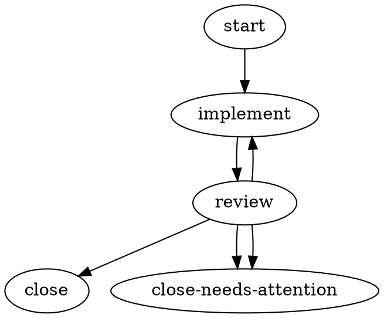

## 2 — `triple-review-consolidate` (THE MARQUEE) — NOW

The headline pattern: one implementer, three reviewers each on a distinct axis (correctness,
design/idioms, tests), a **consolidate** reviewer node that severity-joins them, and a capped
back-edge to the implementer "until there's nothing left to fix." Subsumes the review-slice
`multi-perspective-code-review` (same shape, correctness/security/style lenses — swap the three
reviewer `role` briefs to retarget).

**Runs TODAY** per the marquee brief discipline above: each per-axis reviewer writes+commits
`reviews/reviewer-<axis>.md` FIRST, then writes `.harmonik/review.json`; the consolidate reviewer
reads all findings files, severity-joins (`BLOCK > REQUEST_CHANGES > APPROVE`), and writes the final
`review.json` that the branch edges read. APPROVE = the no-findings fixpoint (→ close); BLOCK →
attention; cap-hit → reopen as needs-attention. (`hk-69asi` NOT required — reviewers commit.)

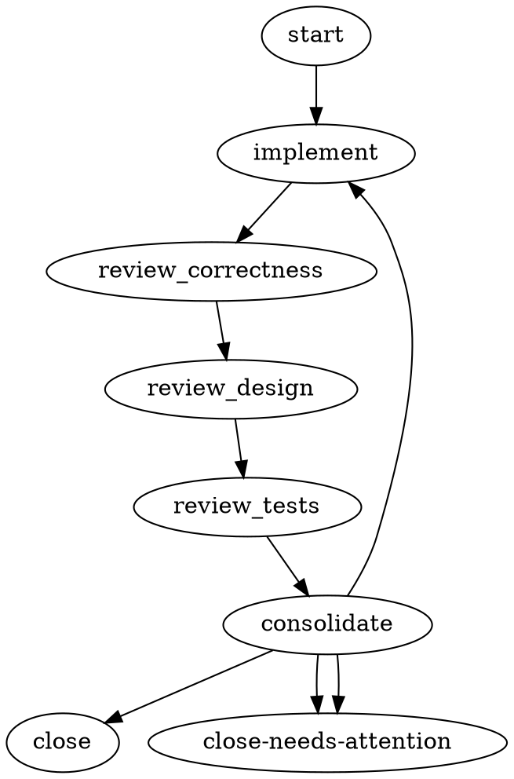

## 3 — `dual-review-consolidate` — NOW (FIRST LIVE SMOKE)

The cheaper everyday MARQUEE: two reviewers (correctness+tests folded into one, design the other)
+ consolidate. Same mechanism as #2. **Recommended as the first live smoke** of the consolidation
family — smaller fan, smaller cap (=2) → cap-hit path reachable fast. Smoking this confirms
reviewer-committed findings are readable by the consolidate node before landing the 3-reviewer
marquee.

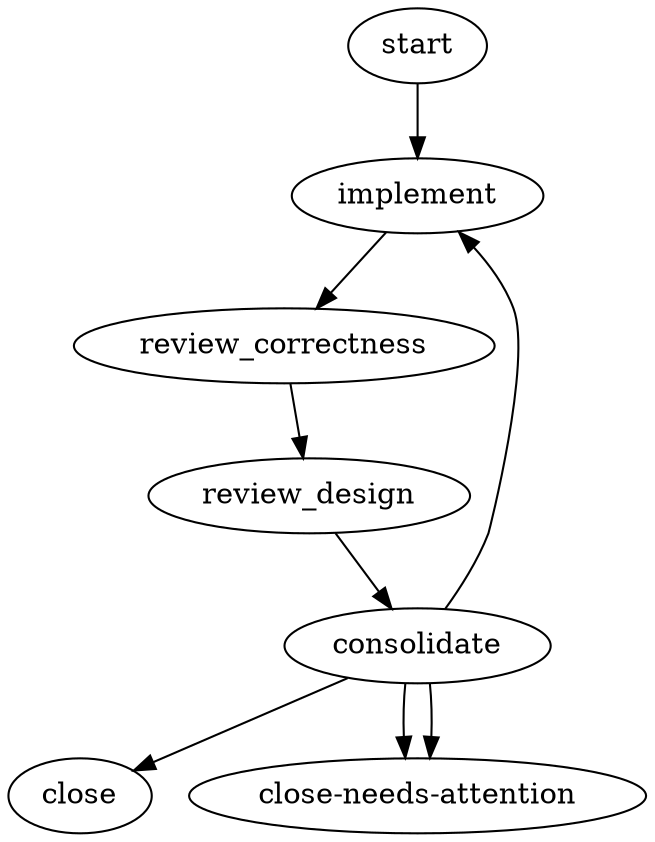

## 4 — `two-reviewer-consensus` (unanimous APPROVE) — NOW

The consolidate node here computes a **boolean AND** of two independent verdicts — APPROVE iff
BOTH approved, BLOCK if either blocked, else REQUEST_CHANGES. This is the canonical answer to
"n-of-m consensus" given equality-only conditions: an edge can only see the CURRENT node's
`outcome.*` (one outcome in scope per cascade), so cross-node verdict combination must live inside
a consolidate agent. Same single-slot brief discipline as #2/#3 (reviewers record their verdicts in
committed notes; consolidate reads them).

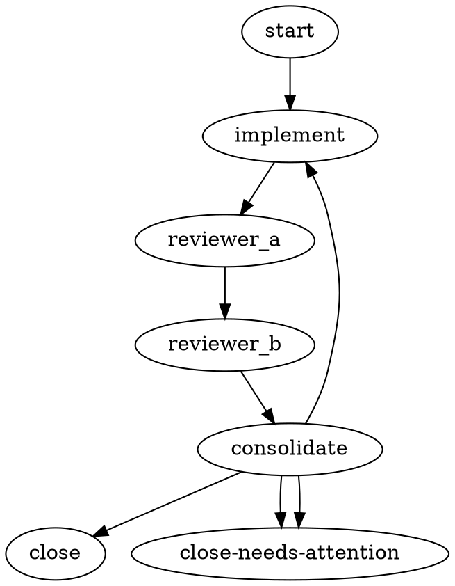

## 5 — `plan-review-loop` (Planning) — NOW

Planning analogue of #1: the implementer writes/revises `plans/<codename>.md` (a committed file
satisfies the HEAD-advance gate), the reviewer gates on scope/grounding/decomposition quality,
REQUEST_CHANGES loops (capped), BLOCK or cap-hit escalates. Subsumes `plan-single-pass`
(= cap-0 variant) and `plan-two-round` (= cap-2 variant; the round count is just the
`traversal_cap` value).

```dot
digraph "plan-review-loop" {
    schema_version="1";
    version="1.0";
    workflow_id="plan-review-loop";
    start_node="start";
    terminal_node_ids="plan-approved,plan-needs-attention";

    start [ type="non-agentic", handler_ref="noop", idempotency_class="idempotent", role="entry — idea bead" ];

    draft_plan [
        type="agentic", agent_type="implementer", handler_ref="claude-implementer",
        idempotency_class="non-idempotent",
        role="write or revise plans/<codename>.md from the bead's idea + framing (commit required each visit)"
    ];
    plan_review [
        type="agentic", agent_type="reviewer", handler_ref="claude-reviewer",
        idempotency_class="idempotent",
        role="verdict on scope, grounding, decomposition quality, Done-means criteria"
    ];

    plan-approved [ type="non-agentic", handler_ref="noop", idempotency_class="idempotent", role="APPROVE — plan accepted" ];
    "plan-needs-attention" [ type="non-agentic", handler_ref="noop", idempotency_class="idempotent", role="BLOCK / cap-hit — operator decides" ];

    start -> draft_plan;
    draft_plan -> plan_review;

    plan_review -> plan-approved [ condition="outcome.preferred_label == 'APPROVE'" ];
    plan_review -> draft_plan [ condition="outcome.preferred_label == 'REQUEST_CHANGES'", traversal_cap="3" ];
    plan_review -> "plan-needs-attention" [ condition="outcome.preferred_label == 'BLOCK'" ];
    plan_review -> "plan-needs-attention";   // fallback
}
```

## 6 — `plan-review-finalize` (Planning) — NOW

#5 plus a non-agentic `finalize_plan` seam between APPROVE and the success terminal — the future
hook for a bead-emitting tool node (`hk-l8rpd`) once it lands. Validates terminal-by-identity
classification through an intermediate non-agentic node (the hk-z03e8 path, like
`review-loop-finalize.dot`).

```dot
digraph "plan-review-finalize" {
    schema_version="1";
    version="1.0";
    workflow_id="plan-review-finalize";
    start_node="start";
    terminal_node_ids="plan-approved,plan-needs-attention";

    start [ type="non-agentic", handler_ref="noop", idempotency_class="idempotent", role="entry" ];
    draft_plan [
        type="agentic", agent_type="implementer", handler_ref="claude-implementer",
        idempotency_class="non-idempotent", role="write/revise plans/<codename>.md (commit required)"
    ];
    plan_review [
        type="agentic", agent_type="reviewer", handler_ref="claude-reviewer",
        idempotency_class="idempotent", role="verdict"
    ];
    finalize_plan [
        type="non-agentic", handler_ref="noop", idempotency_class="idempotent",
        role="lock plan / hand off to decomposition (future tool-node seam, hk-l8rpd)"
    ];
    plan-approved [ type="non-agentic", handler_ref="noop", idempotency_class="idempotent", role="plan accepted" ];
    "plan-needs-attention" [ type="non-agentic", handler_ref="noop", idempotency_class="idempotent", role="BLOCK / cap-hit" ];

    start -> draft_plan;
    draft_plan -> plan_review;

    plan_review -> finalize_plan [ condition="outcome.preferred_label == 'APPROVE'" ];
    plan_review -> draft_plan [ condition="outcome.preferred_label == 'REQUEST_CHANGES'", traversal_cap="3" ];
    plan_review -> "plan-needs-attention" [ condition="outcome.preferred_label == 'BLOCK'" ];
    plan_review -> "plan-needs-attention";   // fallback

    finalize_plan -> plan-approved;   // unconditional; SUCCESS by terminal identity (hk-z03e8)
}
```

## 7 — `spec-R1-R2-cycle` (Spec authoring) — NOW

Two distinct review postures in sequence: R1 constructive (buildability + design critic), an
`integrate_r1` author pass between rounds, then R2 adversarial (skeptic + adversary), a final
`integrate_r2`, then close. Mixes `preferred_label` cascades (reviewers) with `outcome.status`
cascades (the integrate/author commit gates); R2 REQUEST_CHANGES loops back to `integrate_r1`
(nearest author surface) so R1 isn't needlessly re-run. Subsumes the spec-slice
`spec-R1-multiperspective` (= just the R1 chain feeding a consolidate).

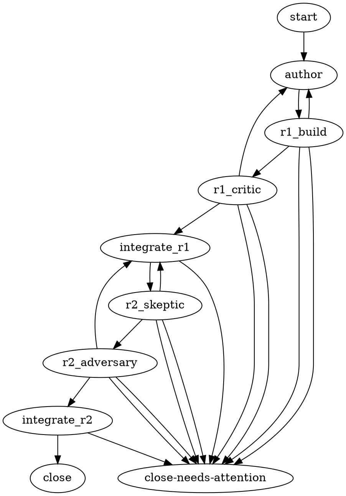

## 8 — `spec-citation-cleanup` (Spec authoring) — NOW

A content gate (review the spec body, ignore citation formatting) → a dedicated `citation_fixer`
author pass → a `citation_verify` reviewer that ONLY checks every cross-reference resolves, with a
tight fixer↔verifier sub-loop. Proves role-differentiation works today purely via node `role`
briefs + commit-gated (`outcome.status == 'SUCCESS'`) handoff between an author node and the next
reviewer. Also covers the `spec-drift-rereview` pattern (a reconcile↔re-review loop is the same
shape with different role briefs).

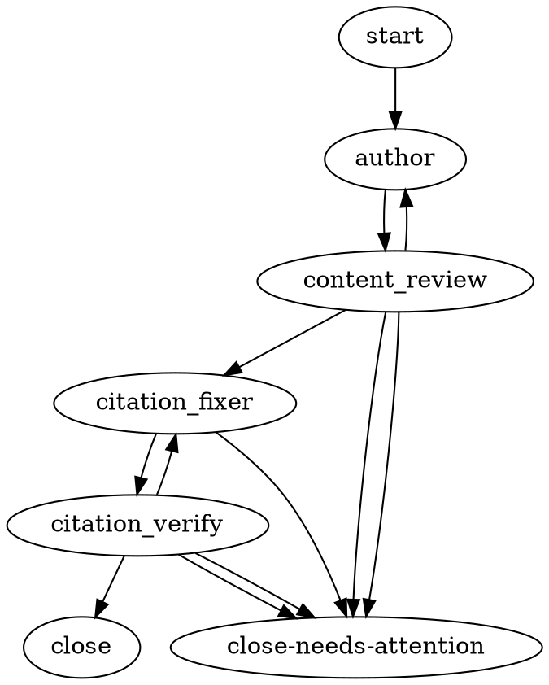

## 9 — `decompose-review-load` (Decomposition) — NOW

Reviewed spec → decompose into a committed `tasks.md` → review for coverage/granularity → on
APPROVE, an implementer creates the beads (commits the `.beads` JSONL diff) → close. NOW-runnable
by expressing the deterministic `br` steps as committing implementer nodes (commit = SUCCESS gate);
the cleaner form uses tool nodes (`hk-l8rpd`). Subsumes `decompose-quality-gate-loop` (= add a
multi-lens reviewer chain → consolidate before load; same consolidate mechanism as #2) and the
load-tail of `spec-change-redecompose`.

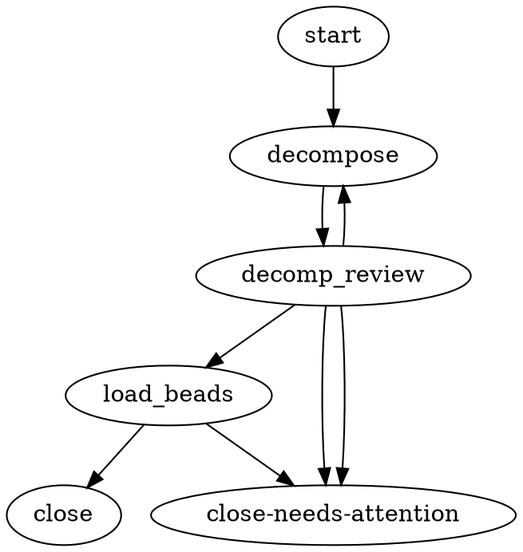

## 10 — `dependency-cycle-fix-loop` (Decomposition) — NOW

Detect → fix → recheck, where the loop pivot is a **non-verdict** condition: a committing
implementer node runs `br dep cycles`, commits a `cycle-report.md`, and surfaces the result as a
custom `preferred_label` (`CYCLE` / `ACYCLIC`). Demonstrates `traversal_cap` on a fix→check
back-edge and `failure_class == 'structural'` routing for a tool-level error. (SOON-cleaner form:
`cycle_check` becomes an `hk-l8rpd` tool node running `br dep cycles` — cycle detection is
deterministic tooling, not agent cognition.)

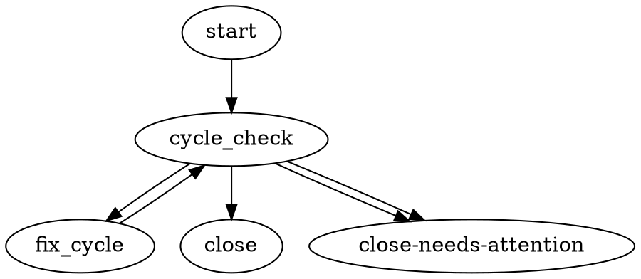

## 11 — `docs-sync` (Testing/Ops) — NOW

Two-implementer spine (code → docs) followed by a reviewer that routes back to EITHER upstream node
via a custom `preferred_label` (`REQUEST_CHANGES` → docs, `CODE_CHANGE` → code). Demonstrates that
`preferred_label` is an arbitrary string (WG-019) — authors can mint domain labels beyond the
APPROVE/REQUEST_CHANGES/BLOCK triad as long as the reviewer is briefed to emit them.

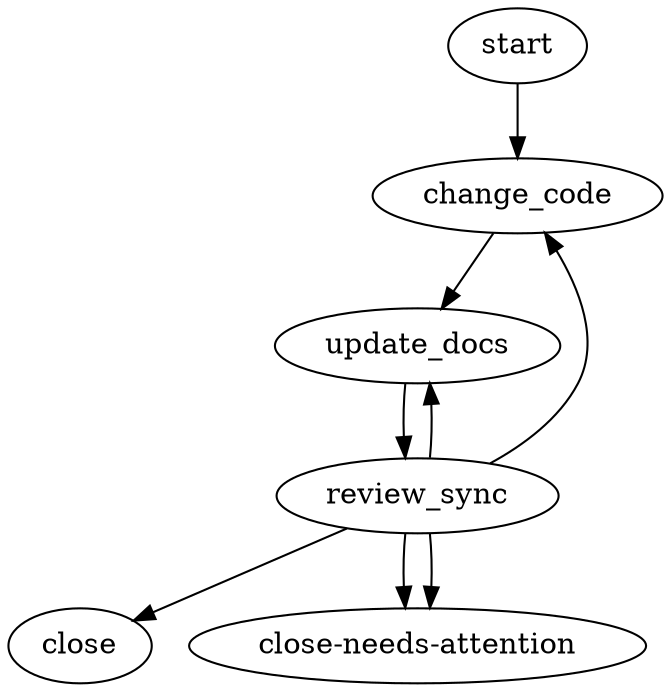

## 12 — `review-route-by-failure-class` (Review/Ops) — NOW

Branches on `outcome.failure_class` (the third LHS whitelist entry), mapping the closed taxonomy to
disposition: `transient` → retry the node (capped); `structural`/`deterministic`/`canceled`/
`budget_exhausted`/`compilation_loop` → needs-attention. Coexists with the verdict cascade because a
SUCCESS outcome carries no failure_class (those edges miss and fall through to the unconditional
handoff). Also folds in the `review-escalate-to-human` pattern (BLOCK + cap-hit are both escalation
triggers; the needs-attention terminal IS the escalation surface — no gate needed).

> Live-run honesty: agents cannot be reliably forced to emit a given failure_class on demand, so
> deterministic exercise of the non-transient branches needs a stub handler (`hk-1xsyu`). The
> topology is valid NOW; the scenario test drives the branches with synthetic outcomes.

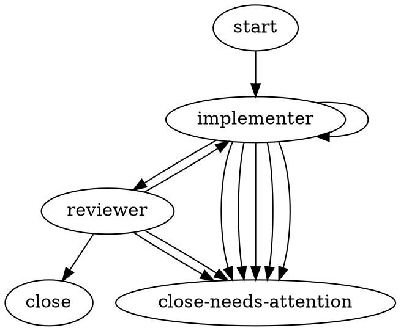

## 13 — `characterize-refactor-verify` (Implementation) — NOW

Behavior-preserving refactor with a safety net: `characterize` commits tests pinning current
behavior (the oracle), `refactor` restructures, `verify_review` confirms behavior preserved. The
loop returns to `refactor` (NOT `characterize`) — the oracle must not be rewritten during the fix
loop. Proves a back-edge can re-enter a mid-graph implementer node while leaving an earlier commit
untouched, and that the same verdict enum serves "behavior preservation" intent purely via the brief.

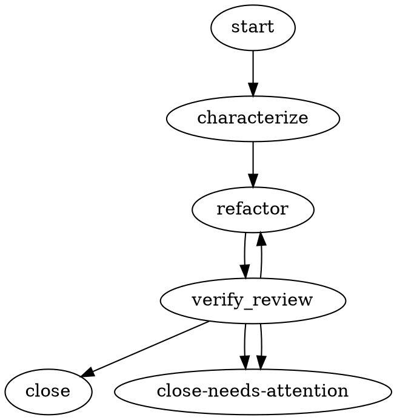

## 14 — `security-review-loop` (Review — security) — NOW  ★ ADDED (review fix #1)

A re-role of the canonical `implement-review-fix` (#1) with a **security-axis** reviewer brief.
Same topology, same dialect, same engine path — the only difference is the reviewer's `role`:
instead of a general correctness verdict, the reviewer renders a verdict on the security posture
of the change (injection / authz / secret-handling / unsafe-deserialization / supply-chain). This
fills the explicit security-review demo gap that #1's "subsumed role-variants" note only covered
implicitly. Promoted to its own NOW fixture because security review is a named demo target — having
a concrete `security-review-loop.dot` makes "harmonik can run a security review" a checkable claim
rather than a footnote. Verdict literals stay the canonical triad (APPROVE / REQUEST_CHANGES /
BLOCK); BLOCK is the "ship-blocking security defect" escalation.

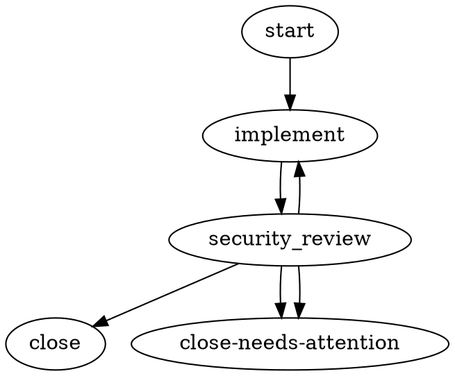

---

# SOON workflows — pseudo-DOT + bead(s) each needs

## 15 — `green-build-merge-gate` — SOON [`hk-l8rpd`; `hk-q8nqr` optional]

The deterministic merge gate: an agent makes the change, then a shell node runs the full green
build; only a green build (exit 0) reaches `close`. The single most directly reusable SOON
workflow — the deterministic analog of harmonik's own review-loop merge gate. Subsumes the
testing-slice `test-then-verify` (= the same shape with `go test ./...` as the gate command).

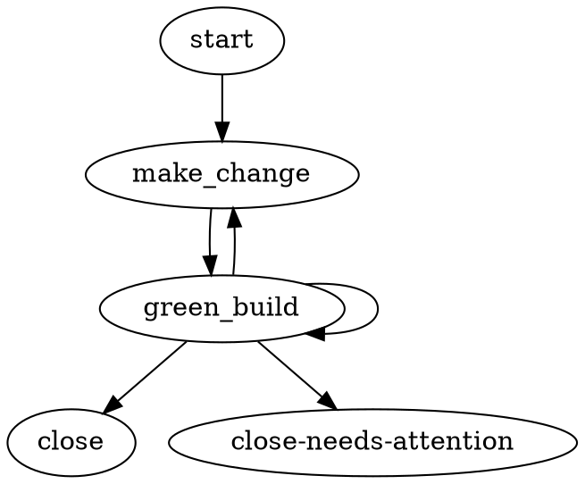

## 16 — `regression-gate` — SOON [`hk-l8rpd`]

Reproduce-before-fix encoded as graph structure: a tool node whose **FAIL is the desired forward
path** (the bug must reproduce before we trust a fix), then fix, then a full regression suite that
catches both "fix didn't take" and "fix broke something else." Subsumes the debugging-slice
`sentry-bugfix-faithful` and the degraded-NOW `bugfix-loop-now` (the latter folds the shell gates
into the agent's own session, trading exit codes for an LLM opinion — runnable today but with no
deterministic gate).

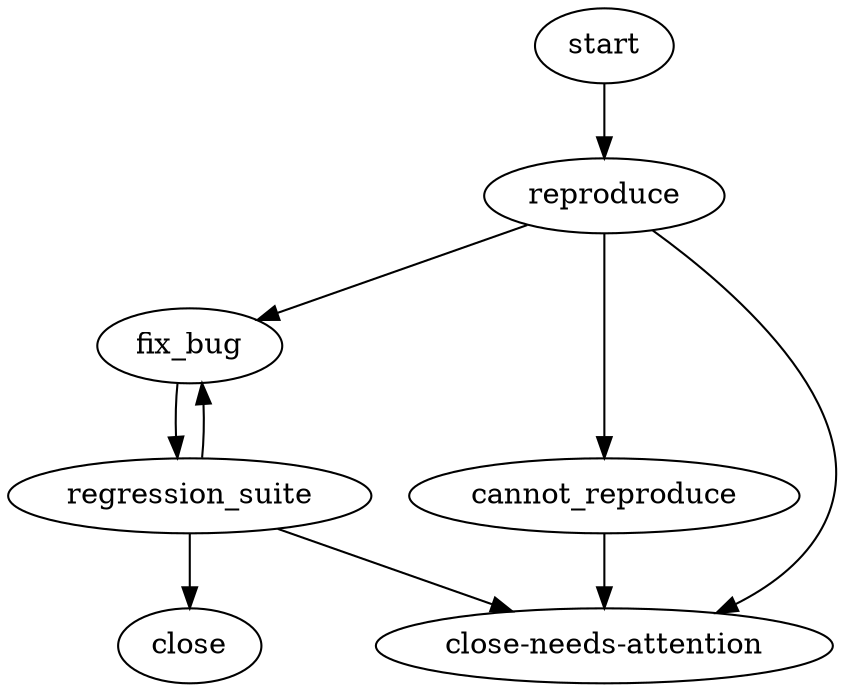

## 17 — `release-with-rollback` — SOON [`hk-l8rpd`]

A release pipeline with a compensating-action node: a failed `publish` routes to a `rollback` shell
node (delete tag, revert release commit) before terminating at needs-attention, leaving the repo
clean for a retry. Idiomatic "on failure, undo, then escalate" within the sequential v1 dialect
(rollback is a routed node, not a parallel try/finally compensator). Subsumes the simpler
`release-readiness` (= drop the rollback node; publish-fail goes straight to attention).

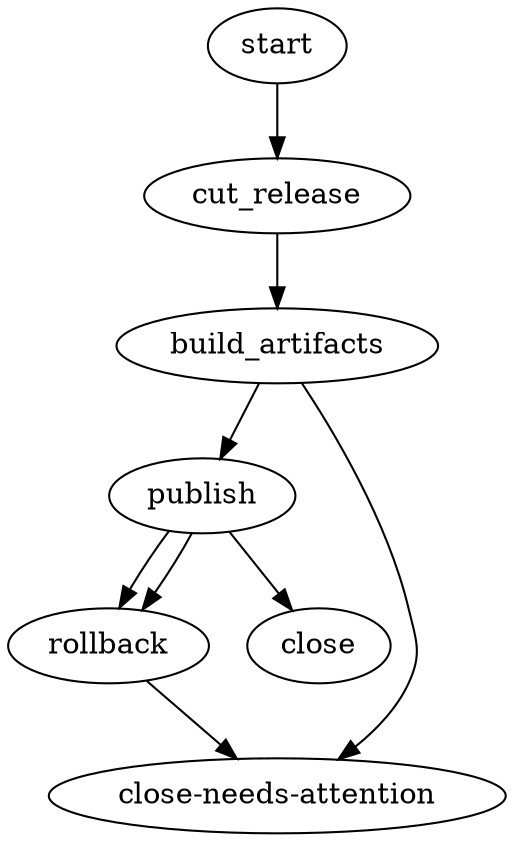

## 18 — `sentry-triage-faithful` — SOON [`hk-l8rpd`, `hk-sdnzj`, `hk-69asi`]

The cleanest demonstration of why `hk-69asi` is load-bearing: investigate → confidence gate →
dedup → create-issue, where **none of the agentic nodes commit** (they write `.ai/*`, call
`gh issue create`) and the gates are shell `grep | exit-code` nodes. A whole run with zero git
commits is impossible in harmonik today. The NOW-degraded sibling is `sentry-triage-native-now`
(fold the shell steps into one agentic session + a ledger-commit kludge + `preferred_label`
verdicts — runnable today, trades deterministic gates for agent reasoning; good first triage demo).

> Modeling tension flagged for `hk-l8rpd` design: **>2-way deterministic verdicts** (confidence
> HIGH/MEDIUM/LOW; flaky FLAKY/REAL/NOREPRO) don't map cleanly onto a single exit code. Either
> define a richer exit-code → failure_class table or steer authors to an agentic classify node
> emitting `preferred_label` for >2-way splits.

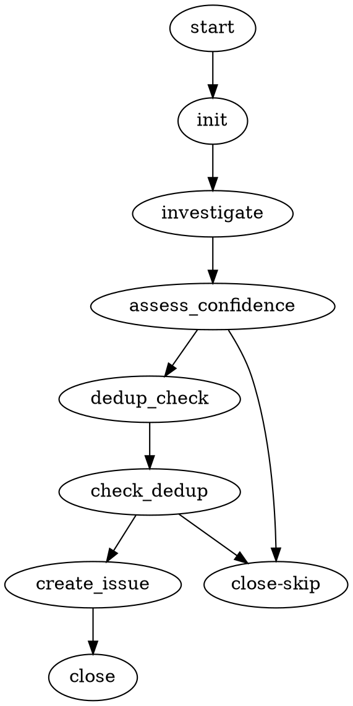

## 19 — `quality-gate-policy` — SOON [`hk-karlz`]

A `gate` node performs a deterministic policy decision (allow / deny / escalate-to-human) from a
named ControlPoint, distinct from a subjective reviewer verdict. Parses today but returns a
deterministic needs-attention failure until the daemon's `GateEvalFunc` provider is wired
(`hk-karlz`). A gate requires BOTH `gate_ref` AND `handler_ref` (uniquely among non-agentic-shaped
nodes) and MUST NOT carry `agent_type`/`idempotency_class`. **`hk-karlz` is orthogonal to kilroy
parity** (kilroy uses `diamond` conditionals, not policy gates). Subsumes the review-slice
`security-cognition-gate` (same gate node with a security-policy `gate_ref`).

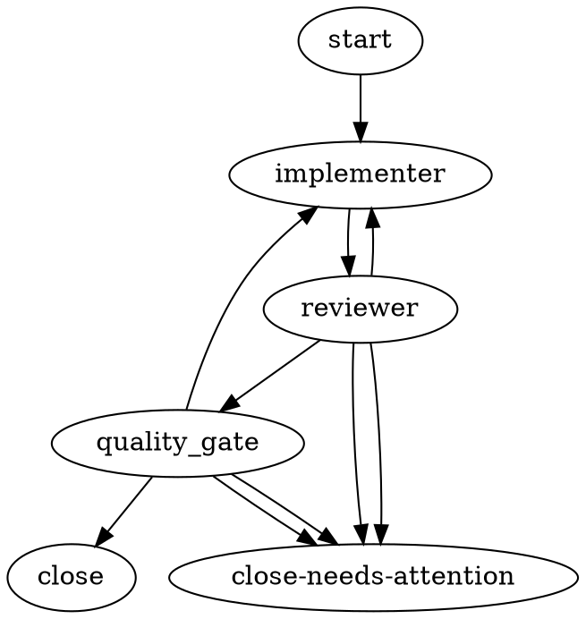

---

# DEMO workflows — whole-SDLC arcs

## D1 — `plan-to-shipped-now` — DEMO (all NOW topology; in-session build gate)  ★ build-gate fix applied (review fix #2)

Chains the proven NOW loops into one end-to-end walk: idea → plan → spec → tasking → implement →
multi-review-consolidate → docs → close. Built entirely from proven primitives (so it is genuinely
runnable as a long sequence of Claude sessions), but classed DEMO because a full clean walk is 14+
agentic nodes — great for demonstrating "the whole SDLC in one graph," heavy for routine use.
Composes #5 (plan loop), #7-style spec gate, #9 (decompose+load), #2 (the MARQUEE consolidate),
and #11 (docs-sync). Runs TODAY per the marquee brief discipline (consolidate reviewers commit
findings).

**★ Green-build gate (review fix #2):** because the deterministic tool node is SOON (`hk-l8rpd`),
the all-NOW arc demonstrates a green build by folding the gate INTO two agentic node briefs: the
`consolidate` reviewer and the `docs_review` reviewer each run `go build ./... && go test ./...`
in-session and **BLOCK on red** (a red build is a ship-blocking defect → BLOCK → needs-attention).
So the arc still demonstrates a green-build gate end-to-end without the tool node. (D2 replaces this
in-session check with a real `green_build` tool node.)

```dot
// pseudo-DOT — all-NOW topology, composed end-to-end (long showcase). Each box = one bead/run.
digraph "plan-to-shipped-now" {
    schema_version="1"; version="1.0"; workflow_id="plan-to-shipped-now";
    start_node="start"; terminal_node_ids="close,close-needs-attention";

    start [ type="non-agentic", handler_ref="noop", idempotency_class="idempotent", role="idea bead" ];

    // PLAN
    draft_plan   [ type="agentic", agent_type="implementer", handler_ref="claude-implementer", idempotency_class="non-idempotent", role="write plans/<cn>.md" ];
    plan_review  [ type="agentic", agent_type="reviewer",    handler_ref="claude-reviewer",    idempotency_class="idempotent",     role="plan verdict" ];
    // SPEC
    draft_spec   [ type="agentic", agent_type="implementer", handler_ref="claude-implementer", idempotency_class="non-idempotent", role="draft spec from plan" ];
    spec_review  [ type="agentic", agent_type="reviewer",    handler_ref="claude-reviewer",    idempotency_class="idempotent",     role="spec verdict" ];
    // TASKING
    decompose    [ type="agentic", agent_type="implementer", handler_ref="claude-implementer", idempotency_class="non-idempotent", role="decompose spec → tasks.md" ];
    load_beads   [ type="agentic", agent_type="implementer", handler_ref="claude-implementer", idempotency_class="non-idempotent", role="create beads; commit .beads JSONL" ];
    // IMPLEMENT + MULTI-REVIEW (MARQUEE)
    implement    [ type="agentic", agent_type="implementer", handler_ref="claude-implementer", idempotency_class="non-idempotent", role="implement the change; on re-entry fix consolidated feedback" ];
    rev_correct  [ type="agentic", agent_type="reviewer",    handler_ref="claude-reviewer",    idempotency_class="idempotent",     role="correctness; write+commit reviews/reviewer-correctness.md FIRST, then write .harmonik/review.json" ];
    rev_design   [ type="agentic", agent_type="reviewer",    handler_ref="claude-reviewer",    idempotency_class="idempotent",     role="design; write+commit reviews/reviewer-design.md FIRST, then write .harmonik/review.json" ];
    consolidate  [ type="agentic", agent_type="reviewer",    handler_ref="claude-reviewer",    idempotency_class="idempotent",     role="severity-join reviews/reviewer-*.md; ALSO run `go build ./... && go test ./...` in-session and BLOCK on red (red build = ship-blocking defect); write .harmonik/review.json" ];
    // DOCS
    update_docs  [ type="agentic", agent_type="implementer", handler_ref="claude-implementer", idempotency_class="non-idempotent", role="sync docs to the change; commit" ];
    docs_review  [ type="agentic", agent_type="reviewer",    handler_ref="claude-reviewer",    idempotency_class="idempotent",     role="verify code+docs agree; ALSO re-run `go build ./... && go test ./...` in-session and BLOCK on red; write .harmonik/review.json" ];

    close [ type="non-agentic", handler_ref="noop", idempotency_class="idempotent", role="shipped" ];
    "close-needs-attention" [ type="non-agentic", handler_ref="noop", idempotency_class="idempotent", role="BLOCK / cap-hit anywhere (incl. red build)" ];

    start -> draft_plan;
    draft_plan -> plan_review;
    plan_review -> draft_spec   [ condition="outcome.preferred_label == 'APPROVE'" ];
    plan_review -> draft_plan   [ condition="outcome.preferred_label == 'REQUEST_CHANGES'", traversal_cap="3" ];
    plan_review -> "close-needs-attention" [ condition="outcome.preferred_label == 'BLOCK'" ];
    plan_review -> "close-needs-attention";

    draft_spec -> spec_review;
    spec_review -> decompose    [ condition="outcome.preferred_label == 'APPROVE'" ];
    spec_review -> draft_spec   [ condition="outcome.preferred_label == 'REQUEST_CHANGES'", traversal_cap="3" ];
    spec_review -> "close-needs-attention" [ condition="outcome.preferred_label == 'BLOCK'" ];
    spec_review -> "close-needs-attention";

    decompose -> load_beads;
    load_beads -> implement [ condition="outcome.status == 'SUCCESS'" ];
    load_beads -> "close-needs-attention";

    implement -> rev_correct;
    rev_correct -> rev_design;
    rev_design -> consolidate;
    consolidate -> update_docs [ condition="outcome.preferred_label == 'APPROVE'" ];
    consolidate -> implement   [ condition="outcome.preferred_label == 'REQUEST_CHANGES'", traversal_cap="3" ];
    consolidate -> "close-needs-attention" [ condition="outcome.preferred_label == 'BLOCK'" ];   // incl. red build
    consolidate -> "close-needs-attention";

    update_docs -> docs_review;
    docs_review -> close       [ condition="outcome.preferred_label == 'APPROVE'" ];
    docs_review -> update_docs [ condition="outcome.preferred_label == 'REQUEST_CHANGES'", traversal_cap="3" ];
    docs_review -> "close-needs-attention" [ condition="outcome.preferred_label == 'BLOCK'" ];   // incl. red build
    docs_review -> "close-needs-attention";
}
```

**Beads needed:** none (all NOW topology). Runs TODAY per the marquee brief discipline; the
green-build gate is in-session (review fix #2) until `hk-l8rpd` lands a real tool node.

## D2 — `plan-to-shipped-faithful` — DEMO [`hk-l8rpd`, `hk-sdnzj`, `hk-69asi`]

The honest end-to-end target once the parity beads land: the same arc as D1 but with the
deterministic steps done right — analysis/decision nodes are non-committing (`hk-69asi`), each
distinct step carries its own prompt (`hk-sdnzj`), the `br` decomposition steps and the build/test
gates are tool nodes (`hk-l8rpd`), and (optionally) hard nodes use a stronger model (`hk-q8nqr`).
This is the north-star showing exactly which beads close the gap between today's loop and a full
deterministic SDLC. Composes the SOON forms of #9 (tool `br` steps), #15 (green-build gate), #16
(regression gate), and the MARQUEE consolidate.

```dot
// PSEUDO-DOT — DEMO target. Pending: hk-l8rpd (tool/shell), hk-sdnzj (per-node prompt),
//             hk-69asi (non-committing analysis), hk-q8nqr (per-node model, optional).
//             NOTE: parallel reviewer fan-out is DEFERRED (EM-059) — reviewers stay sequential.
digraph "plan-to-shipped-faithful" {
    schema_version="1"; version="1.0"; workflow_id="plan-to-shipped-faithful";
    start_node="start"; terminal_node_ids="close,close-needs-attention";

    start [ type="non-agentic", handler_ref="noop", idempotency_class="idempotent" ];

    frame_problem [ type="agentic", agent_type="implementer", handler_ref="claude-implementer",
        idempotency_class="idempotent", non_committing="true",   // hk-69asi
        prompt="Frame the problem space; write .ai/plan/problem.md. No commit." ];   // hk-sdnzj
    draft_plan [ type="agentic", agent_type="implementer", handler_ref="claude-implementer",
        idempotency_class="non-idempotent", class="hard",        // hk-q8nqr
        prompt="Write plans/<cn>.md from .ai/plan/*. Commit." ]; // hk-sdnzj
    plan_review [ type="agentic", agent_type="reviewer", handler_ref="claude-reviewer",
        idempotency_class="idempotent", non_committing="true",
        prompt="Review the plan for scope + Done-means." ];

    draft_spec [ type="agentic", agent_type="implementer", handler_ref="claude-implementer",
        idempotency_class="non-idempotent", prompt="Draft specs/<cn>.md from the plan. Commit." ];
    spec_review [ type="agentic", agent_type="reviewer", handler_ref="claude-reviewer",
        idempotency_class="idempotent", non_committing="true", prompt="Review the spec." ];

    decompose [ type="agentic", agent_type="implementer", handler_ref="claude-implementer",
        idempotency_class="non-idempotent", class="hard", prompt="Decompose spec → tasks.md. Commit." ];
    load_beads [ type="tool", handler_ref="shell", idempotency_class="non-idempotent",   // hk-l8rpd
        tool_command="kerf finalize <cn> && br create ...", role="load beads from tasks.md" ];
    cycle_check [ type="tool", handler_ref="shell", idempotency_class="idempotent",       // hk-l8rpd
        tool_command="br dep cycles", role="detect dependency cycles" ];

    implement [ type="agentic", agent_type="implementer", handler_ref="claude-implementer",
        idempotency_class="non-idempotent", prompt="Implement the change; on re-entry fix consolidated feedback. Commit." ];
    rev_correct [ type="agentic", agent_type="reviewer", handler_ref="claude-reviewer",
        idempotency_class="idempotent", non_committing="true", prompt="Correctness lens; write reviews/correctness.md." ];
    rev_tests [ type="agentic", agent_type="reviewer", handler_ref="claude-reviewer",
        idempotency_class="idempotent", non_committing="true", prompt="Test-adequacy lens; write reviews/tests.md." ];
    consolidate [ type="agentic", agent_type="reviewer", handler_ref="claude-reviewer",
        idempotency_class="idempotent", non_committing="true", prompt="Severity-join reviews/* → .harmonik/review.json." ];

    green_build [ type="tool", handler_ref="shell", idempotency_class="idempotent",       // hk-l8rpd
        tool_command="go build ./... && go vet ./... && go test ./...", timeout="900s",
        role="green-build merge gate" ];

    close [ type="non-agentic", handler_ref="noop", idempotency_class="idempotent", role="shipped" ];
    "close-needs-attention" [ type="non-agentic", handler_ref="noop", idempotency_class="idempotent" ];

    start -> frame_problem;
    frame_problem -> draft_plan;
    draft_plan -> plan_review;
    plan_review -> draft_spec [ condition="outcome.preferred_label == 'APPROVE'" ];
    plan_review -> draft_plan [ condition="outcome.preferred_label == 'REQUEST_CHANGES'", traversal_cap="3" ];
    plan_review -> "close-needs-attention";

    draft_spec -> spec_review;
    spec_review -> decompose  [ condition="outcome.preferred_label == 'APPROVE'" ];
    spec_review -> draft_spec [ condition="outcome.preferred_label == 'REQUEST_CHANGES'", traversal_cap="3" ];
    spec_review -> "close-needs-attention";

    decompose -> load_beads;
    load_beads -> cycle_check [ condition="outcome.status == 'SUCCESS'" ];
    load_beads -> "close-needs-attention";
    cycle_check -> implement  [ condition="outcome.status == 'SUCCESS'" ];   // ACYCLIC
    cycle_check -> "close-needs-attention";                                  // cycle → triage

    implement -> rev_correct;
    rev_correct -> rev_tests;
    rev_tests -> consolidate;
    consolidate -> green_build [ condition="outcome.preferred_label == 'APPROVE'" ];
    consolidate -> implement   [ condition="outcome.preferred_label == 'REQUEST_CHANGES'", traversal_cap="3" ];
    consolidate -> "close-needs-attention";

    green_build -> close      [ condition="outcome.status == 'SUCCESS'" ];
    green_build -> implement  [ condition="outcome.status == 'FAIL' && outcome.failure_class == 'deterministic'", traversal_cap="3" ];
    green_build -> "close-needs-attention";
}
```

**Beads needed:** `hk-l8rpd` (tool/shell, keystone), `hk-sdnzj` (per-node prompt), `hk-69asi`
(non-committing analysis), `hk-q8nqr` (per-node model, optional). Runs the MARQUEE consolidate per
the brief discipline.

---

# DEFERRED (recorded only — NOT a needed capability)

## `parallel-review-consolidate` — DEFERRED (EM-059, out of scope)

True fork+join multi-reviewer: three reviewers run concurrently against a frozen HEAD, a join
barrier waits for all three, then consolidate. Per the parity research §3, parallel/join is a real
Attractor-spec primitive that harmonik **deliberately defers** (EM-059 §7.5.5: "parallel-node-type
semantics... deferred to a post-MVH amendment"; OQ-WG-008: "parallel fan-out primitives rejected,
not stubbed") and is **NOT required by any live kilroy pipeline** (both are strictly sequential).
The sequential `triple-review-consolidate` (#2) is the runnable substitute. If ever pursued it is a
NEW capability requiring coordinated amendments (EM-059 lift, WG-001 node-type additions + schema
major bump, the one-worktree-per-run invariant lift, and a fork/join dispatcher in
`dot_cascade.go`). **Do not file as a parity bead.** Recorded here as a design target only.

---

# Resolved recurring gaps (from across the slices)

1. **Parallel fan-out / join → DEFERRED, OUT OF SCOPE** (EM-059). Surfaced by planning,
   spec-authoring, decomposition, implementation, and review slices as a "would-be" capability.
   Per the parity ruling it is deliberately deferred and not needed for kilroy parity — all
   multi-reviewer patterns are sequential chains + a consolidate node. Do NOT treat as a gap to
   fill; do NOT file a bead. (The implementation slice proposed filing one — overruled by the
   parity research.)
2. **Deterministic gate node → `hk-karlz`, ORTHOGONAL.** The `gate` node type (allow/deny/
   escalate from a named policy) parses but does not run until the daemon's `GateEvalFunc` provider
   is wired. Distinct from kilroy parity (kilroy uses `diamond` conditionals). Owns #19 (and the
   subsumed `security-cognition-gate`).
3. **Context-write routing → MINOR GAP.** `context.<key>` is a legal LHS, but no proven dot-mode
   node *writes* a context value at runtime (only `review-loop` mode populates context). So
   counter-driven loops / `context.research_done`-style routing are inert today. Minor: every NOW
   workflow above routes on verdicts / status / failure_class instead. Would unlock richer drift
   gates and counter loops; candidate for a future bead, not blocking.
4. **>2-way deterministic verdicts from one exit code → FLAG for tool-node (`hk-l8rpd`) design.**
   Debugging surfaced that 3-way classifications (confidence HIGH/MEDIUM/LOW; flaky FLAKY/REAL/
   NOREPRO) don't map onto a single exit code. The `hk-l8rpd` design should either define a richer
   exit-code → failure_class table, or document that >2-way splits use an agentic classify node
   emitting `preferred_label` (the #10 / #18 approach). Also note kilroy's `transient_infra` /
   `partial_success` vocabulary vs harmonik's `transient` / `PARTIAL_SUCCESS` — a port tool must
   translate (parity research E4).
5. **Marquee reviewer-commit channel → RESOLVED (brief discipline), NOT a bead.** The consolidation
   family's single-slot `review.json` problem is solved by the brief discipline (reviewers
   write+commit `reviews/reviewer-*.md` FIRST, then write `review.json`). `hk-69asi` is NOT needed
   for the marquee — only for SOON zero-commit nodes (#18 sentry-triage, D2 `frame_problem`).

---

# Implementation plan — which NOW workflows to land first as test fixtures

Land in this order; each is a drop-in candidate for `specs/examples/` and a daemon test fixture.
**Smoke-first batch (explicit):** `dual-review-consolidate`, `implement-review-fix`,
`plan-review-loop`, `security-review-loop`.

1. **`implement-review-fix` (#1).** Already isomorphic to the proven
   `specs/examples/review-loop.dot`; landing it as a named fixture is near-zero-risk and gives the
   corpus its reference baseline. Captures the subsumed role-variants (plan-single-pass,
   spec-draft-review-approve, test-authoring-loop, bugfix-loop-now) as role-only re-skins
   documented in the fixture header.
2. **`dual-review-consolidate` (#3) — the live-smoke for the MARQUEE.** Smallest consolidation
   graph; running it live **confirms** reviewer-committed findings are readable by the consolidate
   node (the marquee brief discipline). Smoke this FIRST among the consolidation family (cap=2 →
   cap-hit path reachable fast).
3. **`security-review-loop` (#14)** and **`plan-review-loop` (#5).** Both are #1's topology re-roled
   (security axis; planning axis); low-risk, broaden phase + axis coverage. In the smoke-first batch.
4. **`triple-review-consolidate` (#2) — the marquee fixture proper,** once #3 confirms the
   mechanism. The most important fixture in the corpus.
5. **`spec-citation-cleanup` (#8)** and **`decompose-review-load` (#9)** — exercise spec-authoring
   and decomposition phases with commit-gated author→reviewer handoff and a nested fixer↔verifier
   sub-loop. Low risk.
6. **`dependency-cycle-fix-loop` (#10)** and **`review-route-by-failure-class` (#12)** — the
   non-verdict routing surfaces (`preferred_label=CYCLE|ACYCLIC` and `outcome.failure_class`). #12
   needs the `hk-1xsyu` stub for deterministic live-branch coverage; land its topology + scenario
   test (synthetic outcomes) now and gate full live-branch testing on the stub.
7. **`docs-sync` (#11)** and **`characterize-refactor-verify` (#13)** — push the verdict-routing
   surface (custom `CODE_CHANGE` label; mid-graph back-edge re-entry). Good regression fixtures for
   WG-019 arbitrary labels and multi-implementer spines.
8. **`spec-R1-R2-cycle` (#7)**, **`plan-review-finalize` (#6)**, **`two-reviewer-consensus` (#4)** —
   heavier multi-round / seam / consensus fixtures; land last among NOW. #6 re-validates
   terminal-by-identity through a non-agentic intermediate (hk-z03e8).

After the NOW set lands and `hk-l8rpd` ships, the SOON set (#15–18) becomes runnable; land #15
(`green-build-merge-gate`) first as the deterministic analog of the review-loop merge gate, then
#16/#17/#18. #19 waits on `hk-karlz`. The two DEMO arcs (D1 now, D2 post-parity) ship as showcase
fixtures / acceptance targets, not routine production gates.
